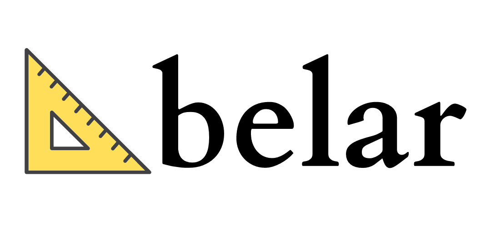

<h1 align="center">
  
</h1>
<p align="center">
  <i>Evaluation framework for your Retrieval Augmented Generation (RAG) pipelines</i>
</p>

<p align="center">
    <a href="https://github.com/explodinggradients/ragas/releases">
        
    </a>
    <a href="https://www.python.org/">
            
    </a>
    <a href="https://github.com/explodinggradients/ragas/blob/master/LICENSE">
        
    </a>
    <a href="https://colab.research.google.com/github/explodinggradients/ragas/blob/main/docs/quickstart.ipynb">
        
    </a>
    <a href="https://discord.gg/5djav8GGNZ">
        
    </a>
    <a href="https://github.com/explodinggradients/ragas/">
        
    </a>
</p>

<h4 align="center">
    <p>
        <a href="#shield-installation">Installation</a> |
        <a href="#fire-quickstart">Quickstart</a> |
        <a href="#luggage-metrics">Metrics</a> |
        <a href="#-community">Community</a> |
        <a href="#-open-analytics">Open Analytics</a> |
        <a href="#raising_hand_man-faq">FAQ</a> |
        <a href="https://huggingface.co/explodinggradients">Hugging Face</a>
    <p>
</h4>

> Note: We're working with a few select organisations, leveraging what we learned building Ragas, to improve the reliability of their RAG systems in production. Due to our small team size we can only work with a few clients so do fill out [this form](https://forms.gle/tk9VZMaeybxQATU69) or write to us at [team@explodinggradients.com](mailto:team@explodinggradients.com) and we will get back 🙂

ragas is a framework that helps you evaluate your Retrieval Augmented Generation (RAG) pipelines. RAG denotes a class of LLM applications that use external data to augment the LLM’s context. There are existing tools and frameworks that help you build these pipelines but evaluating it and quantifying your pipeline performance can be hard... This is where ragas (RAG Assessment) comes in

ragas provides you with the tools based on the latest research for evaluating LLM-generated text to give you insights about your RAG pipeline. ragas can be integrated with your CI/CD to provide continuous checks to ensure performance.

## :shield: Installation

```bash
pip install ragas
```

if you want to install from source

```bash
git clone https://github.com/explodinggradients/ragas && cd ragas
pip install -e .
```

## :fire: Quickstart

This is a small example program you can run to see ragas in action!

```python

from ragas import evaluate
from datasets import Dataset
import os

os.environ["OPENAI_API_KEY"] = "your-openai-key"

# prepare your huggingface dataset in the format
# Dataset({
#     features: ['question', 'contexts', 'answer'],
#     num_rows: 25
# })

dataset: Dataset

results = evaluate(dataset)
# {'ragas_score': 0.860, 'context_relevancy': 0.817,
# 'faithfulness': 0.892, 'answer_relevancy': 0.874}
```

If you want a more in-depth explanation of core components, check out our [quick-start notebook](./docs/quickstart.ipynb)

## :luggage: Metrics

Ragas measures your pipeline's performance against different dimensions

1. **Faithfulness**: measures the information consistency of the generated answer against the given context. If any claims are made in the answer that cannot be deduced from context is penalized.

2. **Context Relevancy**: measures how relevant retrieved contexts are to the question. Ideally, the context should only contain information necessary to answer the question. The presence of redundant information in the context is penalized.

3. **Context Recall**: measures the recall of the retrieved context using annotated answer as ground truth. Annotated answer is taken as proxy for ground truth context.

4. **Answer Relevancy**: refers to the degree to which a response directly addresses and is appropriate for a given question or context. This does not take the factuality of the answer into consideration but rather penalizes the present of redundant information or incomplete answers given a question.

5. **Aspect Critiques**: Designed to judge the submission against defined aspects like harmlessness, correctness, etc. You can also define your own aspect and validate the submission against your desired aspect. The output of aspect critiques is always binary.

The final `ragas_score` is the harmonic mean of individual metric scores.

To read more about our metrics, check out [docs](/docs/metrics.md).

## 🫂 Community

If you want to get more involved with Ragas, check out our [discord server](https://discord.gg/5djav8GGNZ). It's a fun community where we geek out about LLM, Retrieval, Production issues, and more.

## 🔍 Open Analytics

We track very basic usage metrics to guide us to figure out what our users want, what is working, and what's not. As a young startup, we have to be brutally honest about this which is why we are tracking these metrics. But as an Open Startup, we open-source all the data we collect. You can read more about this [here](https://github.com/explodinggradients/ragas/issues/49). **Ragas does not track any information that can be used to identify you or your company**. You can take a look at exactly what we track in the [code](./src/ragas/_analytics.py)

To disable usage-tracking you set the `RAGAS_DO_NOT_TRACK` flag to true.

## :raising_hand_man: FAQ

1. Why harmonic mean?

Harmonic-Mean penalizes extreme values. For example, if your generated answer is fully factually consistent with the context (faithfulness = 1) but is not relevant to the question (relevancy = 0), a simple average would give you a score of 0.5 but a harmonic mean will give you 0.0

2. How to use Ragas to improve your pipeline?

_"Measurement is the first step that leads to control and eventually to improvement" - James Harrington_

Here we assume that you already have your RAG pipeline ready. When it comes to RAG pipelines, there are mainly two parts - Retriever and generator. A change in any of these should also impact your pipelines' quality.

1. First, decide on one parameter that you're interested in adjusting. for example the number of retrieved documents, K.
2. Collect a set of sample prompts (min 20) to form your test set.
3. Run your pipeline using the test set before and after the change. Each time record the prompts with context and generated output.
4. Run ragas evaluation for each of them to generate evaluation scores.
5. Compare the scores and you will know how much the change has affected your pipelines' performance.
