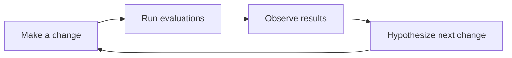

# Experiments

## What is an experiment?

An experiment is a deliberate change made to your application to test a hypothesis or idea. For example, in a Retrieval-Augmented Generation (RAG) system, you might replace the retriever model to evaluate how a new embedding model impacts chatbot responses.

### Principles of a Good Experiment

1. **Define measurable metrics**: Use metrics like accuracy, precision, or recall to quantify the impact of your changes.
2. **Systematic result storage**: Ensure results are stored in an organized manner for easy comparison and tracking.
3. **Isolate changes**: Make one change at a time to identify its specific impact. Avoid making multiple changes simultaneously, as this can obscure the results.
4. **Iterative process**: Follow a structured approach: *Make a change → Run evaluations → Observe results →



## Experiments in Ragas

### Components of an Experiment

1. **Test dataset**: The data used to evaluate the system.
2. **Application endpoint**: The application, component or model being tested.
3. **Metrics**: Quantitative measures to assess performance.

### Execution Process

1. **Setup**: Define the experiment parameters and load the test dataset.
2. **Run**: Execute the application on each sample in the dataset.
3. **Evaluate**: Apply metrics to measure performance.
4. **Store**: Save results for analysis and comparison.

## Creating Experiments with Ragas

Ragas provides an `@experiment` decorator to streamline the experiment creation process. If you prefer a hands-on intro first, see the [Quick Start guide](../getstarted/quickstart.md).

### Basic Experiment Structure

```python
from ragas import experiment
import asyncio

@experiment()
async def my_experiment(row):
    # Process the input through your system
    response = await asyncio.to_thread(my_system_function, row["input"])
    
    # Return results for evaluation
    return {
        **row,  # Include original data
        "response": response,
        "experiment_name": "baseline_v1",
        # Add any additional metadata
        "model_version": "gpt-4o",
        "timestamp": datetime.now().isoformat()
    }
```

### Running Experiments

```python
from ragas import Dataset

# Load your test dataset
dataset = Dataset.load(name="test_data", backend="local/csv", root_dir="./data")

# Run the experiment
results = await my_experiment.arun(dataset)
```

### Control Concurrency

When calling `.arun()` you can throttle concurrent scoring to match your LLM provider’s rate limits by passing a `RunConfig` or the `max_workers` keyword argument.

```python
from ragas.run_config import RunConfig

rate_limited = RunConfig(max_workers=4)

results = await my_experiment.arun(
    dataset,
    run_config=rate_limited,
)

# You can also override per call:
# results = await my_experiment.arun(dataset, max_workers=2)
```

### Parameterized Experiments

You can create parameterized experiments to test different configurations:

```python
@experiment()
async def model_comparison_experiment(row, model_name: str, temperature: float):
    # Configure your system with the parameters
    response = await my_system_function(
        row["input"], 
        model=model_name, 
        temperature=temperature
    )
    
    return {
        **row,
        "response": response,
        "experiment_name": f"{model_name}_temp_{temperature}",
        "model_name": model_name,
        "temperature": temperature
    }

# Run with different parameters
results_gpt4 = await model_comparison_experiment.arun(
    dataset, 
    model_name="gpt-4o", 
    temperature=0.1
)

results_gpt35 = await model_comparison_experiment.arun(
    dataset, 
    model_name="gpt-3.5-turbo", 
    temperature=0.1
)
```

## Experiment Management Best Practices

### 1. Consistent Naming

Use descriptive names that include:
- What changed (model, prompt, parameters)
- Version numbers
- Date/time if relevant

```python
experiment_name = "gpt4o_v2_prompt_temperature_0.1_20241201"
```

### 2. Result Storage

Experiments automatically save results to CSV files in the `experiments/` directory with timestamps:

```
experiments/
├── 20241201-143022-baseline_v1.csv
├── 20241201-143515-gpt4o_improved_prompt.csv
└── 20241201-144001-comparison.csv
```

### 3. Metadata Tracking

Include relevant metadata in your experiment results:

```python
return {
    **row,
    "response": response,
    "experiment_name": "baseline_v1",
    "git_commit": "a1b2c3d",
    "environment": "staging",
    "model_version": "gpt-4o-2024-08-06",
    "total_tokens": response.usage.total_tokens,
    "response_time_ms": response_time
}
```

## Advanced Experiment Patterns

### A/B Testing

Test two different approaches simultaneously:

```python
@experiment()
async def ab_test_experiment(row, variant: str):
    if variant == "A":
        response = await system_variant_a(row["input"])
    else:
        response = await system_variant_b(row["input"])
    
    return {
        **row,
        "response": response,
        "variant": variant,
        "experiment_name": f"ab_test_variant_{variant}"
    }

# Run both variants
results_a = await ab_test_experiment.arun(dataset, variant="A")
results_b = await ab_test_experiment.arun(dataset, variant="B")
```

### Multi-Stage Experiments

For complex systems with multiple components:

```python
@experiment()
async def multi_stage_experiment(row):
    # Stage 1: Retrieval
    retrieved_docs = await retriever(row["query"])
    
    # Stage 2: Generation
    response = await generator(row["query"], retrieved_docs)
    
    return {
        **row,
        "retrieved_docs": retrieved_docs,
        "response": response,
        "num_docs_retrieved": len(retrieved_docs),
        "experiment_name": "multi_stage_v1"
    }
```

### Error Handling in Experiments

Handle errors gracefully to avoid losing partial results:

```python
@experiment()
async def robust_experiment(row):
    try:
        response = await my_system_function(row["input"])
        error = None
    except Exception as e:
        response = None
        error = str(e)
    
    return {
        **row,
        "response": response,
        "error": error,
        "success": error is None,
        "experiment_name": "robust_v1"
    }
```

## Integrating with Metrics

Experiments work seamlessly with Ragas metrics:

```python
from ragas.metrics import FactualCorrectness

@experiment()
async def evaluated_experiment(row):
    response = await my_system_function(row["input"])
    
    # Calculate metrics inline
    factual_score = FactualCorrectness().score(
        response=response,
        reference=row["expected_output"]
    )
    
    return {
        **row,
        "response": response,
        "factual_correctness": factual_score.value,
        "factual_reason": factual_score.reason,
        "experiment_name": "evaluated_v1"
    }
```

This integration allows you to automatically calculate and store metric scores alongside your experiment results, making it easy to track performance improvements over time.
