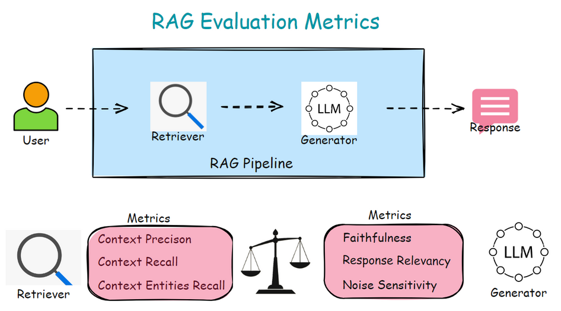

# RAG evaluation metrics overview

## Introduction

RAG helps to reduce hallucinations in LLM generated responses by retrieving relevant context from external knowledge sources.  RAG consists of two core components: the retriever and the generator. Retriever fetches the information relevant to the user query from external knowledge sources and Generator generates the desired answer based on the query and the relevant retrieved information. 

## Evaluating RAG Retriever

The retriever based on the input query, fetches the relevant information from external knowledge sources. This ensures that generator (LLM) has access to  up-to-date and pertinent data.  

Evaluating the retriever is essential because its performance directly impacts the quality of the generated output.  If  retriever fails to retrieve relevant or complete context, the LLM may produce inaccurate or irrelevant answers.

Some of the popular metrics for RAG retriever evaluation are context precision, context recall and context entities recall.

| Metric | Inputs | Type | Assesses |
| --- | --- | --- | --- |
| Context Precision | Context, Reference | Reference Dependent | Retriever’s ability to rank relevant chunks higher in the retrieved context. |
| Context Recall | Context, Reference | Reference Dependent | Retriever’s ability to fetch the  pieces of information (claims) in the reference. |
| Context Entities Recall | Context, Reference | Reference Dependent | Retriever’s ability to fetch the entities in the reference. |

## Evaluating RAG Generator

The generator, typically a large language model, takes the retrieved information and the user query to generate  appropriate response.

Evaluating the RAG generator is crucial because its performance determines the accuracy, relevance, and reliability of the final output. A poorly functioning generator can produce misleading or incoherent responses, even with perfectly retrieved context.

Some of the popular metrics for RAG Generator evaluation are faithfulness, response relevancy, relevant noise sensitivity and irrelevant noise sensitivity.

| Metric | Inputs | Type | Assesses |
| --- | --- | --- | --- |
| Faithfulness | Response, Context | Reference Free | How much factually consistent is the generated response with the retrieved context.  |
| Response Relevancy | Response, Query | Reference Free | How much relevant is the generated response to the user query.  |
| Relevant Noise Sensitivity | Response, Context, Reference | Reference Dependent | Generator's sensitivity to noise (incorrect claims) in relevant retrieved context. |
| Irrelevant Noise Sensitivity | Response, Context, Reference | Reference Dependent | Generator's sensitivity to noise (incorrect claims) in irrelevant retrieved context. |
