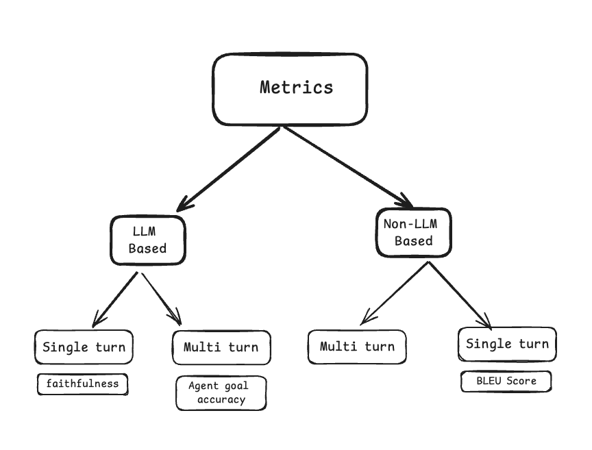

# Overview of Metrics

A metric is a quantitative measure used to evaluate the performance of a AI application. Metrics help in assessing how well the application and individual components that makes up application is performing relative to the given test data. They provide a numerical basis for comparison, optimization, and decision-making throughout the application development and deployment process. Metrics are crucial for:

1. **Component Selection**: Metrics can be used to compare different components of the AI application like LLM, Retriever, Agent configuration, etc with your own data and select the best one from different options.
2. **Error Diagnosis and Debugging**: Metrics help identify which part of the application is causing errors or suboptimal performance, making it easier to debug and refine.
3. **Continuous Monitoring and Maintenance**: Metrics enable the tracking of an AI application’s performance over time, helping to detect and respond to issues such as data drift, model degradation, or changing user requirements.


## Different types of metrics

<figure markdown="span">
  {width="600"}
  <figcaption>Metrics Mind map</figcaption>
</figure>

**Metrics can be classified into two categories based on the mechanism used underneath the hood**:

&nbsp;&nbsp;&nbsp;&nbsp; **LLM-based metrics**: These metrics use LLM underneath to do the evaluation. There might be one or more LLM calls that are performed to arrive at the score or result. These metrics can be somewhat non deterministic as the LLM might not always return the same result for the same input. On the other hand, these metrics has shown to be more accurate and closer to human evaluation.

All LLM based metrics in ragas are inherited from `MetricWithLLM` class. These metrics expects a [LLM]() object to be set before scoring.

```python
from ragas.metrics import FactualCorrectness
scorer = FactualCorrectness(llm=evaluation_llm)
```

Each LLM based metrics also will have prompts associated with it written using [Prompt Object]().


&nbsp;&nbsp;&nbsp;&nbsp; **Non-LLM-based metrics**: These metrics do not use LLM underneath to do the evaluation. These metrics are deterministic and can be used to evaluate the performance of the AI application without using LLM. These metrics rely on traditional methods to evaluate the performance of the AI application, such as string similarity, BLEU score, etc. Due to the same, these metrics are known to have a lower correlation with human evaluation.

All LLM based metrics in ragas are inherited from `Metric` class. 

**Metrics can be broadly classified into two categories based on the type of data they evaluate**:

&nbsp;&nbsp;&nbsp;&nbsp; **Single turn metrics**: These metrics evaluate the performance of the AI application based on a single turn of interaction between the user and the AI. All metrics in ragas that supports single turn evaluation are inherited from `SingleTurnMetric` class and scored using `single_turn_ascore` method. It also expects a [Single Turn Sample]() object as input.

```python
from ragas.metrics import FactualCorrectness

metric = FactualCorrectness()
await metric.single_turn_ascore(sample)
```

&nbsp;&nbsp;&nbsp;&nbsp; **Multi-turn metrics**: These metrics evaluate the performance of the AI application based on multiple turns of interaction between the user and the AI. All metrics in ragas that supports multi turn evaluation are inherited from `MultiTurnMetric` class and scored using `multi_turn_ascore` method. It also expects a [Multi Turn Sample]() object as input.

```python
from ragas.metrics import AgentGoalAccuracy
from ragas import MultiTurnSample

scorer = AgentGoalAccuracy()
await metric.multi_turn_ascore(sample)
```

## Metric Design Principles

Designing effective metrics for AI applications requires following to a set of core principles to ensure their reliability, interpretability, and relevance. Here are five key principles we follow in ragas when designing metrics:

**1. Single-Aspect Focus**  
A single metric should target only one specific aspect of the AI application's performance. This ensures that the metric is both interpretable and actionable, providing clear insights into what is being measured.

**2. Intuitive and Interpretable**  
Metrics should be designed to be easy to understand and interpret. Clear and intuitive metrics make it simpler to communicate results and draw meaningful conclusions.

**3. Effective Prompt Flows**  
When developing metrics using large language models (LLMs), use intelligent prompt flows that align closely with human evaluation. Decomposing complex tasks into smaller sub-tasks with specific prompts can improve the accuracy and relevance of the metric.

**4. Robustness**  
Ensure that LLM-based metrics include sufficient few-shot examples that reflect the desired outcomes. This enhances the robustness of the metric by providing context and guidance for the LLM to follow.

**5.Consistent Scoring Ranges**  
It is crucial to normalize metric score values or ensure they fall within a specific range, such as 0 to 1. This facilitates comparison between different metrics and helps maintain consistency and interpretability across the evaluation framework.

These principles serve as a foundation for creating metrics that are not only effective but also practical and meaningful in evaluating AI applications.
