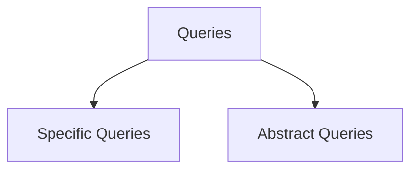
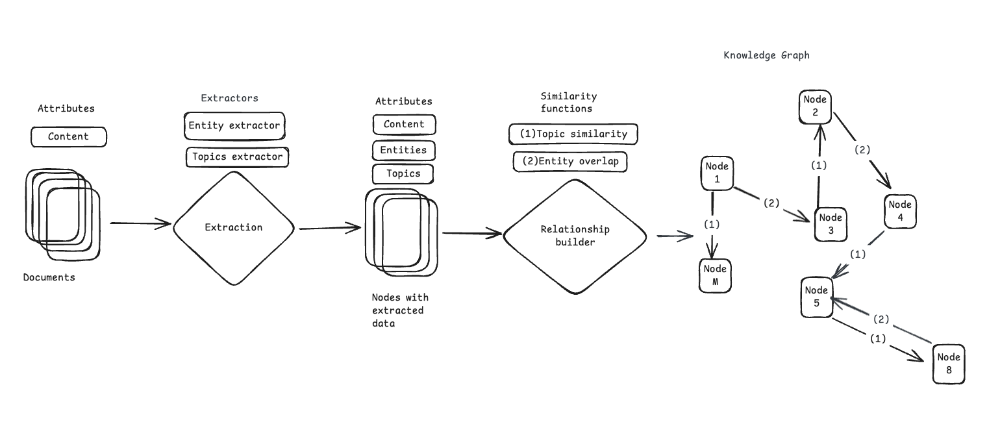
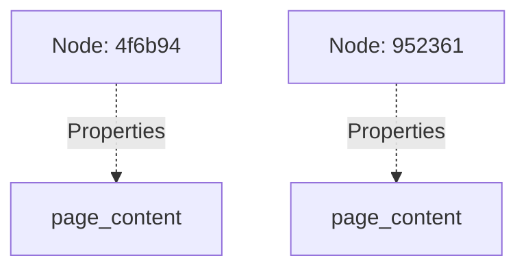
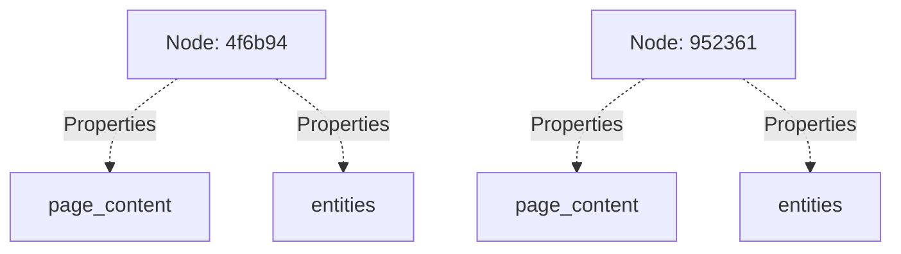
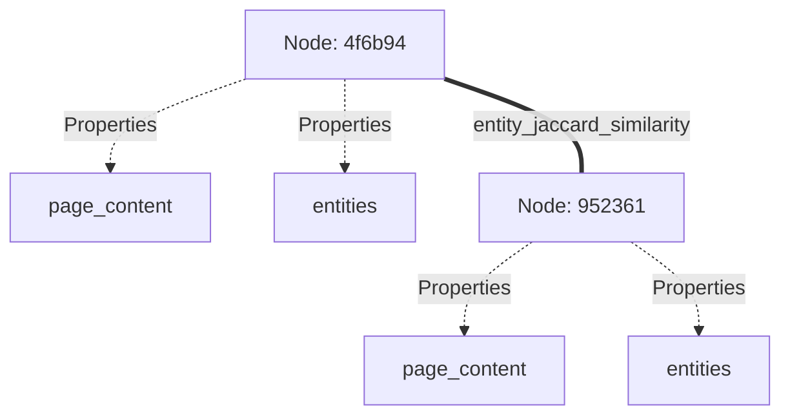
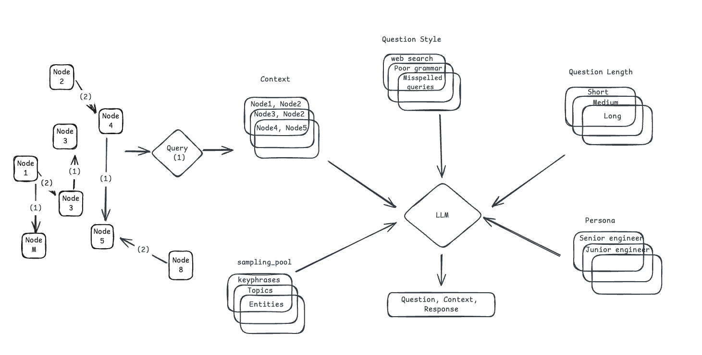

# Testset Generation for RAG

In RAG application, when a user interacts through your application to a set of documents the user may ask different types of queries. These queries in terms of a RAG system can be generally classified into two types:

## Two fundamental query types in RAG



In any RAG application, when an end user interacts with the system, the queries can be broadly classified into two types:

- Specific Queries
    - Queries directly answerable by referring to single context
    - “What is the value of X in Report FY2020 ?”

- Abstract Queries

    - Queries that can only be answered by referring to multiple documents
    - “What is the the revenue trend for Company X from FY2020 through FY2023?”


Synthesizing specific queries is relatively easy as it requires only a single context to generate the query. However, abstract queries require multiple contexts to generate the query.** Now the fundamental question is how select the right set of chunks to generate the abstract queries**. Different types of abstract queries require different types of contexts. For example, 

- Abstract queries comparing two entities in a specific domain require contexts that contain information about the entities.
    - “Compare the revenue growth of Company X and Company Y from FY2020 through FY2023”
- Abstract queries about the a topic discussed in different contexts require contexts that contain information about the topic.
    - “What are the different strategies used by companies to increase revenue?”


To solve this problem, Ragas uses a Knowledge Graph based approach to Test set Generation.

## Knowledge Graph Creation

Given that we want to manufacture different types of queries from the given set of documents, our major challenge is to identify the right set of chunks or documents to enable LLMs to create the queries. To solve this problem, Ragas uses a Knowledge Graph based approach to Test set Generation. 

<figure markdown="span">
  {width="auto"}
  <figcaption>knowledge graph creation</figcaption>
</figure>


The knowledge graph is created by using the following components:

### Document Splitter
    
The documents are chunked to form hierarchial nodes. The chunking can be done by using different splitters. For example, in the case of financial documents, the chunking can be done by using the splitter that splits the document based on the sections like Income Statement, Balance Sheet, Cash Flow Statement etc. You can write your own [custom splitters]() to split the document based on the sections that are relevant to your domain.

####  Example

```python
from ragas.testset.graph import Node

sample_nodes = [Node(
    properties={"page_content": "Einstein's theory of relativity revolutionized our understanding of space and time. It introduced the concept that time is not absolute but can change depending on the observer's frame of reference."}
),Node(
    properties={"page_content": "Time dilation occurs when an object moves close to the speed of light, causing time to pass slower relative to a stationary observer. This phenomenon is a key prediction of Einstein's special theory of relativity."}
)]
sample_nodes
```
Output:
```bash
[Node(id: 4f6b94, type: , properties: ['page_content']),
 Node(id: 952361, type: , properties: ['page_content'])]
```



### Extractors

Different extractors are used to extract information from each nodes that can be used to establish the relationship between the nodes. For example, in the case of financial documents, the extractor that can be used are entity extractor to extract the entities like Company Name, Keyphrase extractor to extract important key phrases present in each node, etc. You can write your own [custom extractors]() to extract the information that is relevant to your domain.

Extractors can be LLM based which are inherited from `LLMBasedExtractor` or rule based which are inherited from `Extractor`.

#### Example

Let's say we have a sample node from the knowledge graph. We can use the `NERExtractor` to extract the named entities from the node.

```python
from ragas.testset.transforms.extractors import NERExtractor

extractor = NERExtractor()
output = [await extractor.extract(node) for node in sample_nodes]
output[0]
```
Returns a tuple of the type of the extractor and the extracted information.

```bash
('entities',
 {'ORG': [],
  'LOC': [],
  'PER': ['Einstein'],
  'MISC': ['theory of relativity',
   'space',
   'time',
   "observer's frame of reference"]})
```

Let's add the extracted information to the node.

```python
_ = [node.properties.update({key:val}) for (key,val), node in zip(output, sample_nodes)]
sample_nodes[0].properties
```

Output:
```bash
{'page_content': "Einstein's theory of relativity revolutionized our understanding of space and time. It introduced the concept that time is not absolute but can change depending on the observer's frame of reference.",
 'entities': {'ORG': [],
  'LOC': [],
  'PER': ['Einstein'],
  'MISC': ['theory of relativity',
   'space',
   'time',
   "observer's frame of reference"]}}
```




### Relationship builder

The extracted information is used to establish the relationship between the nodes. For example, in the case of financial documents, the relationship can be established between the nodes based on the entities present in the nodes.
You can write your own [custom relationship builder]() to establish the relationship between the nodes based on the information that is relevant to your domain.

#### Example 

```python
from ragas.testset.graph import KnowledgeGraph
from ragas.testset.transforms.relationship_builders.cosine import JaccardSimilarityBuilder

kg = KnowledgeGraph(nodes=sample_nodes)
rel_builder = JaccardSimilarityBuilder(property_name="entities", key_name="PER", new_property_name="entity_jaccard_similarity")
relationships = await rel_builder.transform(kg)
relationships
```
Output:
```bash
[Relationship(Node(id: 4f6b94) <-> Node(id: 952361), type: jaccard_similarity, properties: ['entity_jaccard_similarity'])]
```
Since both the nodes have the same entity "Einstein", the relationship is established between the nodes based on the entity similarity.



Now let's understand how to build the knowledge graph using the above components with a `transform`, that would make your job easier.

### Transforms 

All of the components used to build the knowledge graph can be combined into a single `transform` that can be applied to the knowledge graph to build the knowledge graph. Transforms is made of up of a list of components that are applied to the knowledge graph in a sequence. It can also handle parallel processing of the components. The `apply_transforms` method is used to apply the transforms to the knowledge graph.

#### Example
Let's build the above knowledge graph using the above components with a `transform`.
```python
from ragas.testset.transforms import apply_transforms
transforms = [
    extractor,
    rel_builder
    ]

apply_transforms(kg,transforms)
```


To apply few of the components in parallel, you can wrap them in `Parallel` class.

```python
from ragas.testset.transforms import KeyphraseExtractor, NERExtractor
from ragas.testset.transforms import apply_transforms, Parallel

tranforms = [
    Parallel(
        KeyphraseExtractor(),
        NERExtractor()
    ),
    rel_builder
]

apply_transforms(kg,transforms)
```


Once the knowledge graph is created, the different types of queries can be generated by traversing the graph. For example, to generate the query “Compare the revenue growth of Company X and Company Y from FY2020 through FY2023”, the graph can be traversed to find the nodes that contain the information about the revenue growth of Company X and Company Y from FY2020 through FY2023. 

## Scenario Generation

Now we have the knowledge graph that can be used to manufacture the right context to generate any type of query. When a population of users interact with RAG system, they may formulate the queries in various ways depending upon their persona (eg, Senior Engineer, Junior Engineer, etc), Query length (Short, Long, etc), Query style (Formal, Informal, etc). To generate the queries that cover all these scenarios, Ragas uses a Scenario based approach to Test set Generation.

Each `Scenario` in Test set Generation is a combination of following parameters. 

- Nodes : The nodes that are used to generate the query
- Query Length : The length of the desired query, it can be short, medium or long, etc. 
- Query Style : The style of the query, it can be  web search, chat, etc.
- Persona : The persona of the user, it can be Senior Engineer, Junior Engineer, etc. (Coming soon)

<figure markdown="span">
  {width="auto"}
  <figcaption>Scenario in Test Generation</figcaption>
</figure>


### Query Synthesizer

The `QuerySynthesizer` is responsible for generating different scenarios for a single query type. The `generate_scenarios` method is used to generate the scenarios for a single query type. The `generate_sample` method is used to generate the query and reference answer for a single scenario. Let's understand this with an example. 

#### Example

In the previous example, we have created a knowledge graph that contains two nodes that are related to each other based on the entity similarity. Now imagine that you have 20 such pairs of nodes in your KG that are related to each other based on the entity similarity. 

Imagine your goal is to create 50 different queries where each query is about some abstract question comparing two entities. We first have to query the KG to get the pairs of nodes that are related to each other based on the entity similarity. Then we have to generate the scenarios for each pair of nodes untill we get 50 different scenarios. This logic is implemented in `generate_scenarios` method.


```python
from dataclasses import dataclass
from ragas.testset.synthesizers.base_query import QuerySynthesizer

@dataclass
class EntityQuerySynthesizer(QuerySynthesizer):

    async def _generate_scenarios( self, n, knowledge_graph, callbacks):
        """
        logic to query nodes with entity
        logic describing how to combine nodes,styles,length,persona to form n scenarios
        """

        return scenarios

    async def _generate_sample(
        self, scenario, callbacks
    ):

        """
        logic on how to use tranform each scenario to EvalSample (Query,Context,Reference)
        you may create singleturn or multiturn sample
        """

        return SingleTurnSample(user_input=query, reference_contexs=contexts, reference=reference)
```