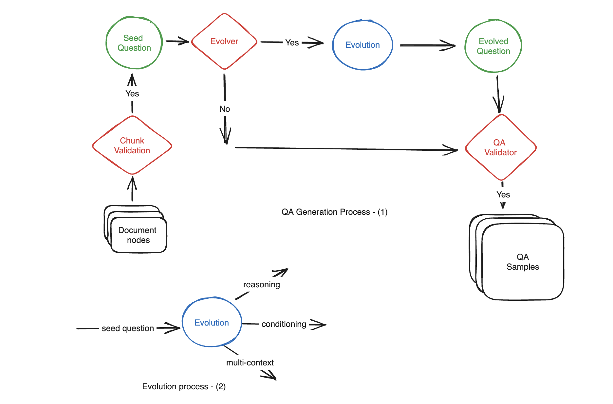
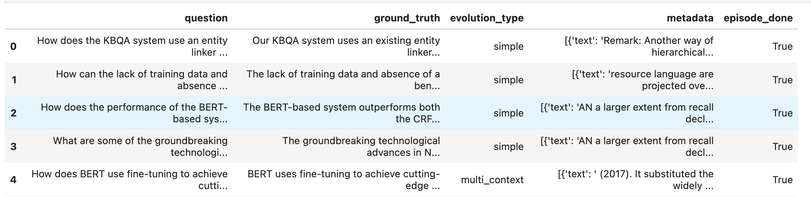

(testset-generation)=
# Synthetic Test Data generation 

## Why synthetic test data?

Evaluating RAG (Retrieval-Augmented Generation) augmented pipelines is crucial for assessing their performance. However, manually creating hundreds of QA (Question-Context-Answer) samples from documents can be time-consuming and labor-intensive. Additionally, human-generated questions may struggle to reach the level of complexity required for a thorough evaluation, ultimately impacting the quality of the assessment. **By using synthetic data generation developer time in data aggregation process can be reduced by 90%**. 

## How does Ragas differ in test data generation?

Ragas takes a novel approach to evaluation data generation. An ideal evaluation dataset should encompass various types of questions encountered in production, including questions of varying difficulty levels. LLMs by default are not good at creating diverse samples as it tends to follow common paths. Inspired by works like [Evol-Instruct](https://arxiv.org/abs/2304.12244), Ragas achieves this by employing an evolutionary generation paradigm, where **questions with different characteristics such as reasoning, conditioning, multi-context, and more are systematically crafted from the provided set of documents**. This approach ensures comprehensive coverage of the performance of various components within your pipeline, resulting in a more robust evaluation process.

<p align="center">

</p>


### In-Depth Evolution

Large Language Models (LLMs) possess the capability to transform simple questions into more complex ones effectively. To generate medium to hard samples from the provided documents, we employ the following methods:

- **Reasoning:** Rewrite the question in a way that enhances the need for reasoning to answer it effectively.

- **Conditioning:** Modify the question to introduce a conditional element, which adds complexity to the question.

- **Multi-Context:** Rephrase the question in a manner that necessitates information from multiple related sections or chunks to formulate an answer.

Moreover, our paradigm extends its capabilities to create conversational questions from the given documents:

- **Conversational:** A portion of the questions, following the evolution process, can be transformed into conversational samples. These questions simulate a chat-based question-and-follow-up interaction, mimicking a chat-Q&A pipeline.

```{note}
Moving forward, we are will be expanding the range of evolution techniques to offer even more diverse evaluation possibilities
```


## Example

```{code-block} python
:caption: loading documents using langchain
from langchain.document_loaders import PubMedLoader

loader = PubMedLoader("liver", load_max_docs=10)
documents = loader.load()
```
Checkout [langchain](https://python.langchain.com/docs/modules/data_connection/document_loaders/) document loaders to see more examples

```{code-block} python
:caption: loading documents using llama-index
from llama_index import download_loader

SemanticScholarReader = download_loader("SemanticScholarReader")
loader = SemanticScholarReader()
query_space = "large language models"
documents = loader.load_data(query=query_space,full_text=True,limit=10)
```
Checkout [llama-index](https://gpt-index.readthedocs.io/en/stable/core_modules/data_modules/connector/root.html) document loaders to see more examples


```{code-block} python
:caption: Customising test data distribution 
from ragas.testset.generator import TestsetGenerator
from ragas.testset.evolutions import simple, reasoning, multi_context
from langchain_openai import ChatOpenAI, OpenAIEmbeddings

# documents = load your documents

# generator with openai models
generator_llm = ChatOpenAI(model="gpt-3.5-turbo-16k")
critic_llm = ChatOpenAI(model="gpt-4")
embeddings = OpenAIEmbeddings()

generator = TestsetGenerator.from_langchain(
    generator_llm,
    critic_llm,
    embeddings
)

# Change resulting question type distribution
distributions = {
    simple: 0.5,
    multi_context: 0.4,
    reasoning: 0.1
}

# use generator.generate_with_llamaindex_docs if you use llama-index as document loader
testset = generator.generate_with_langchain_docs(documents, 10, distributions) 
testset.to_pandas()

```

```{code-block} python 
:caption: Export the results into pandas
test_df = testset.to_pandas()
test_df.head()
```

<p align="left">

</p>


## Analyze question types

 Analyze the frequency of different question types in the created dataset


<p align="left">

</p>
