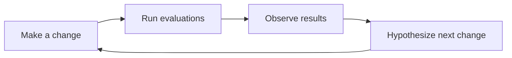

# Experiments

## What is an experiment?

An experiment is a deliberate change made to your application to test a hypothesis or idea. For example, in a Retrieval-Augmented Generation (RAG) system, you might replace the retriever model to evaluate how a new embedding model impacts chatbot responses.

### Principles of a Good Experiment

1. **Define measurable metrics**: Use metrics like accuracy, precision, or recall to quantify the impact of your changes.
2. **Systematic result storage**: Ensure results are stored in an organized manner for easy comparison and tracking.
3. **Isolate changes**: Make one change at a time to identify its specific impact. Avoid making multiple changes simultaneously, as this can obscure the results.
4. **Iterative process**: Follow a structured approach: *Make a change → Run evaluations → Observe results →


## Experiments in Ragas

### Components of an Experiment

1. **Test dataset**: The data used to evaluate the system.
2. **Application endpoint**: The application, component or model being tested.
3. **Metrics**: Quantitative measures to assess performance.

### Execution Process

Running an experiment involves:

1. Executing the dataset against the application endpoint.
2. Calculating metrics to quantify performance.
3. Returning and storing the results.

## Using the `@experiment` Decorator

The `@experiment` decorator in Ragas simplifies the orchestration, scaling, and storage of experiments. Here's an example:

```python
from ragas_experimental import experiment

# Define your metric and dataset
my_metric = ...
dataset = ...

@experiment
async def my_experiment(row):
    # Process the query through your application
    response = my_app(row.query)
    
    # Calculate the metric
    metric = my_metric.score(response, row.ground_truth)
    
    # Return results
    return {**row, "response": response, "accuracy": metric.value}

# Run the experiment
my_experiment.arun(dataset)
```

## Result Storage

Once executed, Ragas processes each row in the dataset, runs it through the function, and stores the results in the `experiments` folder. The storage backend can be configured based on your preferences.