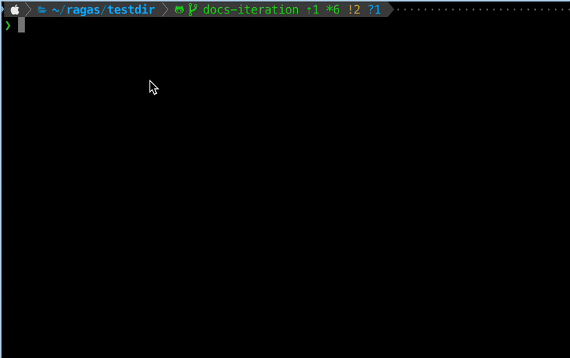
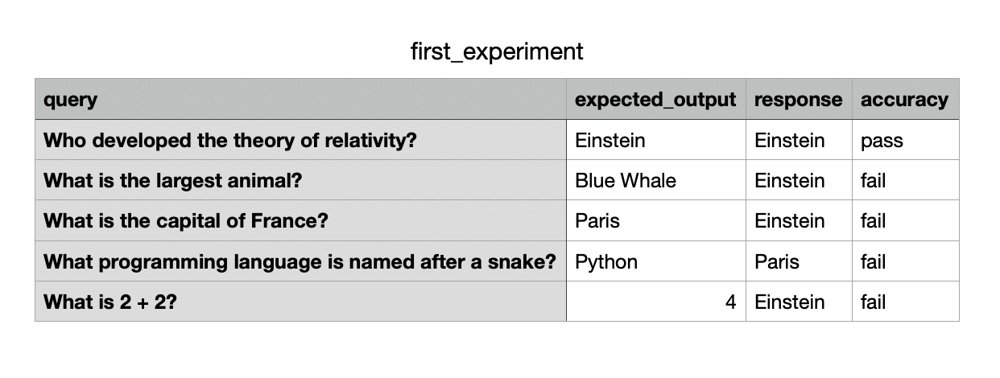

# Ragas Experimental

A framework for applying Evaluation-Driven Development (EDD) to AI applications.

The goal of Ragas Experimental is to evolve Ragas into a general-purpose evaluation framework for AI applications. It helps teams design, run, and reason about evaluations across any AI workflow. Beyond tooling, it provides a mental model for thinking about evaluations not just as a diagnostic tool, but as the backbone of iterative improvement.

# ✨ Introduction


<div class="grid cards" markdown>

- 🚀 **Tutorials**

    Step-by-step guides to help you get started with Ragas Experimental. Learn how to evaluate AI applications like RAGs and agents with practical examples.

    [:octicons-arrow-right-24: Tutorials](tutorials/index.md)

- 📚 **Core Concepts**

    A deeper dive into the principles of evaluation and how Ragas Experimental supports evaluation-driven development for AI applications.

    [:octicons-arrow-right-24: Core Concepts](core_concepts/index.md)

</div>


## Hello World 👋



1\. Install Ragas Experimental with local backend

```bash
pip install ragas-experimental && pip install "ragas-experimental[local]"
```

2\. Copy this snippet to a file named `hello_world.py` and run `python hello_world.py` 


```python
import numpy as np
from ragas_experimental import experiment, Dataset
from ragas_experimental.metrics import MetricResult, discrete_metric  

# Define a custom metric for accuracy
@discrete_metric(name="accuracy_score", allowed_values=["pass", "fail"])
def accuracy_score(response: str, expected: str):
    result = "pass" if expected.lower().strip() == response.lower().strip() else "fail"
    return MetricResult(value=result, reason=f"Match: {result == 'pass'}")

# Mock application endpoint that simulates an AI application response
def mock_app_endpoint(**kwargs) -> str:
    return np.random.choice(["Paris", "4", "Blue Whale", "Einstein", "Python"])

# Create an experiment that uses the mock application endpoint and the accuracy metric
@experiment()
async def run_experiment(row):
    response = mock_app_endpoint(query=row.get("query"))
    accuracy = accuracy_score.score(response=response, expected=row.get("expected_output"))
    return {**row, "response": response, "accuracy": accuracy.value}

if __name__ == "__main__":
    import asyncio
    
    # Create dataset inline
    dataset = Dataset(name="test_dataset", backend="local/csv", root_dir=".")
    test_data = [
        {"query": "What is the capital of France?", "expected_output": "Paris"},
        {"query": "What is 2 + 2?", "expected_output": "4"},
        {"query": "What is the largest animal?", "expected_output": "Blue Whale"},
        {"query": "Who developed the theory of relativity?", "expected_output": "Einstein"},
        {"query": "What programming language is named after a snake?", "expected_output": "Python"},
    ]
    
    for sample in test_data:
        dataset.append(sample)
    dataset.save()
    
    # Run experiment
    results = asyncio.run(run_experiment.arun(dataset, name="first_experiment"))
```

3\. Check your current directory structure to see the created dataset and experiment results.

```bash
tree .
```

Output:

```
├── datasets
│   └── test_dataset.csv
└── experiments
    └── first_experiment.csv
```

4\. View the results of your first experiment

```bash
open experiments/first_experiment.csv
```

Output:

