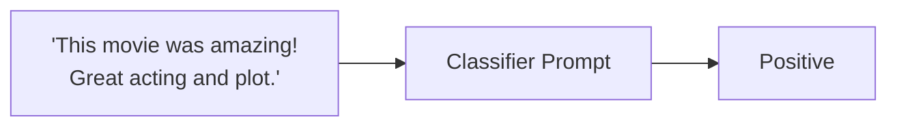

# Prompt Evaluation

In this tutorial, we will write a simple evaluation pipeline to evaluate a prompt that is part of an AI system, here a movie review sentiment classifier. At the end of this tutorial you’ll learn how to evaluate and iterate on a single prompt using evaluation driven development. 




We will start by testing a simple prompt that classifies movie reviews as positive or negative. 

First, make sure you have installed ragas examples and setup your OpenAI API key:

```bash
pip install ragas_experimental[examples]
export OPENAI_API_KEY = "your_openai_api_key"
```

Now test the prompt:

```bash
python -m ragas_examples.prompt_evals.prompt
```

This will test the input `"The movie was fantastic and I loved every moment of it!"` and should output `"positive"`.

> **💡 Quick Start**: If you want to see the complete evaluation in action, you can jump straight to the [end-to-end command](#running-the-example-end-to-end) that runs everything and generates the CSV results automatically.

Next, we will write down few sample inputs and expected outputs for our prompt. Then convert them to a CSV file. 

```python
import pandas as pd

samples = [{"text": "I loved the movie! It was fantastic.", "label": "positive"},
    {"text": "The movie was terrible and boring.", "label": "negative"},
    {"text": "It was an average film, nothing special.", "label": "positive"},
    {"text": "Absolutely amazing! Best movie of the year.", "label": "positive"}]
pd.DataFrame(samples).to_csv("datasets/test_dataset.csv", index=False)
```

Now we need to have a way to measure the performance of our prompt in this task. We will define a metric that will compare the output of our prompt with the expected output and outputs pass/fail based on it. 

```python
from ragas_experimental.metrics import discrete_metric
from ragas_experimental.metrics.result import MetricResult

@discrete_metric(name="accuracy", allowed_values=["pass", "fail"])
def my_metric(prediction: str, actual: str):
    """Calculate accuracy of the prediction."""
    return MetricResult(value="pass", reason="") if prediction == actual else MetricResult(value="fail", reason="")
```

Next, we will write the experiment loop that will run our prompt on the test dataset and evaluate it using the metric, and store the results in a csv file. 

```python
from ragas_experimental import experiment

@experiment()
async def run_experiment(row):
    
    response = run_prompt(row["text"])
    score = my_metric.score(
        prediction=response,
        actual=row["label"]
    )

    experiment_view = {
        **row,
        "response":response,
        "score":score.result,
    }
    return experiment_view
```

Now whenever you make a change to your prompt, you can run the experiment and see how it affects the performance of your prompt. 


## Running the example end to end

1. Setup your OpenAI API key
```bash
export OPENAI_API_KEY = "your_openai_api_key"
```
2. Run the evaluation
```bash
python -m ragas_examples.prompt_evals.evals
```

This will:

- Create the test dataset with sample movie reviews
- Run the sentiment classification prompt on each sample  
- Evaluate the results using the accuracy metric
- Export everything to a CSV file with the results

Voila! You have successfully run your first evaluation using Ragas. You can now inspect the results by opening the `experiments/experiment_name.csv` file.