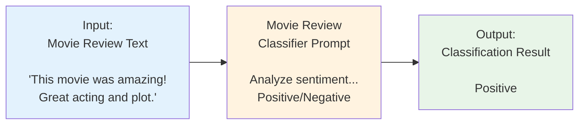

# Prompt Evaluation

At the end of this tutorial you’ll learn how to iterate on a single prompt using evaluation driven development. 




Setup your OpenAI API key

```bash
export OPENAI_API_KEY = "your_openai_api_key"
```


