# Evaluate a simple RAG system

In this tutorial, we will write a simple evaluation pipeline to evaluate a RAG (Retrieval-Augmented Generation) system. At the end of this tutorial, you’ll learn how to evaluate and iterate on a RAG system using evaluation-driven development.

```mermaid
flowchart LR
    A["Query<br/>'What is Ragas 0.3?'"] --> B[Retrieval System]
    
    C[Document Corpus<br/> Ragas 0.3 Docs📄] --> B
    
    B --> D[LLM + Prompt]
    A --> D
    
    D --> E[Final Answer]
```



We will start by writing a simple RAG system that retrieves relevant documents from a corpus and generates an answer using an LLM.

```bash
python -m ragas_examples.rag_eval.rag
```


Next, we will write down a few sample queries and expected outputs for our RAG system. Then convert them to a CSV file.

```python
import pandas as pd

samples = [
    {"query": "What is Ragas 0.3?", "grading_notes": "- Ragas 0.3 is a library for evaluating LLM applications."},
    {"query": "How to install Ragas?", "grading_notes": "- install from source  - install from pip using ragas_experimental"},
    {"query": "What are the main features of Ragas?", "grading_notes": "organised around - experiments - datasets - metrics."}
]
pd.DataFrame(samples).to_csv("datasets/test_dataset.csv", index=False)
```

To evaluate the performance of our RAG system, we will define a llm based metric that compares the output of our RAG system with the grading notes and outputs pass/fail based on it.

```python
from ragas_experimental.metrics import DiscreteMetric
my_metric = DiscreteMetric(
    name="correctness",
    prompt = "Check if the response contains points mentioned from the grading notes and return 'pass' or 'fail'.\nResponse: {response} Grading Notes: {grading_notes}",
    values=["pass", "fail"],
)
```

Next, we will write the experiment loop that will run our RAG system on the test dataset and evaluate it using the metric, and store the results in a CSV file.

```python
@experiment()
async def run_experiment(row):
    response = rag_client.query(row["question"])
    
    score = my_metric.score(
        llm=llm,
        response=response.get("answer", " "),
        grading_notes=row["grading_notes"]
    )

    experiment_view = {
        **row,
        "response": response,
        "score": score.result,
        "log_file": response.get("logs", " "),
    }
    return experiment_view
```

Now whenever you make a change to your RAG pipeline, you can run the experiment and see how it affects the performance of your RAG. 

## Running the example end to end

1. Setup your OpenAI API key

```bash
export OPENAI_API_KEY = "your_openai_api_key"
```

2. Run the evaluation

```bash
python -m ragas_examples.rag_evals.evals
```

Voila! You have successfully run your first evaluation using Ragas. You can now inspect the results by opening the `experiments/experiment_name.csv` file