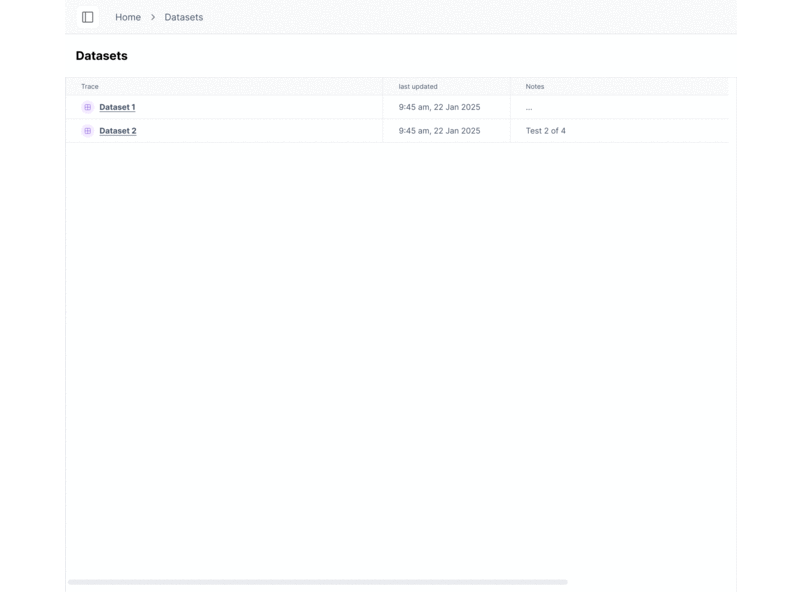

# Evaluate a simple LLM application

The purpose of this guide is to illustrate a simple workflow for testing and evaluating an LLM application with `ragas`. It assumes minimum knowledge in AI application building and evaluation. Please refer to our [installation instruction](./install.md) for installing `ragas`


## Evaluation

In this guide, you will evaluate a **text summarization pipeline**. The goal is to ensure that the output summary accurately captures all the key details specified in the text, such as growth figures, market insights, and other essential information.

`ragas` offers a variety of methods for analyzing the performance of LLM applications, referred to as [metrics](../concepts/metrics/available_metrics/index.md). Each metric requires a predefined set of data points, which it uses to calculate scores that indicate performance.

### Evaluating using a Non-LLM Metric

Here is a simple example that uses `BleuScore` score to score summary

```python
from ragas import SingleTurnSample
from ragas.metrics import BleuScore

test_data = {
    "user_input": "summarise given text\nThe company reported an 8% rise in Q3 2024, driven by strong performance in the Asian market. Sales in this region have significantly contributed to the overall growth. Analysts attribute this success to strategic marketing and product localization. The positive trend in the Asian market is expected to continue into the next quarter.",
    "response": "The company experienced an 8% increase in Q3 2024, largely due to effective marketing strategies and product adaptation, with expectations of continued growth in the coming quarter.",
    "reference": "The company reported an 8% growth in Q3 2024, primarily driven by strong sales in the Asian market, attributed to strategic marketing and localized products, with continued growth anticipated in the next quarter."
}
metric = BleuScore()
test_data = SingleTurnSample(**test_data)
metric.single_turn_score(test_data)
```

Output
```
0.137
```

Here we used:

- A test sample containing `user_input`, `response` (the output from the LLM), and `reference` (the expected output from the LLM) as data points to evaluate the summary.
- A non-LLM metric called [BleuScore](../concepts/metrics/available_metrics/traditional.md#bleu-score)


As you may observe, this approach has two key limitations:

- **Time-Consuming Preparation:** Evaluating the application requires preparing the expected output (`reference`) for each input, which can be both time-consuming and challenging.

- **Inaccurate Scoring:** Even though the `response` and `reference` are similar, the output score was low. This is a known limitation of non-LLM metrics like `BleuScore`. 


!!! info
    A **non-LLM metric** refers to a metric that does not rely on an LLM for evaluation.

To address these issues, let's try an LLM-based metric.


### Evaluating using a LLM based Metric


**Choose your LLM**
--8<--
choose_evaluator_llm.md
--8<--

**Evaluation**


Here we will use [AspectCritic](../concepts/metrics/available_metrics/aspect_critic.md), which an LLM based metric that outputs pass/fail given the evaluation criteria.


```python
from ragas import SingleTurnSample
from ragas.metrics import AspectCritic

test_data = {
    "user_input": "summarise given text\nThe company reported an 8% rise in Q3 2024, driven by strong performance in the Asian market. Sales in this region have significantly contributed to the overall growth. Analysts attribute this success to strategic marketing and product localization. The positive trend in the Asian market is expected to continue into the next quarter.",
    "response": "The company experienced an 8% increase in Q3 2024, largely due to effective marketing strategies and product adaptation, with expectations of continued growth in the coming quarter.",
}

metric = AspectCritic(name="summary_accuracy",llm=evaluator_llm, definition="Verify if the summary is accurate.")
test_data = SingleTurnSample(**test_data)
await metric.single_turn_ascore(test_data)

```

Output
```
1
```

Success! Here 1 means pass and 0 means fail

!!! info
    There are many other types of metrics that are available in ragas (with and without `reference`), and you may also create your own metrics if none of those fits your case. To explore this more checkout [more on metrics](../concepts/metrics/index.md). 

### Evaluating on a Dataset

In the examples above, we used only a single sample to evaluate our application. However, evaluating on just one sample is not robust enough to trust the results. To ensure the evaluation is reliable, you should add more test samples to your test data.

Here, we’ll load a dataset from Hugging Face Hub, but you can load data from any source, such as production logs or other datasets. Just ensure that each sample includes all the required attributes for the chosen metric.

In our case, the required attributes are:  
- **`user_input`**: The input provided to the application (here the input text report).  
- **`response`**: The output generated by the application (here the generated summary).

For example

```python
[
    # Sample 1
    {
        "user_input": "summarise given text\nThe Q2 earnings report revealed a significant 15% increase in revenue, ...",
        "response": "The Q2 earnings report showed a 15% revenue increase, ...",
    },
    # Additional samples in the dataset
    ....,
    # Sample N
    {
        "user_input": "summarise given text\nIn 2023, North American sales experienced a 5% decline, ...",
        "response": "Companies are strategizing to adapt to market challenges and ...",
    }
]
```

```python
from datasets import load_dataset
from ragas import EvaluationDataset
eval_dataset = load_dataset("explodinggradients/earning_report_summary",split="train")
eval_dataset = EvaluationDataset.from_hf_dataset(eval_dataset)
print("Features in dataset:", eval_dataset.features())
print("Total samples in dataset:", len(eval_dataset))
```

Output
```
Features in dataset: ['user_input', 'response']
Total samples in dataset: 50
```

Evaluate using dataset

```python
from ragas import evaluate

results = evaluate(eval_dataset, metrics=[metric])
results
```

Output
```
{'summary_accuracy': 0.84}
```

This score shows that out of all the samples in our test data, only 84% of summaries passes the given evaluation criteria. Now, **It
s important to see why is this the case**.

Export the sample level scores to pandas dataframe

```python
results.to_pandas()
```

Output
```
	user_input	                                        response	                                        summary_accuracy
0	summarise given text\nThe Q2 earnings report r...	The Q2 earnings report showed a 15% revenue in...	1
1	summarise given text\nIn 2023, North American ...	Companies are strategizing to adapt to market ...	1
2	summarise given text\nIn 2022, European expans...	Many companies experienced a notable 15% growt...	1
3	summarise given text\nSupply chain challenges ...	Supply chain challenges in North America, caus...	1
```

Viewing the sample-level results in a CSV file, as shown above, is fine for quick checks but not ideal for detailed analysis or comparing results across evaluation runs. 

### Want help in improving your AI application using evals?

In the past 2 years, we have seen and helped improve many AI applications using evals. 

We are compressing this knowledge into a product to replace vibe checks with eval loops so that you can focus on building great AI applications.

If you want help with improving and scaling up your AI application using evals.


🔗 Book a [slot](https://bit.ly/3EBYq4J) or drop us a line: [founders@explodinggradients.com](mailto:founders@explodinggradients.com).





## Up Next

- [Evaluate a simple RAG application](rag_eval.md)