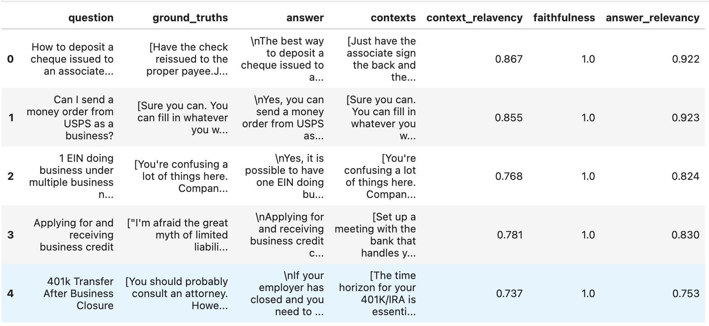

(get-started-evaluation)=
# Evaluating Using Your Test Set

Once your test set is ready (whether you've created your own or used the [synthetic test set generation module](get-started-testset-generation)), it's time to evaluate your RAG pipeline. This guide assists you in setting up Ragas as quickly as possible, enabling you to focus on enhancing your Retrieval Augmented Generation pipelines while this library ensures that your modifications are improving the entire pipeline.

This guide utilizes OpenAI for running some metrics, so ensure you have your OpenAI key ready and available in your environment.

```python
import os
os.environ["OPENAI_API_KEY"] = "your-openai-key"
```
:::{note}
By default, these metrics use OpenAI's API to compute the score. If you're using this metric, ensure that you've set the environment key `OPENAI_API_KEY` with your API key. You can also try other LLMs for evaluation, check the [Bring your own LLM guide](../howtos/customisations/bring-your-own-llm-or-embs.md) to learn more.
:::

Let's begin with the data.

## The Data

For this tutorial, we'll use an example dataset from one of the baselines we created for the [Amnesty QA](https://huggingface.co/datasets/explodinggradients/amnesty_qa) dataset. The dataset contains the following columns:

- question: `list[str]` - These are the questions your RAG pipeline will be evaluated on.
- context: `list[list[str]]` - The contexts which were passed into the LLM to answer the question.
- ground_truth: `list[str]` - The ground truth answer to the questions.

An ideal test data set should contain samples that closely mirror your real-world use case.

```{code-block} python
:caption: import sample dataset
from datasets import load_dataset

# loading the V2 dataset
amnesty_qa = load_dataset("explodinggradients/amnesty_qa", "english_v2")
amnesty_qa
```

:::{seealso}
See [test set generation](./testset_generation.md) to learn how to generate your own `Question/Context/Ground_Truth` triplets for evaluation.
See [preparing your own dataset](../howtos/applications/data_preparation.md) to learn how to prepare your own dataset for evaluation.
:::

## Metrics

Ragas provides several metrics to evaluate various aspects of your RAG systems:

1. Retriever: Offers `context_precision` and `context_recall` that measure the performance of your retrieval system.
2. Generator (LLM): Provides `faithfulness` that measures hallucinations and `answer_relevancy` that measures how relevant the answers are to the question.

There are numerous other metrics available in Ragas, check the [metrics guide](ragas-metrics) to learn more.

Now, let's import these metrics and understand more about what they denote.

```{code-block} python
:caption: import metrics
from ragas.metrics import (
    answer_relevancy,
    faithfulness,
    context_recall,
    context_precision,
)
```
Here we're using four metrics, but what do they represent?

1. Faithfulness - Measures the factual consistency of the answer to the context based on the question.
2. Context_precision - Measures how relevant the retrieved context is to the question, conveying the quality of the retrieval pipeline.
3. Answer_relevancy - Measures how relevant the answer is to the question.
4. Context_recall - Measures the retriever's ability to retrieve all necessary information required to answer the question.

To explore other metrics, check the [metrics guide](ragas-metrics).

## Evaluation

Running the evaluation is as simple as calling `evaluate` on the `Dataset` with your chosen metrics.

```{code-block} python
:caption: evaluate using sample dataset
from ragas import evaluate

result = evaluate(
    amnesty_qa["eval"],
    metrics=[
        context_precision,
        faithfulness,
        answer_relevancy,
        context_recall,
    ],
)

result
```
There you have it, all the scores you need.

If you want to delve deeper into the results and identify examples where your pipeline performed poorly or exceptionally well, you can convert it into a pandas DataFrame and use your standard analytics tools!

```{code-block} python
:caption: export results
df = result.to_pandas()
df.head()
```
<p align="left">

</p>

That's all!

If you have any suggestions, feedback, or issues, please share them in the [issue section](https://github.com/explodinggradients/ragas/issues). We value your input.
