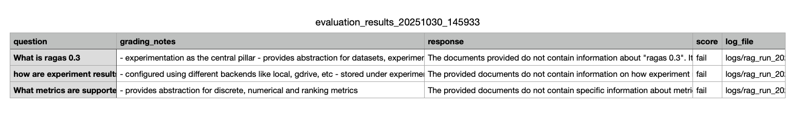

# Quick Start: Get Evaluations Running in a Flash

Get started with Ragas in minutes. Create a complete evaluation project with just a few commands.

## Step 1: Create Your Project

Choose one of the following methods:

=== "uvx (Recommended)"
    No installation required. `uvx` automatically downloads and runs ragas:

    ```sh
    uvx ragas quickstart rag_eval
    cd rag_eval
    ```

=== "Install Ragas First"
    Install ragas first, then create the project:

    ```sh
    pip install ragas
    ragas quickstart rag_eval
    cd rag_eval
    ```

## Step 2: Install Dependencies

Install the project dependencies:

```sh
uv sync
```

Or if you prefer `pip`:

```sh
pip install -e .
```

## Step 3: Set Your API Key

By default, the quickstart example uses OpenAI. Set your API key and you're ready to go. You can also use some other provider with a minor change:

=== "OpenAI (Default)"
    ```sh
    export OPENAI_API_KEY="your-openai-key"
    ```

    The quickstart project is already configured to use OpenAI. You're all set!

=== "Anthropic Claude"
    Set your Anthropic API key:

    ```sh
    export ANTHROPIC_API_KEY="your-anthropic-key"
    ```

    Then update the LLM initialization in `evals.py`:

    ```python
    from anthropic import Anthropic
    from ragas.llms import llm_factory

    client = Anthropic(api_key=os.environ.get("ANTHROPIC_API_KEY"))
    llm = llm_factory("claude-3-5-sonnet-20241022", provider="anthropic", client=client)
    ```

=== "Google Gemini"
    Set up your Google credentials:

    ```sh
    export GOOGLE_API_KEY="your-google-api-key"
    ```

    Then update the LLM initialization in `evals.py`:

    ```python
    import google.generativeai as genai
    from ragas.llms import llm_factory

    genai.configure(api_key=os.environ.get("GOOGLE_API_KEY"))
    client = genai.GenerativeModel("gemini-1.5-pro")
    llm = llm_factory("gemini-1.5-pro", provider="google", client=client)
    ```

=== "Local Models (Ollama)"
    Install and run Ollama locally, then update the LLM initialization in `evals.py`:

    ```python
    from openai import OpenAI
    from ragas.llms import llm_factory

    # Create an OpenAI-compatible client for Ollama
    client = OpenAI(
        api_key="ollama",  # Ollama doesn't require a real key
        base_url="http://localhost:11434/v1"
    )
    llm = llm_factory("mistral", provider="openai", client=client)
    ```

=== "Custom / Other Providers"
    For any LLM with OpenAI-compatible API:

    ```python
    from openai import OpenAI
    from ragas.llms import llm_factory

    client = OpenAI(
        api_key="your-api-key",
        base_url="https://your-api-endpoint"
    )
    llm = llm_factory("model-name", provider="openai", client=client)
    ```

    For more details, learn about [LLM integrations](../concepts/metrics/index.md).

## Project Structure

Your generated project includes:

```sh
rag_eval/
├── README.md              # Project documentation
├── pyproject.toml         # Project configuration
├── rag.py                 # Your RAG application
├── evals.py               # Evaluation workflow
├── __init__.py            # Makes this a Python package
└── evals/
    ├── datasets/          # Test data files
    ├── experiments/       # Evaluation results
    └── logs/              # Execution logs
```

## Step 4: Run Your Evaluation

Run the evaluation script:

```sh
uv run python evals.py
```

Or if you installed with `pip`:

```sh
python evals.py
```

The evaluation will:
- Load test data from the `load_dataset()` function in `evals.py`
- Query your RAG application with test questions
- Evaluate responses
- Display results in the console
- Save results to CSV in the `evals/experiments/` directory



Congratulations! You have a complete evaluation setup running. 🎉

---

## Customize Your Evaluation

### Add More Test Cases

Edit the `load_dataset()` function in `evals.py` to add more test questions:

```python
from ragas import Dataset

def load_dataset():
    """Load test dataset for evaluation."""
    dataset = Dataset(
        name="test_dataset",
        backend="local/csv",
        root_dir=".",
    )

    data_samples = [
        {
            "question": "What is Ragas?",
            "grading_notes": "Ragas is an evaluation framework for LLM applications",
        },
        {
            "question": "How do metrics work?",
            "grading_notes": "Metrics evaluate the quality and performance of LLM responses",
        },
        # Add more test cases here
    ]

    for sample in data_samples:
        dataset.append(sample)

    dataset.save()
    return dataset
```

### Customize Evaluation Metrics

The template includes a `DiscreteMetric` for custom evaluation logic. You can customize the evaluation by:

1. **Modify the metric prompt** - Change the evaluation criteria
2. **Adjust allowed values** - Update valid output categories
3. **Add more metrics** - Create additional metrics for different aspects

Example of modifying the metric:

```python
from ragas.metrics import DiscreteMetric
from ragas.llms import llm_factory

my_metric = DiscreteMetric(
    name="custom_evaluation",
    prompt="Evaluate this response: {response} based on: {context}. Return 'excellent', 'good', or 'poor'.",
    allowed_values=["excellent", "good", "poor"],
)
```

## What's Next?

- **Learn the concepts**: Read the [Evaluate a Simple LLM Application](evals.md) guide for deeper understanding
- **Custom metrics**: [Write your own metrics](../howtos/customizations/metrics/_write_your_own_metric.md) tailored to your use case
- **Production integration**: [Integrate evaluations into your CI/CD pipeline](../howtos/index.md)
- **RAG evaluation**: Evaluate [RAG systems](rag_eval.md) with specialized metrics
- **Agent evaluation**: Explore [AI agent evaluation](../howtos/applications/text2sql.md)
- **Test data generation**: [Generate synthetic test datasets](rag_testset_generation.md) for your evaluations

## Getting Help

- 📚 [Full Documentation](https://docs.ragas.io/)
- 💬 [Join our Discord Community](https://discord.gg/5djav8GGNZ)
- 🐛 [Report Issues](https://github.com/explodinggradients/ragas/issues)
