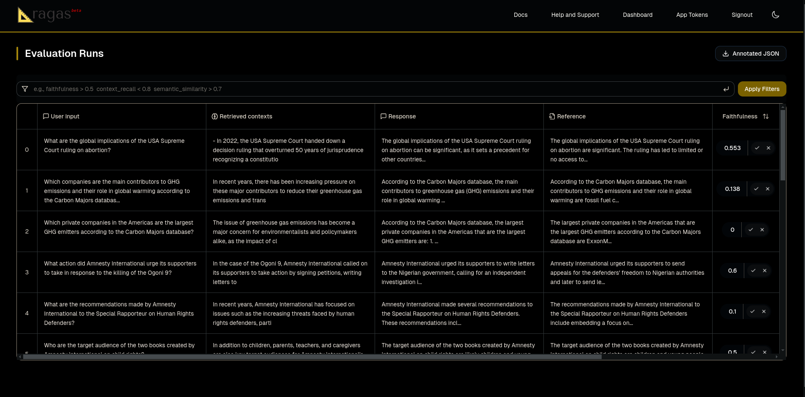

## Run ragas metrics for evaluating RAG

In this tutorial, we will take a sample [test dataset](https://huggingface.co/datasets/explodinggradients/amnesty_qa), select a few of the [available metrics](../concepts/metrics/available_metrics/index.md) that Ragas offers, and evaluate a simple RAG pipeline. 

### Working with Data

The dataset used here is from [Amnesty QA RAG](https://huggingface.co/datasets/explodinggradients/amnesty_qa) that contains the necessary data points we need for this tutorial. Here I am loading it from huggingface hub, but you may use file from any source. 

```python
from datasets import load_dataset
dataset = load_dataset(
    "explodinggradients/amnesty_qa",
    "english_v3",
    trust_remote_code=True
)
```

Load the dataset into Ragas EvaluationDataset object. 

```python
from ragas import EvaluationDataset

eval_dataset = EvaluationDataset.from_hf_dataset(dataset["eval"])
```


### Selecting required metrics
Ragas offers a [wide variety of metrics](../concepts/metrics/available_metrics/index.md/#retrieval-augmented-generation) that one can select from to evaluate LLM applications. You can also build your own metrics on top of ragas. For this tutorial, we will select a few metrics that are commonly used to evaluate single turn RAG systems.

```python
from ragas.metrics import LLMContextRecall, Faithfulness, FactualCorrectness, SemanticSimilarity
from ragas import evaluate
```

Since all of the metrics we have chosen are LLM-based metrics, we need to choose the evaluator LLMs we want to use for evaluation.

### Choosing evaluator LLM

--8<--
choose_evaluator_llm.md
--8<--


### Running Evaluation

```python
metrics = [
    LLMContextRecall(llm=evaluator_llm), 
    FactualCorrectness(llm=evaluator_llm), 
    Faithfulness(llm=evaluator_llm),
    SemanticSimilarity(embeddings=evaluator_embeddings)
]
results = evaluate(dataset=eval_dataset, metrics=metrics)
```

### Analyzing results

You can use the `to_pandas()` method to get a pandas dataframe of the results and do various analysis on it.

```python
df = results.to_pandas()
df.head()
```


Once you have evaluated, you may want to view, analyse and share results. For this you can use app.ragas.io or any other similar tools available for you in the [Integrations](../howtos/integrations/index.md) section.

In order to use the [app.ragas.io](http://app.ragas.io) dashboard, you need to have an account on [app.ragas.io](https://app.ragas.io/). If you don't have one, you can sign up for one [here](https://app.ragas.io/login). You will also need to generate a [Ragas API key](https://app.ragas.io/settings/api-keys).

Once you have the API key, you can use the `upload()` method to export the results to the dashboard.

```python
import os
os.environ["RAGAS_API_KEY"] = "your_api_key"
results.upload()
```

Now you can view the results in the dashboard by following the link in the output of the `upload()` method.


