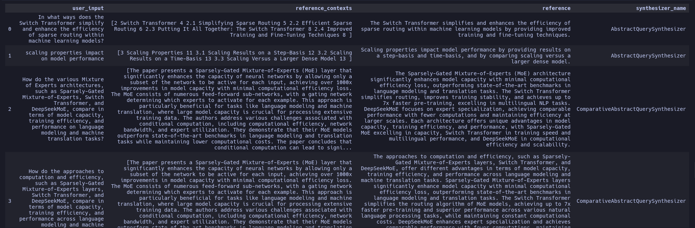

# Testset Generation for RAG

This simple guide will help you generate a testset for evaluating your RAG pipeline using your own documents.

## Quickstart
Let's walk through an quick example of generating a testset for a RAG pipeline. Following that will will explore the main components of the testset generation pipeline.

### Load Sample Documents

For the sake of this tutorial we will use sample documents from this [repository](https://huggingface.co/datasets/explodinggradients/Sample_Docs_Markdown). You can replace this with your own documents.

```bash
git clone https://huggingface.co/datasets/explodinggradients/Sample_Docs_Markdown
```

### Load documents

Now we will load the documents from the sample dataset using `DirectoryLoader`, which is one of document loaders from [langchain_community](https://python.langchain.com/v0.1/docs/modules/data_connection/document_loaders/). You may also use any loaders from [llama_index](https://docs.llamaindex.ai/en/stable/understanding/loading/llamahub/)

```python
from langchain_community.document_loaders import DirectoryLoader

path = "Sample_Docs_Markdown/"
loader = DirectoryLoader(path, glob="**/*.md")
docs = loader.load()
```

### Choose your LLM

You may choose to use any [LLM of your choice](../howtos/customizations/customize_models.md)
--8<--
choose_generator_llm.md
--8<--

### Generate Testset

Now we will run the test generation using the loaded documents and the LLM setup. If you have used `llama_index` to load documents, please use `generate_with_llama_index_docs` method instead.

```python
from ragas.testset import TestsetGenerator

generator = TestsetGenerator(llm=generator_llm, embedding_model=generator_embeddings)
dataset = generator.generate_with_langchain_docs(docs, testset_size=10)
```

### Export

You may now export and inspect the generated testset.

```python
dataset.to_pandas()
```




## A Deeper Look

Now that we have a seen how to generate a testset, let's take a closer look at the main components of the testset generation pipeline and how you can quickly customize it.

At the core there are 2 main operations that are performed to generate a testset.

1. **KnowledgeGraph Creation**: We first create a [KnowledgeGraph][ragas.testset.graph.KnowledgeGraph] using the documents you provide and use various [Transformations][ragas.testset.transforms.base.BaseGraphTransformation] to enrich the knowledge graph with additional information that we can use to generate the testset. You can learn more about this from the [core concepts section](../concepts/test_data_generation/rag.md#knowledge-graph-creation).
2. **Testset Generation**: We use the [KnowledgeGraph][ragas.testset.graph.KnowledgeGraph] to generate a set of [scenarios][ragas.testset.synthesizers.base.BaseScenario]. These scenarios are used to generate the [testset][ragas.testset.synthesizers.generate.Testset]. You can learn more about this from the [core concepts section](../concepts/test_data_generation/rag.md#scenario-generation).

Now let's see an example of how these components work together to generate a testset.

### KnowledgeGraph Creation

Let's first create a [KnowledgeGraph][ragas.testset.graph.KnowledgeGraph] using the documents we loaded earlier.

```python
from ragas.testset.graph import KnowledgeGraph

kg = KnowledgeGraph()
```
```
KnowledgeGraph(nodes: 0, relationships: 0)
```

and then add the documents to the knowledge graph.

```python
from ragas.testset.graph import Node, NodeType

for doc in docs:
    kg.nodes.append(
        Node(
            type=NodeType.DOCUMENT,
            properties={"page_content": doc.page_content, "document_metadata": doc.metadata}
        )
    )
```
```
KnowledgeGraph(nodes: 10, relationships: 0)
```

Now we will enrich the knowledge graph with additional information using [Transformations][ragas.testset.transforms.base.BaseGraphTransformation]. Here we will use [default_transforms][ragas.testset.transforms.default_transforms] to create a set of default transformations to apply with an LLM and Embedding Model of your choice. 
But you can mix and match transforms or build your own as needed.

```python
from ragas.testset.transforms import default_transforms, apply_transforms


# define your LLM and Embedding Model
# here we are using the same LLM and Embedding Model that we used to generate the testset
transformer_llm = generator_llm
embedding_model = generator_embeddings

trans = default_transforms(llm=transformer_llm, embedding_model=embedding_model)
apply_transforms(kg, trans)
```

Now we have a knowledge graph with additional information. You can save the knowledge graph too.

```python
kg.save("knowledge_graph.json")
loaded_kg = KnowledgeGraph.load("knowledge_graph.json")
loaded_kg
```
```
KnowledgeGraph(nodes: 48, relationships: 605)
```

### Testset Generation

Now we will use the `loaded_kg` to create the [TestsetGenerator][ragas.testset.synthesizers.generate.TestsetGenerator].

```python
from ragas.testset import TestsetGenerator

generator = TestsetGenerator(llm=generator_llm, knowledge_graph=loaded_kg)
```

We can also define the distribution of queries we would like to generate. Here lets use the default distribution.

```python
from ragas.testset.synthesizers import default_query_distribution

query_distribution = default_query_distribution(generator_llm)
```
```
[
        (SingleHopSpecificQuerySynthesizer(llm=llm), 0.5),
        (MultiHopAbstractQuerySynthesizer(llm=llm), 0.25),
        (MultiHopSpecificQuerySynthesizer(llm=llm), 0.25),
]
```

Now we can generate the testset.

```python
testset = generator.generate(testset_size=10, query_distribution=query_distribution)
testset.to_pandas()
```


