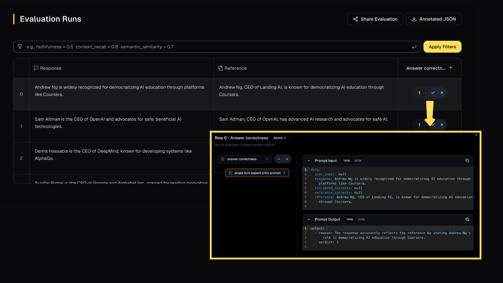

## Debug LLM based metrics using tracing

When evaluating using LLM-based metrics, each metric might make one or more calls to the LLM. These traces are useful for understanding the results and debugging any issues. This notebook shows how to capture and analyze LLM evaluation traces using [app.ragas.io](https://app.ragas.io).

## Evaluation
Do a sample evaluation using one of the LLM based metrics.


```python
from ragas import EvaluationDataset
from ragas import evaluate
from ragas.metrics import AspectCritic

dataset = [
    {
        "response": "Andrew Ng is widely recognized for democratizing AI education through platforms like Coursera.",
        "reference": "Andrew Ng, CEO of Landing AI, is known for democratizing AI education through Coursera.",
    },
    {
        "response": "Sam Altman is the CEO of OpenAI and advocates for safe, beneficial AI technologies.",
        "reference": "Sam Altman, CEO of OpenAI, has advanced AI research and advocates for safe AI.",
    },
    {
        "response": "Demis Hassabis is the CEO of DeepMind, known for developing systems like AlphaGo.",
        "reference": "Demis Hassabis, CEO of DeepMind, is known for developing AlphaGo.",
    },
    {
        "response": "Sundar Pichai is the CEO of Google and Alphabet Inc., praised for leading innovation across Google's product ecosystem.",
        "reference": "Sundar Pichai, CEO of Google and Alphabet Inc., leads innovation across Google's product ecosystem.",
    },
    {
        "response": "Arvind Krishna transformed IBM by focusing on cloud computing and AI solutions.",
        "reference": "Arvind Krishna, CEO of IBM, transformed the company through cloud computing and AI.",
    },
]

evaluation_dataset = EvaluationDataset.from_list(dataset)


metric = AspectCritic(
    name="answer_correctness",
    definition="is the response correct compared to reference",
)

results = evaluate(evaluation_dataset, metrics=[metric])
```
Output
```
Evaluating: 100%|██████████| 5/5 [00:00<?, ?it/s]
```

## Exploring the evaluation traces

To review and debug your evaluations, you can use the [app.ragas.io](https://app.ragas.io) dashboard. First, you’ll need to create an account. If you don't have one, sign up [here](https://app.ragas.io/login). After signing up, generate an [API token](https://app.ragas.io/dashboard/settings/app-tokens).

Once you have the token, set it as an environment variable like this:


```python
import os

os.environ["RAGAS_APP_TOKEN"] = "your_app_token"
```

Then, use the `upload()` method to send the results to the dashboard:


```python
results.upload()
```

Once the upload is complete, you can view the results in the dashboard by following the link provided in the output. Simply click on the scores to access the associated prompt and the LLM calls made.


