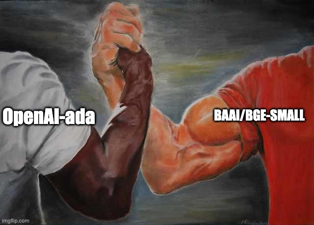

# Compare Embeddings for retriever


The performance of the retriever is a critical and influential factor that determines the overall effectiveness of a Retrieval Augmented Generation (RAG) system. In particular, the quality of the embeddings used plays a pivotal role in determining the quality of the retrieved content.

This tutorial notebook provides a step-by-step guide on how to compare and choose the most suitable embeddings for your own data using the Ragas library.

<p align="center">

</p>


## Create synthetic test data 


Ragas offers a unique test generation paradigm that enables the creation of evaluation datasets specifically tailored to your retrieval and generation tasks. Unlike traditional QA generators, Ragas can generate a wide variety of challenging test cases from your document corpus.

```{seealso}
Refer to [testset generation](../../concepts/testset_generation.md) to know more on how it works.
```

For this tutorial notebook, I am using papers from Semantic Scholar that is related to large language models to build RAG.

```{code-block} python
:caption: load documents using llama-hub and create test data
from llama_index import download_loader
from ragas.testset import TestsetGenerator

SemanticScholarReader = download_loader("SemanticScholarReader")
loader = SemanticScholarReader()
query_space = "large language models"
documents = loader.load_data(query=query_space, limit=100)

testsetgenerator = TestsetGenerator.from_default()
test_size = 30
testset = testsetgenerator.generate(documents, test_size=test_size)
test_df = testset.to_pandas()
test_df.head()
```

<p align="left">

</p>

```{code-block} python
:caption: collect questions and answers
test_questions = test_df['question'].values.tolist()
test_answers = [[item] for item in test_df['answer'].values.tolist()]
```


## Build your RAG

Here I am using llama-index to build a basic RAG pipeline with my documents. The goal here is to collect retrieved contexts and generated answer for each of the test questions from your pipeline. Ragas has integrations with various RAG frameworks which makes evaluating them easier using ragas.

```{note}
refer to [langchain-tutorial]() see how to evaluate using langchain
```

```{code-block} python

import nest_asyncio
from llama_index import VectorStoreIndex, SimpleDirectoryReader, ServiceContext,OpenAIEmbedding
from langchain.embeddings import HuggingFaceEmbeddings
import pandas as pd

nest_asyncio.apply()


def build_query_engine(embed_model):
    vector_index = VectorStoreIndex.from_documents(
        documents, service_context=ServiceContext.from_defaults(chunk_size=512),
        embed_model=embed_model,
    )

    query_engine = vector_index.as_query_engine(similarity_top_k=2)
    return query_engine
```

## Import metrics from ragas

Here we are importing metrics that are required to evaluate retriever component.

```{code-block} python
from ragas.metrics import (
    context_precision,
    context_recall,
)

metrics = [
    context_precision,
    context_recall,
]
```

## Evaluate OpenAI embeddings

```{code-block} python
from ragas.llama_index import evaluate

openai_model = OpenAIEmbedding()
query_engine1 = build_query_engine(openai_model)
result = evaluate(query_engine1, metrics, test_questions, test_answers)
```

```{code-block}
:caption: output
{'ragas_score': 0.3570, 'context_precision': 0.2378, 'context_recall': 0.7159}
```

## Evaluate Bge embeddings

```{code-block} python
from ragas.llama_index import evaluate

flag_model = HuggingFaceEmbeddings(model_name="BAAI/bge-small-en-v1.5")
query_engine2 = build_query_engine(flag_model)
result = evaluate(query_engine2, metrics, test_questions, test_answers)
```

```{code-block}
:caption: output
{'ragas_score': 0.3883, 'context_precision': 0.2655, 'context_recall': 0.7227}

```

## Compare Scores

Based on the evaluation results, it is apparent that the `context_precision` and `context_recall` metrics of the BGE model slightly outperform the OpenAI-Ada model in my RAG pipeline when applied to my own dataset. 

For any further analysis of the scores you can export the results to pandas

```{code-block} python
result_df = result.to_pandas()
result_df.head()
```

<p align="left">

</p>