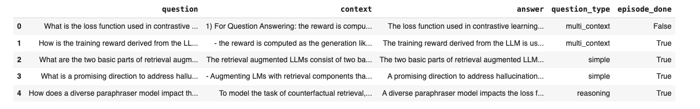
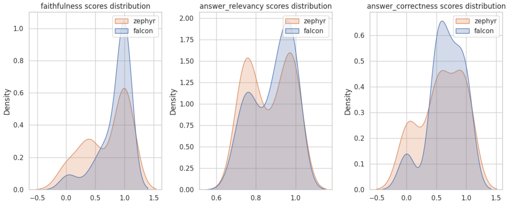

---
search:
  exclude: true
---

# Compare LLMs using Ragas Evaluations

The llm used in the Retrieval Augmented Generation (RAG) system has a major impact in the quality of the generated output. Evaluating the results generated by different llms can give an idea about the right llm to use for a particular use case.

This tutorial notebook provides a step-by-step guide on how to compare and choose the most suitable llm for your own data using the Ragas library.

<figure markdown="span">
{width="800"}
<figcaption>Compare LLMs</figcaption>
</figure>


## Create synthetic test data 


!!! tip
    Ragas can also work with your dataset. Refer to [data preparation](./data_preparation.md) to see how you can use your dataset with ragas. 

Ragas offers a unique test generation paradigm that enables the creation of evaluation datasets specifically tailored to your retrieval and generation tasks. Unlike traditional QA generators, Ragas can generate a wide variety of challenging test cases from your document corpus.

!!! tip
    Refer to [testset generation](../../concepts/testset_generation.md) to know more on how it works.

For this tutorial notebook, I am using papers from Arxiv that is related to large language models to build RAG.

!!! note
    Generate a set of 50+ samples using Testset generator for better results

```python
import os
from llama_index import download_loader, SimpleDirectoryReader
from ragas.testset import TestsetGenerator
from ragas.testset.generator import TestsetGenerator
from ragas.testset.evolutions import simple, reasoning, multi_context
from langchain_openai import ChatOpenAI, OpenAIEmbeddings

os.environ['OPENAI_API_KEY'] = 'Your OPEN AI key'

# load documents
reader = SimpleDirectoryReader("./arxiv-papers/",num_files_limit=30)
documents = reader.load_data()

# generator with openai models
generator_llm = ChatOpenAI(model="gpt-4o-mini")
critic_llm = ChatOpenAI(model="gpt-4o")
embeddings = OpenAIEmbeddings()

generator = TestsetGenerator.from_langchain(
    generator_llm,
    critic_llm,
    embeddings
)

distributions = {
    simple: 0.5,
    multi_context: 0.4,
    reasoning: 0.1
}

# generate testset
testset = generator.generate_with_llama_index_docs(documents, 100,distributions)
testset.to_pandas()
```

<p align="left">

</p>

```python
test_questions = test_df['question'].values.tolist()
test_answers = [[item] for item in test_df['answer'].values.tolist()]
```


## Build your RAG

Here I am using llama-index to build a basic RAG pipeline with my documents. The goal here is to collect retrieved contexts and generated answer for each of the test questions from your pipeline. Ragas has integrations with various RAG frameworks which makes evaluating them easier using ragas.

!!! note
    refer to [langchain-tutorial](../integrations/_langchain.md) see how to evaluate using langchain

```python
import nest_asyncio
from llama_index import VectorStoreIndex, SimpleDirectoryReader, ServiceContext
from llama_index.llms import HuggingFaceInferenceAPI
from llama_index.embeddings import HuggingFaceInferenceAPIEmbedding
import pandas as pd

nest_asyncio.apply()


def build_query_engine(llm):
    vector_index = VectorStoreIndex.from_documents(
        documents, service_context=ServiceContext.from_defaults(chunk_size=512, llm=llm),
        embed_model=HuggingFaceInferenceAPIEmbedding,
    )

    query_engine = vector_index.as_query_engine(similarity_top_k=2)
    return query_engine

# Function to evaluate as Llama index does not support async evaluation for HFInference API
def generate_responses(query_engine, test_questions, test_answers):
  responses = [query_engine.query(q) for q in test_questions]

  answers = []
  contexts = []
  for r in responses:
    answers.append(r.response)
    contexts.append([c.node.get_content() for c in r.source_nodes])
  dataset_dict = {
        "question": test_questions,
        "answer": answers,
        "contexts": contexts,
  }
  if test_answers is not None:
    dataset_dict["ground_truth"] = test_answers
  ds = Dataset.from_dict(dataset_dict)
  return ds
```

## Import metrics from ragas

Here we are importing metrics that are required to evaluate retriever component.

```python
from datasets import Dataset
from ragas import evaluate
from ragas.metrics import (
    faithfulness,
    answer_relevancy,
    answer_correctness,
)

metrics = [
    faithfulness,
    answer_relevancy,
    answer_correctness,
]
```

## Evaluate Zephyr 7B Alpha LLM

For the first llm, I will be using HuggingFace [zephyr-7b-alpha](https://huggingface.co/HuggingFaceH4/zephyr-7b-alpha). I am using HuggingFaceInferenceAPI to generate answers using the model. HuggingFaceInferenceAPI is free to use and token can be setup using [HuggingFaceToken](https://huggingface.co/docs/hub/security-tokens).

```python
# Use zephyr model using HFInference API
zephyr_llm = HuggingFaceInferenceAPI(
    model_name="HuggingFaceH4/zephyr-7b-alpha",
    token="Your Hugging Face token"
)
query_engine1 = build_query_engine(zephyr_llm)
result_ds = generate_responses(query_engine1, test_questions, test_answers)
result_zephyr = evaluate(
    result_ds,
    metrics=metrics,
)

result_zephyr
```

```python
{'faithfulness': 0.8365, 'answer_relevancy': 0.8831, 'answer_correctness': 0.6605}
```

## Evaluate Falcon-7B-Instruct LLM
For the second model to evaluate, I am using [Falcon-7B-Instruct](https://huggingface.co/tiiuae/falcon-7b-instruct). This can also be used with the HuggingFaceInferenceAPI.

```python
falcon_llm = HuggingFaceInferenceAPI(
    model_name="tiiuae/falcon-7b-instruct",
    token="Your Huggingface token"
)
query_engine2 = build_query_engine(falcon_llm)
result_ds_falcon = generate_responses(query_engine2, test_questions, test_answers)
result = evaluate(
    result_ds_falcon,
    metrics=metrics,
)

result
```

```python
{'faithfulness': 0.6909, 'answer_relevancy': 0.8651, 'answer_correctness': 0.5850}
```

## Compare Scores

Based on the evaluation results, it is apparent that the `faithfulness`, `answer_correctness` and `answer_relevancy` metrics of the HuggingFace zephyr-7b-alpha model slightly outperform the falcon-7b-instruct model in my RAG pipeline when applied to my own dataset.

Refer to the complete colab notebook [here](https://colab.research.google.com/drive/10dNeU56XLOGUJ9gRuBFryyRwoy70rIeS?usp=sharing).

```python
import numpy as np
import matplotlib.pyplot as plt

def analysis(zephyr_df, falcon_df):
  sns.set_style("whitegrid")
  fig, axs = plt.subplots(1,3, figsize=(12, 5))
  for i,col in enumerate(zephyr_df.columns):
    sns.kdeplot(data=[zephyr_df[col].values,falcon_df[col].values],legend=False,ax=axs[i],fill=True)
    axs[i].set_title(f'{col} scores distribution')
    axs[i].legend(labels=["zephyr", "falcon"])
  plt.tight_layout()
  plt.show()

result_zephyr_df = result_zephyr.to_pandas()
result_falcon_df = result.to_pandas()
analysis(
    result_zephyr_df[['faithfulness', 'answer_relevancy', 'answer_correctness']],
    result_falcon_df[['faithfulness', 'answer_relevancy', 'answer_correctness']]
) 
```

### Score distribution analysis

<figure markdown="span">
{width="800"}
<figcaption>Compare LLMs</figcaption>
</figure>