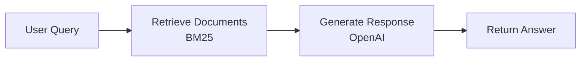
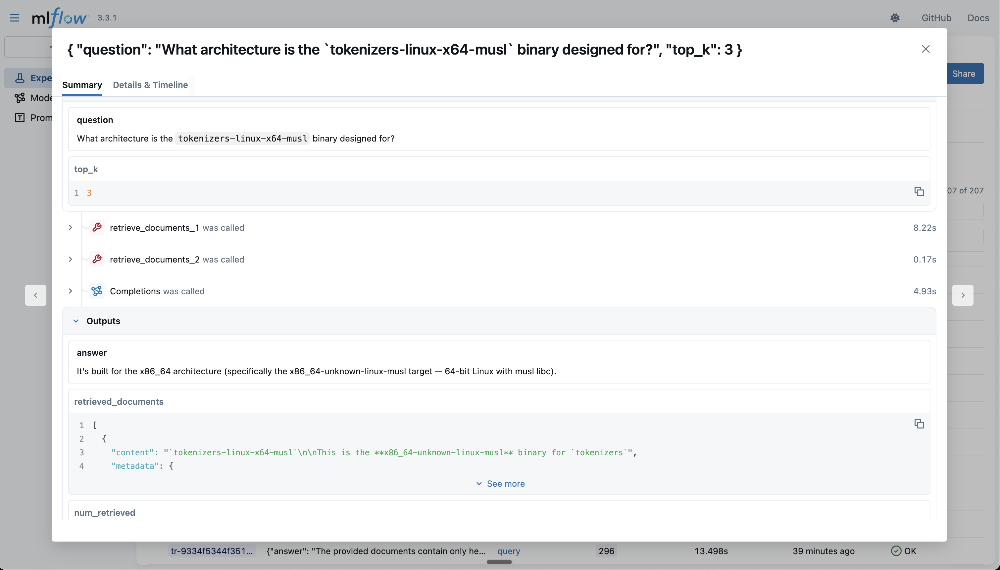
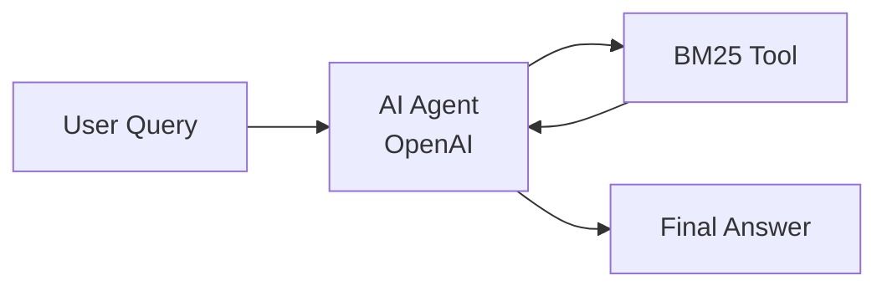

# How to Evaluate and Improve a RAG App

In this guide, you'll learn how to evaluate and iteratively improve a RAG (Retrieval-Augmented Generation) app using Ragas.

## What you'll accomplish
- Set up evaluation dataset
- Establish metrics to measure RAG performance 
- Build a reusable evaluation pipeline
- Analyze errors and systematically improve your RAG app
- Learn how to leverage Ragas for RAG evaluation

## Set up and run the RAG system

We've built a simple RAG system that retrieves relevant documents from the [Hugging Face documentation dataset](https://huggingface.co/datasets/m-ric/huggingface_doc) and generates answers using an LLM. This dataset contains documentation pages for many Hugging Face packages stored as markdown, providing a rich knowledge base for testing RAG capabilities.

The complete implementation is available at: [ragas_examples/improve_rag/](https://github.com/vibrantlabsai/ragas/blob/main/examples/ragas_examples/improve_rag/)



To run this, install the dependencies:

```bash
uv pip install "ragas-examples[improverag]"
```

Then run the RAG app:

```python
import os
import asyncio
from openai import AsyncOpenAI
from ragas_examples.improve_rag.rag import RAG, BM25Retriever

# Set up OpenAI client
os.environ["OPENAI_API_KEY"] = "<your_key>"
openai_client = AsyncOpenAI()

# Create retriever and RAG system
retriever = BM25Retriever()
rag = RAG(openai_client, retriever)

# Query the system
question = "What architecture is the `tokenizers-linux-x64-musl` binary designed for?"
result = await rag.query(question)
print(f"Answer: {result['answer']}")
```
??? note "Output"
    ```python
    Answer: It's built for the x86_64 architecture (specifically the x86_64-unknown-linux-musl target — 64-bit Linux with musl libc).
    ```

??? example "Understanding the RAG implementation"
    The code above uses a simple `RAG` class that demonstrates the core RAG pattern. Here's how it works:

    ```python
    # examples/ragas_examples/improve_rag/rag.py
    from typing import Any, Dict, Optional
    from openai import AsyncOpenAI

    class RAG:
        """Simple RAG system for document retrieval and answer generation."""

        def __init__(self, llm_client: AsyncOpenAI, retriever: BM25Retriever, system_prompt=None, model="gpt-4o-mini", default_k=3):
            self.llm_client = llm_client
            self.retriever = retriever
            self.model = model
            self.default_k = default_k
            self.system_prompt = system_prompt or "Answer only based on documents. Be concise.\n\nQuestion: {query}\nDocuments:\n{context}\nAnswer:"

        async def query(self, question: str, top_k: Optional[int] = None) -> Dict[str, Any]:
            """Query the RAG system."""
            if top_k is None:
                top_k = self.default_k
                
            return await self._naive_query(question, top_k)

        async def _naive_query(self, question: str, top_k: int) -> Dict[str, Any]:
            """Handle naive RAG: retrieve once, then generate."""
            # 1. Retrieve documents using BM25
            docs = self.retriever.retrieve(question, top_k)
            
            if not docs:
                return {"answer": "No relevant documents found.", "retrieved_documents": [], "num_retrieved": 0}
            
            # 2. Build context from retrieved documents
            context = "\n\n".join([f"Document {i}:\n{doc.page_content}" for i, doc in enumerate(docs, 1)])
            prompt = self.system_prompt.format(query=question, context=context)
            
            # 3. Generate response using OpenAI with retrieved context
            response = await self.llm_client.chat.completions.create(
                model=self.model,
                messages=[{"role": "user", "content": prompt}]
            )
            
            return {
                "answer": response.choices[0].message.content.strip(),
                "retrieved_documents": [{"content": doc.page_content, "metadata": doc.metadata, "document_id": i} for i, doc in enumerate(docs)],
                "num_retrieved": len(docs)
            }
    ```

    This shows the essential RAG pattern: **retrieve relevant documents → inject into prompt → generate answer**. 

## Create evaluation dataset

We'll use [huggingface_doc_qa_eval](https://huggingface.co/datasets/m-ric/huggingface_doc_qa_eval), a dataset of questions and answers about Hugging Face documentation. 

Here are a few sample rows from the dataset:

| Question | Expected Answer |
|----------|----------------|
| What architecture is the `tokenizers-linux-x64-musl` binary designed for? | x86_64-unknown-linux-musl |
| What is the purpose of the BLIP-Diffusion model? | The BLIP-Diffusion model is designed for controllable text-to-image generation and editing. |
| What is the purpose of the /healthcheck endpoint in the Datasets server API? | Ensure the app is running |

The evaluation script downloads the dataset from [here](https://raw.githubusercontent.com/vibrantlabsai/ragas/main/examples/ragas_examples/improve_rag/datasets/hf_doc_qa_eval.csv) and converts it into Ragas Dataset format:

```python
# examples/ragas_examples/improve_rag/evals.py
import urllib.request
from pathlib import Path
from ragas import Dataset
import pandas as pd

def download_and_save_dataset() -> Path:
    dataset_path = Path("datasets/hf_doc_qa_eval.csv")
    dataset_path.parent.mkdir(exist_ok=True)
    
    if not dataset_path.exists():
        github_url = "https://raw.githubusercontent.com/vibrantlabsai/ragas/main/examples/ragas_examples/improve_rag/datasets/hf_doc_qa_eval.csv"
        urllib.request.urlretrieve(github_url, dataset_path)
    
    return dataset_path

def create_ragas_dataset(dataset_path: Path) -> Dataset:
    dataset = Dataset(name="hf_doc_qa_eval", backend="local/csv", root_dir=".")
    df = pd.read_csv(dataset_path)
    
    for _, row in df.iterrows():
        dataset.append({"question": row["question"], "expected_answer": row["expected_answer"]})
    
    dataset.save()
    return dataset
```

Learn more about working with datasets in [Core Concepts - Datasets](../../concepts/datasets.md).

## Set up metrics for RAG evaluation

Now that we have our evaluation dataset ready, we need metrics to measure RAG performance. Start with simple, focused metrics that directly measure your core use case. More information on metrics can be found in [Core Concepts - Metrics](../../concepts/metrics/index.md).

Here we use a `correctness` discrete metric that evaluates whether the RAG response contains the key information from the expected answer and is factually accurate based on the provided context.

```python
# examples/ragas_examples/improve_rag/evals.py
from ragas.metrics import DiscreteMetric

# Define correctness metric
correctness_metric = DiscreteMetric(
    name="correctness",
    prompt="""Compare the model response to the expected answer and determine if it's correct.
    
Consider the response correct if it:
1. Contains the key information from the expected answer
2. Is factually accurate based on the provided context
3. Adequately addresses the question asked

Return 'pass' if the response is correct, 'fail' if it's incorrect.

Question: {question}
Expected Answer: {expected_answer}
Model Response: {response}

Evaluation:""",
    allowed_values=["pass", "fail"],
)
```

Now that we have our evaluation metric, we need to run it systematically across our dataset. This is where Ragas experiments come in.

## Create the evaluation experiment

The experiment function runs your RAG system on each data sample and evaluates the response using our correctness metric. More information on experimentation can be found in [Core Concepts - Experimentation](../../concepts/experimentation.md).

The experiment function takes a dataset row containing the question, expected context, and expected answer, then:

1. Queries the RAG system with the question
2. Evaluates the response using the correctness metric  
3. Returns detailed results including scores and reason

```python
# examples/ragas_examples/improve_rag/evals.py
import asyncio
from typing import Dict, Any
from ragas import experiment

@experiment()
async def evaluate_rag(row: Dict[str, Any], rag: RAG, llm) -> Dict[str, Any]:
    """
    Run RAG evaluation on a single row.
    
    Args:
        row: Dictionary containing question and expected_answer
        rag: Pre-initialized RAG instance
        llm: Pre-initialized LLM client for evaluation
        
    Returns:
        Dictionary with evaluation results
    """
    question = row["question"]
    
    # Query the RAG system
    rag_response = await rag.query(question, top_k=4)
    model_response = rag_response.get("answer", "")
    
    # Evaluate correctness asynchronously
    score = await correctness_metric.ascore(
        question=question,
        expected_answer=row["expected_answer"],
        response=model_response,
        llm=llm
    )
    
    # Return evaluation results
    result = {
        **row,
        "model_response": model_response,
        "correctness_score": score.value,
        "correctness_reason": score.reason,
        "mlflow_trace_id": rag_response.get("mlflow_trace_id", "N/A"),  # MLflow trace ID for debugging (explained later)
        "retrieved_documents": [
            doc.get("content", "")[:200] + "..." if len(doc.get("content", "")) > 200 else doc.get("content", "")
            for doc in rag_response.get("retrieved_documents", [])
        ]
    }
    
    return result
```

With our dataset, metrics, and experiment function ready, we can now evaluate our RAG system's performance.

## Run initial RAG experiment

Now let's run the complete evaluation pipeline to get baseline performance metrics for our RAG system:

```python
# Import required components
import asyncio
from datetime import datetime
from ragas_examples.improve_rag.evals import (
    evaluate_rag,
    download_and_save_dataset, 
    create_ragas_dataset,
    get_openai_client,
    get_llm_client
)
from ragas_examples.improve_rag.rag import RAG, BM25Retriever

async def run_evaluation():
    # Download and prepare dataset
    dataset_path = download_and_save_dataset()
    dataset = create_ragas_dataset(dataset_path)
    
    # Initialize RAG components
    openai_client = get_openai_client()
    retriever = BM25Retriever()
    rag = RAG(llm_client=openai_client, retriever=retriever, model="gpt-5-mini", mode="naive")
    llm = get_llm_client()
    
    # Run evaluation experiment
    exp_name = f"{datetime.now().strftime('%Y%m%d-%H%M%S')}_naiverag"
    results = await evaluate_rag.arun(
        dataset, 
        name=exp_name,
        rag=rag,
        llm=llm
    )
    
    # Print results
    if results:
        pass_count = sum(1 for result in results if result.get("correctness_score") == "pass")
        total_count = len(results)
        pass_rate = (pass_count / total_count) * 100 if total_count > 0 else 0
        print(f"Results: {pass_count}/{total_count} passed ({pass_rate:.1f}%)")
    
    return results

# Run the evaluation
results = await run_evaluation()
print(results)
```

This downloads the dataset, initializes the BM25 retriever, runs the evaluation experiment on each sample, and saves detailed results to the `experiments/` directory as CSV files for analysis.


??? note "Output"
    ```python
    Results: 43/66 passed (65.2%)
    Evaluation completed successfully!

    Detailed results:
    Experiment(name=20250924-212541_naiverag,  len=66)
    ```

With a 65.2% pass rate, we now have a baseline. The detailed results CSV in `experiments/` now contains all the data we need for error analysis and systematic improvement.

### Using observability tools for better analysis

For detailed trace analysis, you can use MLflow (as shown in this example) or your preferred observability tool. The experiment results CSV includes both `mlflow_trace_id` and `mlflow_trace_url` for each evaluation:

```python
# In rag.py - capture trace ID after LLM call
trace_id = mlflow.get_last_active_trace_id()
return {
    "answer": response.choices[0].message.content.strip(),
    "mlflow_trace_id": trace_id,
    # ... other fields
}

# In evals.py - include both trace ID and clickable URL
trace_id = rag_response.get("mlflow_trace_id", "N/A")
trace_url = construct_mlflow_trace_url(trace_id) if trace_id != "N/A" else "N/A"

result = {
    **row,
    "model_response": model_response,
    "mlflow_trace_id": trace_id,
    "mlflow_trace_url": trace_url,
    # ... other evaluation fields
}
```

This allows you to:

1. **Analyze results in CSV**: View responses, metric scores and reasons
2. **Deep-dive with traces**: Use the trace ID/trace url to view detailed execution in MLflow UI at [http://127.0.0.1:5000](http://127.0.0.1:5000)

!!! tip "Pro Tip: Add Direct Trace URLs to your evaluation results"
    In this example, we've added `mlflow_trace_url` - a direct clickable link to each trace in MLflow UI. No need to manually copy trace IDs or navigate through the interface. Just click the URL and jump straight to the detailed execution trace for debugging!

The traces help you understand exactly where failures occur - whether in retrieval, generation, or evaluation steps. 

```bash
# Start MLflow server for tracing (optional, in a separate terminal)
uv run mlflow ui --backend-store-uri sqlite:///mlflow.db --port 5000
```

```python
# Configure MLflow for automatic logging
import mlflow

# Set tracking URI (optional, defaults to local)
mlflow.set_tracking_uri("sqlite:///mlflow.db")

# Enable autologging for experiment tracking
mlflow.autolog()
```



## Analyze errors and failure modes

After running the evaluation, examine the results CSV file in the `experiments/` directory to identify patterns in failed cases. Each row includes the `mlflow_trace_id`/`mlflow_trace_url` - to view detailed execution traces in the MLflow UI. Annotate each failure case to understand patterns so that we can improve our app. 

### Analysis of actual failure patterns from our evaluation:

In our example, the core issue is **retrieval failure** - the BM25 retriever is not finding documents that contain the answers. The model correctly follows instructions to say when documents don't contain information, but the wrong documents are being retrieved.

**Poor Document Retrieval Examples**
The BM25 retriever fails to retrieve relevant documents containing the answers:

| Question | Expected Answer | Model Response | Root Cause |
|----------|----------------|----------------|------------|
| "What is the default repository type for create_repo?" | `model` | "The provided documents do not state the default repository type..." | **BM25 missed docs with create_repo details** |
| "What is the purpose of the BLIP-Diffusion model?" | "controllable text-to-image generation and editing" | "The provided documents do not mention BLIP‑Diffusion..." | **BM25 didn't retrieve BLIP-Diffusion docs** |
| "What is the name of the new Hugging Face library for hosting scikit-learn models?" | `Skops` | "The provided documents do not mention or name any new Hugging Face library..." | **BM25 missed Skops documentation** |

Based on this analysis, we can see that retrieval is the primary bottleneck. Let's implement targeted improvements.

## Improve the RAG app

With retrieval identified as the primary bottleneck, we can improve our system in two ways:

**Traditional approaches** focus on better chunking, hybrid search, or vector embeddings. However, since our BM25 retrieval consistently misses relevant documents with single queries, we'll explore an **agentic approach** instead.

**Agentic RAG** lets the AI iteratively refine its search strategy - trying multiple search terms and deciding when it has found sufficient context, rather than relying on one static query.

### Agentic RAG implementation



Run the Agentic RAG app for a sample query:

```python
# Switch to agentic mode
rag_agentic = RAG(openai_client, retriever, mode="agentic")

question = "What architecture is the `tokenizers-linux-x64-musl` binary designed for?"
result = await rag_agentic.query(question)
print(f"Answer: {result['answer']}")
```

??? note "Output"
    ```python
    Answer: It targets x86_64 — i.e. the x86_64-unknown-linux-musl target triple.
    ```

??? example "Understanding the Agentic RAG implementation"
    The Agentic RAG mode uses the OpenAI Agents SDK to create an AI agent with a BM25 retrieval tool:

    ```python
    # Key components from the RAG class when mode="agentic"
    from agents import Agent, Runner, function_tool

    def _setup_agent(self):
        """Setup agent for agentic mode."""
        @function_tool
        def retrieve(query: str) -> str:
            """Search documents using BM25 retriever for a given query."""
            docs = self.retriever.retrieve(query, self.default_k)
            if not docs:
                return "No documents found."
            return "\n\n".join([f"Doc {i}: {doc.page_content}" for i, doc in enumerate(docs, 1)])

        self._agent = Agent(
            name="RAG Assistant",
            model=self.model,
            instructions="Use short keywords to search. Try 2-3 different searches. Only answer based on documents. Be concise.",
            tools=[retrieve]
        )

    async def _agentic_query(self, question: str, top_k: int) -> Dict[str, Any]:
        """Handle agentic mode: agent controls retrieval strategy."""
        result = await Runner.run(self._agent, input=question)
        print(result.answer)
    ```

    Unlike naive mode's single retrieval call, the agent autonomously decides when and how to search - trying multiple keyword combinations until it finds sufficient context.

## Run experiment again and compare results

Now let's evaluate the agentic RAG approach:

```python
# Import required components
import asyncio
from datetime import datetime
from dotenv import load_dotenv

# Load environment variables
load_dotenv()

from ragas_examples.improve_rag.evals import (
    evaluate_rag,
    download_and_save_dataset, 
    create_ragas_dataset,
    get_openai_client,
    get_llm_client
)
from ragas_examples.improve_rag.rag import RAG, BM25Retriever

async def run_agentic_evaluation():
    # Download and prepare dataset
    dataset_path = download_and_save_dataset()
    dataset = create_ragas_dataset(dataset_path)
    
    # Initialize RAG components with agentic mode
    openai_client = get_openai_client()
    retriever = BM25Retriever()
    rag = RAG(llm_client=openai_client, retriever=retriever, model="gpt-5-mini", mode="agentic")
    llm = get_llm_client()
    
    # Run evaluation experiment
    exp_name = f"{datetime.now().strftime('%Y%m%d-%H%M%S')}_agenticrag"
    results = await evaluate_rag.arun(
        dataset, 
        name=exp_name,
        rag=rag,
        llm=llm
    )
    
    # Print results
    if results:
        pass_count = sum(1 for result in results if result.get("correctness_score") == "pass")
        total_count = len(results)
        pass_rate = (pass_count / total_count) * 100 if total_count > 0 else 0
        print(f"Results: {pass_count}/{total_count} passed ({pass_rate:.1f}%)")
    
    return results

# Run the agentic evaluation
results = await run_agentic_evaluation()
print("\nDetailed results:")
print(results)
```

??? note "Agentic RAG evaluation output"
    ```python
    Results: 58/66 passed (87.9%)
    ```

Excellent! We achieved a significant improvement from 65.2% (naive) to 87.9% (agentic) - that's a 22.7 percentage point improvement with the agentic RAG approach!

### Performance Comparison

The agentic RAG approach shows great improvement over the naive RAG baseline:

| Approach | Correctness | Improvement |
|----------|-----------|-------------|
| **Naive RAG** | 65.2% | - |
| **Agentic RAG** | **87.9%** | **+22.7%** |


## Apply this loop to your RAG system

Follow this systematic approach to improve any RAG system:

1. **Create evaluation dataset**: Use real queries from your system or generate synthetic data with LLMs. 

2. **Define metrics**: Choose simple metrics aligned with your use case. Keep it focused.

3. **Run baseline evaluation**: Measure current performance and analyze error patterns to identify systematic failures.

4. **Implement targeted improvements**: Based on error analysis, improve retrieval (chunking, hybrid search), generation (prompts, models), or try agentic approaches.

5. **Compare and iterate**: Test improvements against baseline. Change one thing at a time until accuracy meets business requirements.

The Ragas framework handles orchestration and result aggregation automatically, letting you focus on analysis and improvements rather than building evaluation infrastructure.
