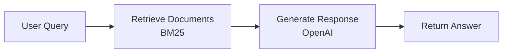
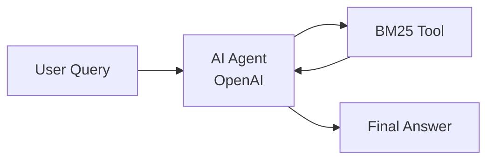

# How to Evaluate and Improve a RAG App

In this guide, you'll learn how to evaluate and iteratively improve a RAG (Retrieval-Augmented Generation) app using Ragas.

## What you'll accomplish
- Set up evaluation dataset
- Establish metrics to measure RAG performance 
- Build a reusable evaluation pipeline
- Analyze errors and systematically improve your RAG app
- Learn how to leverage Ragas for RAG evaluation

## Set up and run the RAG system

We've built a simple RAG system that retrieves relevant documents from the [Hugging Face documentation dataset](https://huggingface.co/datasets/m-ric/huggingface_doc) and generates answers using an LLM. This dataset contains documentation pages for many Hugging Face packages stored as markdown, providing a rich knowledge base for testing RAG capabilities.

The complete implementation is available at: [ragas_examples/improve_rag/](https://github.com/explodinggradients/ragas/blob/main/examples/ragas_examples/improve_rag/)



To run this, install the dependencies:

```bash
uv pip install "ragas-examples[improverag]"
```

Then run the RAG app:

```bash
export OPENAI_API_KEY="<your_key>"
uv run python -m ragas_examples.improve_rag.simple_rag
```
??? note "Output"
    ```bash
    uv run python -m ragas_examples.improve_rag.simple_rag
    ```
    ```bash

    Query: What architecture is the `tokenizers-linux-x64-musl` binary designed for?
    Loading dataset for BM25 retriever...
    Splitting documents for BM25 retriever...
    100%|██████████████████████████████████████████████████████████████████████████████████████████████████████████████| 2647/2647 [00:01<00:00, 1555.56it/s]
    Creating BM25 retriever...

    Answer: It’s built for the x86_64 architecture (specifically the x86_64-unknown-linux-musl target — 64-bit Linux with musl libc).

    Retrieved 3 documents:

    Document 1:
    Content: `tokenizers-linux-x64-musl`

    This is the **x86_64-unknown-linux-musl** binary for `tokenizers`...
    Source: tokenizers

    Document 2:
    Content: ## What are embeddings for?...
    Source: blog

    Document 3:
    Content: - What kind of model is it?
    - What is your model useful for?
    - What data was your model trained on?
    - How well does your model perform?...
    Source: transformers
    ```

??? example "Understanding the RAG implementation"
    The command above runs a `SimpleRAG` app that demonstrates the core RAG pattern. Here's how it works:

    ```python
    # examples/ragas_examples/improve_rag/simple_rag.py
    from typing import Any, Dict, List
    from .retriever import get_bm25_retriever

    class SimpleRAG:
        def __init__(self, openai_client, model="gpt-5-mini"):
            self.openai_client = openai_client
            self.model = model
            # System prompt that tells the LLM how to use retrieved documents
            self.system_prompt = """Answer the following question based on the provided documents. 
            If the documents don't contain enough information to answer the question, say so clearly.
            Be concise in your response.

            Question: {query}

            Documents:
            {context}

            Answer:"""

        def retrieve_documents(self, query: str, top_k: int = 4) -> List[Dict[str, Any]]:
            """Retrieve top-k most relevant documents for the query"""
            retriever = get_bm25_retriever()
            retriever.k = top_k
            retrieved_docs = retriever.invoke(query)
            
            result_docs = []
            for i, doc in enumerate(retrieved_docs[:top_k]):
                result_docs.append({
                    "content": doc.page_content,
                    "metadata": doc.metadata,
                    "document_id": i
                })
            return result_docs

        async def query(self, question: str, top_k: int = 4) -> Dict[str, Any]:
            """Complete RAG pipeline: retrieve documents and generate response"""
            # 1. Retrieve relevant documents using BM25
            retrieved_docs = self.retrieve_documents(question, top_k)
            
            # 2. Build context from retrieved documents  
            context_parts = []
            for i, doc in enumerate(retrieved_docs, 1):
                context_parts.append(f"Document {i}:\n{doc['content']}")
            context = "\n\n".join(context_parts)
            
            # 3. Generate response using OpenAI with retrieved context
            prompt = self.system_prompt.format(query=question, context=context)
            response = await self.openai_client.chat.completions.create(
                model=self.model,
                messages=[{"role": "user", "content": prompt}]
            )
            
            return {
                "answer": response.choices[0].message.content.strip(),
                "retrieved_documents": retrieved_docs,
                "num_retrieved": len(retrieved_docs)
            }
    ```

    This shows the essential RAG pattern: **retrieve relevant documents → inject into prompt → generate answer**. 

## Create evaluation dataset

We'll use [huggingface_doc_qa_eval](https://huggingface.co/datasets/m-ric/huggingface_doc_qa_eval), a dataset of questions and answers about Hugging Face documentation. 

Here are a few sample rows from the dataset:

| Question | Expected Answer |
|----------|----------------|
| What architecture is the `tokenizers-linux-x64-musl` binary designed for? | x86_64-unknown-linux-musl |
| What is the purpose of the BLIP-Diffusion model? | The BLIP-Diffusion model is designed for controllable text-to-image generation and editing. |
| What is the purpose of the /healthcheck endpoint in the Datasets server API? | Ensure the app is running |

The evaluation script downloads the dataset from [here](https://raw.githubusercontent.com/explodinggradients/ragas/main/examples/ragas_examples/improve_rag/datasets/hf_doc_qa_eval.csv) and converts it into Ragas Dataset format:

```python
# examples/ragas_examples/improve_rag/evals.py
import urllib.request
from ragas import Dataset
import pandas as pd

def download_and_save_dataset() -> Path:
    dataset_path = Path("datasets/hf_doc_qa_eval.csv")
    dataset_path.parent.mkdir(exist_ok=True)
    
    if not dataset_path.exists():
        github_url = "https://raw.githubusercontent.com/explodinggradients/ragas/main/examples/ragas_examples/improve_rag/datasets/hf_doc_qa_eval.csv"
        urllib.request.urlretrieve(github_url, dataset_path)
    
    return dataset_path

def create_ragas_dataset(dataset_path: Path) -> Dataset:
    dataset = Dataset(name="hf_doc_qa_eval", backend="local/csv", root_dir=".")
    df = pd.read_csv(dataset_path)
    
    for _, row in df.iterrows():
        dataset.append({"question": row["question"], "expected_answer": row["expected_answer"]})
    
    dataset.save()
    return dataset
```

Learn more about working with datasets in [Core Concepts - Datasets](../../concepts/datasets.md).

## Set up metrics for RAG evaluation

Now that we have our evaluation dataset ready, we need metrics to measure RAG performance. Start with simple, focused metrics that directly measure your core use case. More information on metrics can be found in [Core Concepts - Metrics](../../concepts/metrics/index.md).

Here we use a `correctness` discrete metric that evaluates whether the RAG response contains the key information from the expected answer and is factually accurate based on the provided context.

```python
# examples/ragas_examples/improve_rag/evals.py
from ragas.metrics import DiscreteMetric

# Define correctness metric
correctness_metric = DiscreteMetric(
    name="correctness",
    prompt="""Compare the model response to the expected answer and determine if it's correct.
    
Consider the response correct if it:
1. Contains the key information from the expected answer
2. Is factually accurate based on the provided context
3. Adequately addresses the question asked

Return 'pass' if the response is correct, 'fail' if it's incorrect.

Question: {question}
Expected Answer: {expected_answer}
Model Response: {response}

Evaluation:""",
    allowed_values=["pass", "fail"],
)
```

Now that we have our evaluation metric, we need to run it systematically across our dataset. This is where Ragas experiments come in.

## Create the evaluation experiment

The experiment function runs your RAG system on each data sample and evaluates the response using our correctness metric. More information on experimentation can be found in [Core Concepts - Experimentation](../../concepts/experimentation.md).

The experiment function takes a dataset row containing the question, expected context, and expected answer, then:

1. Queries the RAG system with the question
2. Evaluates the response using the correctness metric  
3. Returns detailed results including scores and reason

```python
# examples/ragas_examples/improve_rag/evals.py
import asyncio
from typing import Dict, Any
from ragas import experiment

@experiment()
async def evaluate_rag(row: Dict[str, Any]) -> Dict[str, Any]:
    """
    Run RAG evaluation on a single row.
    
    Args:
        row: Dictionary containing question and expected_answer
        
    Returns:
        Dictionary with evaluation results
    """
    question = row["question"]
    
    # Get RAG response using async call
    rag_response = await rag_client.query(question, top_k=4)
    model_response = rag_response.get("answer", "")
    
    # Evaluate correctness using async metric scoring
    score = await correctness_metric.ascore(
        question=question,
        expected_answer=row["expected_answer"],
        response=model_response,
        llm=llm
    )
    
    # Return evaluation results
    result = {
        **row,
        "model_response": model_response,
        "correctness_score": score.value,
        "correctness_reason": score.reason,
        "retrieved_documents": [
            doc.get("content", "")[:200] + "..." if len(doc.get("content", "")) > 200 else doc.get("content", "")
            for doc in rag_response.get("retrieved_documents", [])
        ]
    }
    
    return result
```

With our dataset, metrics, and experiment function ready, we can now evaluate our RAG system's performance.

## Run initial RAG experiment

Now let's run the complete evaluation pipeline to get baseline performance metrics for our RAG system:

```bash
# Run the evaluation on 3 samples to test setup
uv run python -m ragas_examples.improve_rag.evals --test
```

This downloads the dataset, initializes the BM25 retriever, runs the evaluation experiment on each sample, and saves detailed results to the `experiments/` directory as CSV files for analysis.

!!! tip "Using observability tools for better analysis"
    For detailed trace analysis, you can use MLflow (as shown in this example) or your preferred observability tool. You can view traces via mlflow UI at [http://127.0.0.1:5000](http://127.0.0.1:5000) to see step-by-step execution, timing, and intermediate results for failed cases

    The traces help you understand exactly where failures occur - whether in retrieval, generation, or evaluation steps. 


```bash
# Start MLflow server for tracing (optional, in a separate terminal)
uv run mlflow ui --backend-store-uri sqlite:///mlflow.db --port 5000

# Full evaluation (will take longer)
uv run python -m ragas_examples.improve_rag.evals
```

??? note "Full evaluation output"
    ```bash
    uv run python -m ragas_examples.improve_rag.evals
    === SimpleRAG Evaluation Pipeline ===

    1. Downloading dataset...
    Dataset already exists at datasets/hf_doc_qa_eval.csv

    2. Creating Ragas dataset...
    Created Ragas dataset with 65 samples

    2.5. Initializing BM25 retriever (this may take a moment)...
    Loading dataset for BM25 retriever...
    Splitting documents for BM25 retriever...
    100%|██████████████████████████████████████████████████████████████████████████████████████████████████████████████| 2647/2647 [00:00<00:00, 6365.97it/s]
    Creating BM25 retriever...
    BM25 retriever initialized successfully!

    3. Running evaluation on 65 samples...
    This may take several minutes depending on the dataset size...
    Running experiment: 100%|████████████████████████████████████████████████████████████████████████████████████████████████| 65/65 [01:17<00:00,  1.19s/it]

    === Evaluation Results ===
    Total samples evaluated: 65
    Passed: 54
    Failed: 11
    Pass rate: 83.1%

    Evaluation completed successfully!
    ```

With an 83.1% pass rate, we have a good baseline. The detailed results CSV in `experiments/` now contains all the data we need for error analysis and systematic improvement.

## Analyze errors and failure modes

After running the evaluation, examine the results CSV file in the `experiments/` directory to identify patterns in failed cases. You can also view the traces in the MLflow UI to see the exact steps that failed. Annotate each failure case to understand patterns so that we can improve our app. 

### Analysis of actual failure patterns from our evaluation:

In our example, the core issue is **retrieval failure** - the BM25 retriever is not finding documents that contain the answers. The model correctly follows instructions to say when documents don't contain information, but the wrong documents are being retrieved.

**Poor Document Retrieval Examples**
The BM25 retriever fails to retrieve relevant documents containing the answers:

| Question | Expected Answer | Model Response | Root Cause |
|----------|----------------|----------------|------------|
| "What is the default repository type for create_repo?" | `model` | "The provided documents do not state the default repository type..." | **BM25 missed docs with create_repo details** |
| "What is the purpose of the BLIP-Diffusion model?" | "controllable text-to-image generation and editing" | "The provided documents do not mention BLIP‑Diffusion..." | **BM25 didn't retrieve BLIP-Diffusion docs** |
| "What is the name of the new Hugging Face library for hosting scikit-learn models?" | `Skops` | "The provided documents do not mention or name any new Hugging Face library..." | **BM25 missed Skops documentation** |

Based on this analysis, we can see that retrieval is the primary bottleneck. Let's implement targeted improvements.

## Improve the RAG app

With retrieval identified as the primary bottleneck, we can improve our system in two ways:

**Traditional approaches** focus on better chunking, hybrid search, or vector embeddings. However, since our BM25 retrieval consistently misses relevant documents with single queries, we'll explore an **agentic approach** instead.

**Agentic RAG** lets the AI iteratively refine its search strategy - trying multiple search terms and deciding when it has found sufficient context, rather than relying on one static query.

### Agentic RAG implementation



Run the Agentic RAG app for a sample query:

```bash
uv run python -m ragas_examples.improve_rag.agentic_rag
```

??? note "Output"
    ```bash
    uv run python -m ragas_examples.improve_rag.agentic_rag

    Question: What architecture is the `tokenizers-linux-x64-musl` binary designed for?

    ==================================================
    Loading dataset for BM25 retriever...
    Splitting documents for BM25 retriever...
    100%|██████████| 2647/2647 [00:00<00:00, 9152.51it/s]
    Creating BM25 retriever...
    Answer: The tokenizers-linux-x64-musl binary is designed for the x86_64 (64-bit Intel/AMD) architecture on Linux systems using the musl libc, which is common in lightweight distributions like Alpine Linux. (Source: tokenizers)
    ```

??? example "Understanding the AgenticRAG implementation"
    The AgenticRAG system uses the OpenAI Agents SDK to create an AI agent with a BM25 retrieval tool:

    ```python
    # Key components from examples/ragas_examples/improve_rag/agentic_rag.py
    from agents import Agent, Runner, function_tool

    @function_tool
    def bm25_retrieve(query: str) -> str:
        """Retrieve relevant documents using BM25 retriever."""
        return self._bm25_retrieve_tool(query)
    
    self.agent = Agent(
        name="Agentic RAG Assistant",
        instructions="""Search documents using multiple keyword queries. 
        Try 2-3 different search terms before answering.""", # Actual prompt is more detailed
        tools=[bm25_retrieve],
    )

    async def query(self, question: str) -> str:
        result = await Runner.run(self.agent, input=question)
        return result.final_output
    ```

    Unlike SimpleRAG's single retrieval call, the agent autonomously decides when and how to search - trying multiple keyword combinations until it finds sufficient context.

## Run experiment again and compare results

Now let's evaluate the agentic RAG approach:

```bash
# Test mode with agentic RAG to test setup
uv run python -m ragas_examples.improve_rag.evals --agentic-rag --test

# Full evaluation with agentic RAG
uv run python -m ragas_examples.improve_rag.evals --agentic-rag
```

??? note "Agentic RAG evaluation output"
    ```bash
    uv run python -m ragas_examples.improve_rag.evals --agentic-rag
    🤖 Running with AGENTIC RAG
    === Agentic RAG Evaluation Pipeline ===

    1. Downloading dataset...
    Dataset already exists at datasets/hf_doc_qa_eval.csv

    2. Creating Ragas dataset...
    Created Ragas dataset with 65 samples

    2.5. Initializing BM25 retriever (this may take a moment)...
    Loading dataset for BM25 retriever...
    Splitting documents for BM25 retriever...
    100%|██████████████████████████████████████████████████████████████████████████████████████████████████████████████| 2647/2647 [00:00<00:00, 9151.95it/s]
    Creating BM25 retriever...
    BM25 retriever initialized successfully!

    3. Running Agentic RAG evaluation on 65 samples...
    This may take several minutes depending on the dataset size...
    Running experiment: 100%|████████████████████████████████████████████████████████████████████████████████████████████████| 65/65 [00:49<00:00,  1.30it/s]

    === Evaluation Results ===
    Total samples evaluated: 65
    Passed: 61
    Failed: 4
    Pass rate: 93.8%

    Evaluation completed successfully!
    ```

Great, we got a 93.8% pass rate with the agentic RAG approach!

### Performance Comparison

The agentic RAG approach shows great improvement over the simple RAG baseline:

| Approach | Correctness | Improvement |
|----------|-----------|-------------|
| **Simple RAG** | 83.1% | - |
| **Agentic RAG** | **93.8%** | **+10.7%** |


## Apply this loop to your RAG system

Follow this systematic approach to improve any RAG system:

1. **Create evaluation dataset**: Use real queries from your system or generate synthetic data with LLMs. 

2. **Define metrics**: Choose simple metrics aligned with your use case (correctness, relevance, completeness). Keep it focused.

3. **Run baseline evaluation**: Measure current performance and analyze error patterns to identify systematic failures.

4. **Implement targeted improvements**: Based on error analysis, improve retrieval (chunking, hybrid search), generation (prompts, models), or try agentic approaches.

5. **Compare and iterate**: Test improvements against baseline. Change one thing at a time until accuracy meets business requirements.

The Ragas framework handles orchestration and result aggregation automatically, letting you focus on analysis and improvements rather than building evaluation infrastructure.
