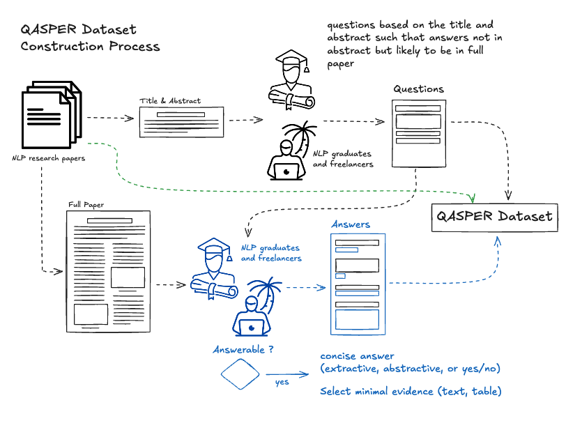

# Benchmarking Gemini Models using Ragas

In this tutorial, we'll benchmark Gemini models on the AllenAI's QASPER dataset using Ragas metrics for the Academic Question Answering task.

### About the Dataset

QASPER (Question Answering over Scientific Papers) is a dataset consisting of 5,049 questions based on 1,585 NLP research papers. Annotators created these questions from titles and abstracts, a different set of annotators answered them from the full paper texts.

Data Collection Process:  

1. Paper Selection: NLP domain papers from arXiv (LaTeX format) were selected from the S2ORC corpus.
2. Question Writing: Annotators wrote realistic, information-seeking questions based only on paper titles and abstracts.
3. Answer Annotation: Different annotators reviewed the entire paper to identify answers, selecting minimal relevant evidence (texts, tables, figures).




Link to the [Dataset](https://huggingface.co/datasets/allenai/qasper) and further details about QASPER can be found [here](https://huggingface.co/datasets/allenai/qasper). 


## Loading Dataset

For demonstration purposes, we'll use a subset of 10 examples from the validation split:


```python
from datasets import load_dataset
import pandas as pd
import numpy as np
from tqdm.auto import tqdm

dataset = load_dataset("allenai/qasper", split="validation[:10]")
dataset
```
Output
```
Dataset({
    features: ['id', 'title', 'abstract', 'full_text', 'qas', 'figures_and_tables'],
    num_rows: 10
})
```


## Processing Dataset

Since our goal is to benchmark the model’s performance on academic question-answering tasks, we need answers generated by LLMs based on the entire text of each research paper. We extract the full text from the dataset’s "full_text" column and format it into markdown, clearly organizing it into sections and paragraphs for improved readability and context.

To create question-answer pairs for evaluation, we use the dataset’s "qas" column. This column provides questions paired with answers in one of three formats: extractive spans, yes/no responses, or free-form answers. We then combine these into a single "golden answer" column, which serves as the ground truth for assessing model performance.


```python
def convert_full_text_to_markdown(full_text_dict):
    """
    Converts a full_text dictionary into a markdown-formatted string.

    Expected keys:
      - "section_name": list of section titles.
      - "paragraphs": list of lists of paragraphs corresponding to each section.

    Each section becomes a markdown header (##) followed by its paragraphs.
    """
    sections = full_text_dict.get("section_name", [])
    paragraphs = full_text_dict.get("paragraphs", [])

    markdown_lines = []
    for section, paragraph in zip(sections, paragraphs):
        markdown_lines.append(f"## {section}")
        markdown_lines.append("")  # Blank line
        markdown_lines.append("\n".join(map(str, paragraph)))
        markdown_lines.append("")  # End of section
        markdown_lines.append("")  # Extra blank line for separation
    return "\n".join(markdown_lines)
```


```python
def combine_responses(row):
    """
    Combines 'extractive_spans', 'yes_no', and 'free_form_answer'
    into one single string. Skips components that are missing.
    """
    responses = []
    if pd.notna(row.get("extractive_spans")):
        if isinstance(row["extractive_spans"], list):
            responses.append(" ".join(map(str, row["extractive_spans"])))
        else:
            responses.append(str(row["extractive_spans"]))
    if pd.notna(row.get("yes_no")):
        responses.append(str(row["yes_no"]))
    if pd.notna(row.get("free_form_answer")):
        responses.append(str(row["free_form_answer"]))
    return "\n".join(responses) if responses else np.nan
```


```python
def preprocess_hf_dataset(hf_ds):
    """
    Processes a HuggingFace dataset split into a cleaned Pandas DataFrame.

    Steps:
      1. For each sample, convert 'full_text' to a markdown string.
      2. For every QA pair in the sample, extract the question and first answer.
      3. Build lists for answers, questions, and full_text (duplicated per question).
      4. Create a DataFrame from the collected data.
      5. Clean columns by replacing empty lists/strings with NaN and joining lists.
      6. Combine the answer components into a single 'golden response'.

    The function uses nested tqdm progress bars for real-time feedback.

    Returns:
        pd.DataFrame: The preprocessed DataFrame.
    """
    answers_list = []  # Stores the first answer for each question
    questions_list = []  # Stores each question text
    full_text_list = []  # Stores the formatted full text per QA pair

    # Outer loop: iterate over samples with progress bar
    for sample in tqdm(hf_ds, desc="Processing samples", unit="sample"):
        # Convert full text once per sample
        formatted_text = convert_full_text_to_markdown(sample["full_text"])
        # Create a list of QA pairs
        qa_pairs = list(zip(sample["qas"]["question"], sample["qas"]["answers"]))

        # Inner loop: iterate over each QA pair with its own progress bar
        for question, answer_set in tqdm(
            qa_pairs, desc="Processing QAs", total=len(qa_pairs), leave=False, unit="qa"
        ):
            answers_list.append(answer_set["answer"][0])
            questions_list.append(question)
            full_text_list.append(formatted_text)

    # Create DataFrame from the collected data
    df = pd.DataFrame(answers_list)
    df["question"] = questions_list
    df["full_text"] = full_text_list

    # Data Cleaning: Replace empty lists/strings with NaN and join lists if needed
    df["extractive_spans"] = df["extractive_spans"].apply(
        lambda x: np.nan if isinstance(x, list) and len(x) == 0 else x
    )
    df["free_form_answer"] = df["free_form_answer"].apply(
        lambda x: np.nan if isinstance(x, str) and x.strip() == "" else x
    )
    df["yes_no"] = df["yes_no"].apply(lambda x: np.nan if x is None else x)
    df["extractive_spans"] = df["extractive_spans"].apply(
        lambda x: "\n".join(x) if isinstance(x, list) else x
    )

    # Combine the answer components into a single 'golden response'
    df["golden response"] = df.apply(lambda row: combine_responses(row), axis=1)

    return df
```


```python
processed_dataset = preprocess_hf_dataset(dataset)
processed_dataset.head()
```
```
Processing samples: 100%|██████████| 10/10 [00:00<00:00, 208.37sample/s]
```
<div>
<style scoped>
    .dataframe tbody tr th:only-of-type {
        vertical-align: middle;
    }

    .dataframe tbody tr th {
        vertical-align: top;
    }

    .dataframe thead th {
        text-align: right;
    }
</style>
<table border="1">
  <thead>
    <tr style="text-align: right;">
      <th></th>
      <th>unanswerable</th>
      <th>extractive_spans</th>
      <th>yes_no</th>
      <th>free_form_answer</th>
      <th>evidence</th>
      <th>highlighted_evidence</th>
      <th>question</th>
      <th>full_text</th>
      <th>golden response</th>
    </tr>
  </thead>
  <tbody>
    <tr>
      <th>0</th>
      <td>False</td>
      <td>BIBREF19\nBIBREF20</td>
      <td>NaN</td>
      <td>NaN</td>
      <td>[Table TABREF19 and TABREF26 report zero-shot ...</td>
      <td>[We compare our approaches with related approa...</td>
      <td>which multilingual approaches do they compare ...</td>
      <td>## Introduction\n\nAlthough Neural Machine Tra...</td>
      <td>BIBREF19\nBIBREF20</td>
    </tr>
    <tr>
      <th>1</th>
      <td>False</td>
      <td>pivoting\npivoting$_{\rm m}$</td>
      <td>NaN</td>
      <td>NaN</td>
      <td>[Table TABREF19 and TABREF26 report zero-shot ...</td>
      <td>[We compare our approaches with related approa...</td>
      <td>what are the pivot-based baselines?</td>
      <td>## Introduction\n\nAlthough Neural Machine Tra...</td>
      <td>pivoting\npivoting$_{\rm m}$</td>
    </tr>
    <tr>
      <th>2</th>
      <td>False</td>
      <td>Europarl\nMultiUN</td>
      <td>NaN</td>
      <td>NaN</td>
      <td>[We evaluate our cross-lingual pre-training ba...</td>
      <td>[We evaluate our cross-lingual pre-training ba...</td>
      <td>which datasets did they experiment with?</td>
      <td>## Introduction\n\nAlthough Neural Machine Tra...</td>
      <td>Europarl\nMultiUN</td>
    </tr>
    <tr>
      <th>3</th>
      <td>False</td>
      <td>NaN</td>
      <td>NaN</td>
      <td>De-En, En-Fr, Fr-En, En-Es, Ro-En, En-De, Ar-E...</td>
      <td>[For MultiUN corpus, we use four languages: En...</td>
      <td>[For MultiUN corpus, we use four languages: En...</td>
      <td>what language pairs are explored?</td>
      <td>## Introduction\n\nAlthough Neural Machine Tra...</td>
      <td>De-En, En-Fr, Fr-En, En-Es, Ro-En, En-De, Ar-E...</td>
    </tr>
    <tr>
      <th>4</th>
      <td>False</td>
      <td>Stanford NER\nspaCy 2.0 \nrecurrent model with...</td>
      <td>NaN</td>
      <td>NaN</td>
      <td>[In this section we describe a number of exper...</td>
      <td>[In this section we describe a number of exper...</td>
      <td>what ner models were evaluated?</td>
      <td>## Introduction\n\nNamed entity recognition is...</td>
      <td>Stanford NER\nspaCy 2.0 \nrecurrent model with...</td>
    </tr>
  </tbody>
</table>
</div>


## Generating Responses from Gemini Models

To generate responses using the Gemini model, we’ll first need to instantiate the Google GenAI client. We will define a prompt template that will be used when generating responses.


```python
import os
from google import genai
from dotenv import load_dotenv

load_dotenv()

client = genai.Client(api_key=os.getenv("GOOGLE_API_KEY"))

qa_prompt = (
    f"Context information is below.\n"
    "---------------------\n"
    "{context_str}\n"
    "---------------------\n"
    "Given the context information and not prior knowledge, "
    "answer the query.\n"
    "If you cannot find answer to the query, just say that it cannot be answered.\n"
    "Query: {query_str}\n"
    "Answer: "
)
```

### Gemini 2.0 Falsh

??? note "Code for AsyncExecutor"

    ```python
    # async_executor.py
    from __future__ import annotations
    import asyncio
    import time
    import logging
    from typing import Callable, Any, List, Tuple
    from dataclasses import dataclass, field
    import nest_asyncio
    from tqdm import tqdm

    # Apply nest_asyncio to allow nested event loops (e.g., in Jupyter)
    nest_asyncio.apply()

    logger = logging.getLogger(__name__)


    def is_event_loop_running() -> bool:
        try:
            loop = asyncio.get_running_loop()
        except RuntimeError:
            return False
        else:
            return loop.is_running()


    class RateLimiter:
        """
        An asynchronous rate limiter that enforces a minimum interval between calls.
        For example, with max_calls_per_minute=1250, it ensures that calls are spaced by ~0.048 seconds.
        """

        def __init__(self, max_calls_per_minute: int):
            self.interval = 60.0 / max_calls_per_minute
            self.last_call = 0.0
            self.lock = asyncio.Lock()

        async def acquire(self):
            async with self.lock:
                now = time.monotonic()
                elapsed = now - self.last_call
                wait_time = self.interval - elapsed
                if wait_time > 0:
                    await asyncio.sleep(wait_time)
                self.last_call = time.monotonic()


    @dataclass
    class AsyncExecutor:
        """
        An asynchronous executor similar in usage to the one in the evaluate function.

        Attributes:
            desc: Description for the progress bar.
            show_progress: Whether to display a progress bar.
            raise_exceptions: Whether to propagate exceptions.
            max_calls_per_minute: API rate limit to enforce.
        """

        desc: str = "Evaluating"
        show_progress: bool = True
        raise_exceptions: bool = False
        max_calls_per_minute: int = 1250
        jobs: List[Tuple[Callable[..., Any], tuple, dict, int]] = field(
            default_factory=list, repr=False
        )
        job_counter: int = 0
        rate_limiter: RateLimiter = field(init=False)

        def __post_init__(self):
            self.rate_limiter = RateLimiter(self.max_calls_per_minute)

        def wrap_callable_with_index(
            self, func: Callable[..., Any], index: int
        ) -> Callable[..., Any]:
            """
            Wraps an asynchronous callable so that it enforces the rate limit,
            and if an error occurs, it waits for an increasing delay (fallback)
            before retrying the function call indefinitely.
            """
            async def wrapped(*args, **kwargs) -> Tuple[int, Any]:
                retry_delay = 10  # initial delay in seconds
                while True:
                    try:
                        # Enforce the API rate limit before executing the function
                        await self.rate_limiter.acquire()
                        result = await func(*args, **kwargs)
                        return index, result
                    except Exception as e:
                        if self.raise_exceptions:
                            raise e
                        else:
                            logger.error(
                                "Error in job %d: %s. Retrying in %d seconds...",
                                index, e, retry_delay
                            )
                            # Wait asynchronously before retrying
                            await asyncio.sleep(retry_delay)
                            retry_delay += 5  # Increase delay for subsequent retries
            return wrapped

        def submit(self, func: Callable[..., Any], *args, **kwargs):
            """
            Submit an asynchronous job to the executor.
            """
            wrapped_func = self.wrap_callable_with_index(func, self.job_counter)
            self.jobs.append((wrapped_func, args, kwargs, self.job_counter))
            self.job_counter += 1

        async def _run_jobs(self) -> List[Any]:
            tasks = []
            # Create asyncio tasks for each job
            for wrapped_func, args, kwargs, index in self.jobs:
                tasks.append(asyncio.create_task(wrapped_func(*args, **kwargs)))

            results = [None] * len(tasks)
            if self.show_progress:
                pbar = tqdm(total=len(tasks), desc=self.desc)
                for completed in asyncio.as_completed(tasks):
                    index, result = await completed
                    results[index] = result
                    pbar.update(1)
                pbar.close()
            else:
                for completed in asyncio.as_completed(tasks):
                    index, result = await completed
                    results[index] = result
            return results

        def results(self) -> List[Any]:
            """
            Execute all submitted asynchronous jobs and return their results
            in the order they were submitted.

            Thanks to nest_asyncio, this method can be used inside a Jupyter Notebook.
            """
            # If an event loop is already running, nest_asyncio allows asyncio.run() to work.
            return asyncio.run(self._run_jobs())
    ```


```python
from async_executor import AsyncExecutor

async def query_gemini_2(query_str: str, context_str: str):
    formatted_prompt = qa_prompt.format(context_str=context_str, query_str=query_str)
    response = await client.aio.models.generate_content(
        model="gemini-2.0-flash", contents=formatted_prompt
    )
    return response.text

# Create an instance of the asynchronous executor
executor = AsyncExecutor(
    desc="LLM Processing",
    show_progress=True,
    raise_exceptions=False,
)

for idx in range(processed_dataset.shape[0]):
    query = processed_dataset.iloc[idx]["question"]
    context = processed_dataset.iloc[idx]["full_text"]
    executor.submit(query_gemini_2, query, context)

processed_dataset["gemini_2_flash_responses"] = executor.results()
```
```
LLM Processing: 100%|██████████| 30/30 [00:04<00:00,  7.20it/s]
```

### Gemini 1.5 Falsh


```python
from async_executor import AsyncExecutor

async def query_gemini_1_5(query_str: str, context_str: str):
    formatted_prompt = qa_prompt.format(context_str=context_str, query_str=query_str)
    response = await client.aio.models.generate_content(
        model="gemini-1.5-flash", contents=formatted_prompt
    )
    return response.text

# Create a new instance of the asynchronous executor
executor = AsyncExecutor(
    desc="LLM Processing",
    show_progress=True,
    raise_exceptions=False,
)

for idx in range(processed_dataset.shape[0]):
    query = processed_dataset.iloc[idx]["question"]
    context = processed_dataset.iloc[idx]["full_text"]
    executor.submit(query_gemini_1_5, query, context)

processed_dataset["gemini_1_5_flash_responses"] = executor.results()
```
```
LLM Processing: 100%|██████████| 30/30 [00:05<00:00,  5.94it/s]
```


```python
processed_dataset.head()
```
<div>
<style scoped>
    .dataframe tbody tr th:only-of-type {
        vertical-align: middle;
    }

    .dataframe tbody tr th {
        vertical-align: top;
    }

    .dataframe thead th {
        text-align: right;
    }
</style>
<table border="1">
  <thead>
    <tr style="text-align: right;">
      <th></th>
      <th>unanswerable</th>
      <th>extractive_spans</th>
      <th>yes_no</th>
      <th>free_form_answer</th>
      <th>evidence</th>
      <th>highlighted_evidence</th>
      <th>question</th>
      <th>full_text</th>
      <th>golden response</th>
      <th>gemini_2_flash_responses</th>
      <th>gemini_1_5_flash_responses</th>
    </tr>
  </thead>
  <tbody>
    <tr>
      <th>0</th>
      <td>False</td>
      <td>BIBREF19\nBIBREF20</td>
      <td>NaN</td>
      <td>NaN</td>
      <td>[Table TABREF19 and TABREF26 report zero-shot ...</td>
      <td>[We compare our approaches with related approa...</td>
      <td>which multilingual approaches do they compare ...</td>
      <td>## Introduction\n\nAlthough Neural Machine Tra...</td>
      <td>BIBREF19\nBIBREF20</td>
      <td>The text mentions comparison with Multilingual...</td>
      <td>The paper compares its approach with multiling...</td>
    </tr>
    <tr>
      <th>1</th>
      <td>False</td>
      <td>pivoting\npivoting$_{\rm m}$</td>
      <td>NaN</td>
      <td>NaN</td>
      <td>[Table TABREF19 and TABREF26 report zero-shot ...</td>
      <td>[We compare our approaches with related approa...</td>
      <td>what are the pivot-based baselines?</td>
      <td>## Introduction\n\nAlthough Neural Machine Tra...</td>
      <td>pivoting\npivoting$_{\rm m}$</td>
      <td>The pivot-based baselines are pivoting and piv...</td>
      <td>The provided text mentions two types of pivot-...</td>
    </tr>
    <tr>
      <th>2</th>
      <td>False</td>
      <td>Europarl\nMultiUN</td>
      <td>NaN</td>
      <td>NaN</td>
      <td>[We evaluate our cross-lingual pre-training ba...</td>
      <td>[We evaluate our cross-lingual pre-training ba...</td>
      <td>which datasets did they experiment with?</td>
      <td>## Introduction\n\nAlthough Neural Machine Tra...</td>
      <td>Europarl\nMultiUN</td>
      <td>They experimented with the Europarl and MultiU...</td>
      <td>The experiments used two public datasets: Euro...</td>
    </tr>
    <tr>
      <th>3</th>
      <td>False</td>
      <td>NaN</td>
      <td>NaN</td>
      <td>De-En, En-Fr, Fr-En, En-Es, Ro-En, En-De, Ar-E...</td>
      <td>[For MultiUN corpus, we use four languages: En...</td>
      <td>[For MultiUN corpus, we use four languages: En...</td>
      <td>what language pairs are explored?</td>
      <td>## Introduction\n\nAlthough Neural Machine Tra...</td>
      <td>De-En, En-Fr, Fr-En, En-Es, Ro-En, En-De, Ar-E...</td>
      <td>The language pairs explored in this paper are:...</td>
      <td>The paper explores the following language pair...</td>
    </tr>
    <tr>
      <th>4</th>
      <td>False</td>
      <td>Stanford NER\nspaCy 2.0 \nrecurrent model with...</td>
      <td>NaN</td>
      <td>NaN</td>
      <td>[In this section we describe a number of exper...</td>
      <td>[In this section we describe a number of exper...</td>
      <td>what ner models were evaluated?</td>
      <td>## Introduction\n\nNamed entity recognition is...</td>
      <td>Stanford NER\nspaCy 2.0 \nrecurrent model with...</td>
      <td>Based on the provided text, the following NER ...</td>
      <td>Stanford NER, spaCy 2.0, and a recurrent model...</td>
    </tr>
  </tbody>
</table>
</div>


## Defining Metrics For Evaluation

We are benchmarking a question-answering task and we want to ensure that each question is answered properly and accurately. To achieve this, we use the following metrics from Ragas you find the complete list of metrics available in Ragas [here](../../concepts/metrics/available_metrics/index.md)

- Answer Accuracy: Measures how closely a response matches the reference answer.
- Answer Correctness: Assesses the alignment between the generated answer and the reference answer.
- Factual Correctness: Checks if all statements in a response are supported by the reference answer.

For each question, we know whether it can be answered from the provided context, and we want to see if the model can correctly identify it or not. For this purpose, we define a custom binary metric using AspectCritique.


```python
from ragas.metrics import AnswerAccuracy, AnswerCorrectness, FactualCorrectness, AspectCritic
import getpass
import os

from ragas.llms import LangchainLLMWrapper
from langchain_openai import ChatOpenAI

if "OPENAI_API_KEY" not in os.environ:
    os.environ["OPENAI_API_KEY"] = getpass.getpass("Enter your OpenAI API key: ")

evaluator_llm = LangchainLLMWrapper(ChatOpenAI(model="gpt-4o-mini"))

aspect_critic = AspectCritic(
    name="unanswerable",
    definition="Return 1 if the query cannot be answered by the provided context, otherwise return 0.",
    llm=evaluator_llm,
)

metrics = [
    AnswerAccuracy(llm=evaluator_llm),
    AnswerCorrectness(llm=evaluator_llm, weights=[1, 0]),
    aspect_critic,
    FactualCorrectness(llm=evaluator_llm),
]
```

## Benchmarking on Ragas Metrics

We format the processed data into a Ragas EvaluationDataset, then apply the metrics to evaluate model performance, more information on it can be found [here](../../concepts/components/eval_dataset.md). We’ll construct the EvaluationDataset using the questions and the golden answer responses generated by the Gemini models from our processed dataset.

### Gemini 2.0 Falsh

We'll create EvaluationDataset for the Gemini 2.0 Flash.


```python
from ragas.dataset_schema import EvaluationDataset

dataset_list = []

for i in range(processed_dataset.shape[0]):
    sample = {
        "user_input": (
            "" if pd.isna(processed_dataset.iloc[i].get("question")) else processed_dataset.iloc[i].get("question")
        ),
        "reference": (
            ""
            if pd.isna(processed_dataset.iloc[i].get("golden response"))
            else processed_dataset.iloc[i].get("golden response")
        ),
        "response": (
            ""
            if pd.isna(processed_dataset["gemini_2_flash_responses"].iloc[i])
            else processed_dataset["gemini_2_flash_responses"].iloc[i]
        ),
    }
    dataset_list.append(sample)

gemini_2_dataset = EvaluationDataset.from_list(dataset_list)
gemini_2_dataset.to_pandas().head()
```
<div>
<style scoped>
    .dataframe tbody tr th:only-of-type {
        vertical-align: middle;
    }

    .dataframe tbody tr th {
        vertical-align: top;
    }

    .dataframe thead th {
        text-align: right;
    }
</style>
<table border="1">
  <thead>
    <tr style="text-align: right;">
      <th></th>
      <th>user_input</th>
      <th>response</th>
      <th>reference</th>
    </tr>
  </thead>
  <tbody>
    <tr>
      <th>0</th>
      <td>which multilingual approaches do they compare ...</td>
      <td>The text mentions comparison with Multilingual...</td>
      <td>BIBREF19\nBIBREF20</td>
    </tr>
    <tr>
      <th>1</th>
      <td>what are the pivot-based baselines?</td>
      <td>The pivot-based baselines are pivoting and piv...</td>
      <td>pivoting\npivoting$_{\rm m}$</td>
    </tr>
    <tr>
      <th>2</th>
      <td>which datasets did they experiment with?</td>
      <td>They experimented with the Europarl and MultiU...</td>
      <td>Europarl\nMultiUN</td>
    </tr>
    <tr>
      <th>3</th>
      <td>what language pairs are explored?</td>
      <td>The language pairs explored in this paper are:...</td>
      <td>De-En, En-Fr, Fr-En, En-Es, Ro-En, En-De, Ar-E...</td>
    </tr>
    <tr>
      <th>4</th>
      <td>what ner models were evaluated?</td>
      <td>Based on the provided text, the following NER ...</td>
      <td>Stanford NER\nspaCy 2.0 \nrecurrent model with...</td>
    </tr>
  </tbody>
</table>
</div>


Now, let’s evaluate the responses of Gemini 2.0 Falsh.


```python
from ragas import evaluate

gemini_2_flash_score = evaluate(dataset=gemini_2_dataset, metrics=metrics)
gemini_2_flash_score.to_pandas().head()
```
```
Evaluating: 100%|██████████| 120/120 [00:49<00:00,  2.44it/s]
```
<div>
<style scoped>
    .dataframe tbody tr th:only-of-type {
        vertical-align: middle;
    }

    .dataframe tbody tr th {
        vertical-align: top;
    }

    .dataframe thead th {
        text-align: right;
    }
</style>
<table border="1">
  <thead>
    <tr style="text-align: right;">
      <th></th>
      <th>user_input</th>
      <th>response</th>
      <th>reference</th>
      <th>nv_accuracy</th>
      <th>answer_correctness</th>
      <th>unanswerable</th>
      <th>factual_correctness(mode=f1)</th>
    </tr>
  </thead>
  <tbody>
    <tr>
      <th>0</th>
      <td>which multilingual approaches do they compare ...</td>
      <td>The text mentions comparison with Multilingual...</td>
      <td>BIBREF19\nBIBREF20</td>
      <td>0.25</td>
      <td>0.400000</td>
      <td>0</td>
      <td>0.5</td>
    </tr>
    <tr>
      <th>1</th>
      <td>what are the pivot-based baselines?</td>
      <td>The pivot-based baselines are pivoting and piv...</td>
      <td>pivoting\npivoting$_{\rm m}$</td>
      <td>0.25</td>
      <td>0.000000</td>
      <td>0</td>
      <td>0.0</td>
    </tr>
    <tr>
      <th>2</th>
      <td>which datasets did they experiment with?</td>
      <td>They experimented with the Europarl and MultiU...</td>
      <td>Europarl\nMultiUN</td>
      <td>1.00</td>
      <td>1.000000</td>
      <td>0</td>
      <td>0.0</td>
    </tr>
    <tr>
      <th>3</th>
      <td>what language pairs are explored?</td>
      <td>The language pairs explored in this paper are:...</td>
      <td>De-En, En-Fr, Fr-En, En-Es, Ro-En, En-De, Ar-E...</td>
      <td>0.25</td>
      <td>0.545455</td>
      <td>0</td>
      <td>0.0</td>
    </tr>
    <tr>
      <th>4</th>
      <td>what ner models were evaluated?</td>
      <td>Based on the provided text, the following NER ...</td>
      <td>Stanford NER\nspaCy 2.0 \nrecurrent model with...</td>
      <td>0.50</td>
      <td>0.600000</td>
      <td>0</td>
      <td>0.0</td>
    </tr>
  </tbody>
</table>
</div>


A completely optional step, if you want to upload the evaluation results to your Ragas app, you can run the command below.You can learn more about Ragas app here.


```python
gemini_2_flash_score.upload()
```

### Gemini 1.5 Flash

Next, we’ll follow similar steps for Gemini 1.5 Flash.


```python
from ragas.dataset_schema import EvaluationDataset

dataset_list = []

for i in range(processed_dataset.shape[0]):
    sample = {
        "user_input": (
            "" if pd.isna(processed_dataset.iloc[i].get("question")) else processed_dataset.iloc[i].get("question")
        ),
        "reference": (
            ""
            if pd.isna(processed_dataset.iloc[i].get("golden response"))
            else processed_dataset.iloc[i].get("golden response")
        ),
        "response": (
            ""
            if pd.isna(processed_dataset["gemini_1_5_flash_responses"].iloc[i])
            else processed_dataset["gemini_1_5_flash_responses"].iloc[i]
        ),
    }
    dataset_list.append(sample)

gemini_1_5_dataset = EvaluationDataset.from_list(dataset_list)
gemini_1_5_dataset.to_pandas().head()
```

<div>
<style scoped>
    .dataframe tbody tr th:only-of-type {
        vertical-align: middle;
    }

    .dataframe tbody tr th {
        vertical-align: top;
    }

    .dataframe thead th {
        text-align: right;
    }
</style>
<table border="1">
  <thead>
    <tr style="text-align: right;">
      <th></th>
      <th>user_input</th>
      <th>response</th>
      <th>reference</th>
    </tr>
  </thead>
  <tbody>
    <tr>
      <th>0</th>
      <td>which multilingual approaches do they compare ...</td>
      <td>The paper compares its approach with multiling...</td>
      <td>BIBREF19\nBIBREF20</td>
    </tr>
    <tr>
      <th>1</th>
      <td>what are the pivot-based baselines?</td>
      <td>The provided text mentions two types of pivot-...</td>
      <td>pivoting\npivoting$_{\rm m}$</td>
    </tr>
    <tr>
      <th>2</th>
      <td>which datasets did they experiment with?</td>
      <td>The experiments used two public datasets: Euro...</td>
      <td>Europarl\nMultiUN</td>
    </tr>
    <tr>
      <th>3</th>
      <td>what language pairs are explored?</td>
      <td>The paper explores the following language pair...</td>
      <td>De-En, En-Fr, Fr-En, En-Es, Ro-En, En-De, Ar-E...</td>
    </tr>
    <tr>
      <th>4</th>
      <td>what ner models were evaluated?</td>
      <td>Stanford NER, spaCy 2.0, and a recurrent model...</td>
      <td>Stanford NER\nspaCy 2.0 \nrecurrent model with...</td>
    </tr>
  </tbody>
</table>
</div>


```python
from ragas import evaluate

gemini_1_5_flash_score = evaluate(dataset=gemini_1_5_dataset, metrics=metrics)
gemini_1_5_flash_score.to_pandas().head()
```
```
Evaluating: 100%|██████████| 120/120 [01:02<00:00,  1.93it/s]
```

<div>
<style scoped>
    .dataframe tbody tr th:only-of-type {
        vertical-align: middle;
    }

    .dataframe tbody tr th {
        vertical-align: top;
    }

    .dataframe thead th {
        text-align: right;
    }
</style>
<table border="1">
  <thead>
    <tr style="text-align: right;">
      <th></th>
      <th>user_input</th>
      <th>response</th>
      <th>reference</th>
      <th>nv_accuracy</th>
      <th>answer_correctness</th>
      <th>unanswerable</th>
      <th>factual_correctness(mode=f1)</th>
    </tr>
  </thead>
  <tbody>
    <tr>
      <th>0</th>
      <td>which multilingual approaches do they compare ...</td>
      <td>The paper compares its approach with multiling...</td>
      <td>BIBREF19\nBIBREF20</td>
      <td>0.25</td>
      <td>0.400000</td>
      <td>0</td>
      <td>0.00</td>
    </tr>
    <tr>
      <th>1</th>
      <td>what are the pivot-based baselines?</td>
      <td>The provided text mentions two types of pivot-...</td>
      <td>pivoting\npivoting$_{\rm m}$</td>
      <td>0.25</td>
      <td>0.181818</td>
      <td>0</td>
      <td>0.18</td>
    </tr>
    <tr>
      <th>2</th>
      <td>which datasets did they experiment with?</td>
      <td>The experiments used two public datasets: Euro...</td>
      <td>Europarl\nMultiUN</td>
      <td>1.00</td>
      <td>0.800000</td>
      <td>0</td>
      <td>0.00</td>
    </tr>
    <tr>
      <th>3</th>
      <td>what language pairs are explored?</td>
      <td>The paper explores the following language pair...</td>
      <td>De-En, En-Fr, Fr-En, En-Es, Ro-En, En-De, Ar-E...</td>
      <td>0.00</td>
      <td>0.533333</td>
      <td>0</td>
      <td>0.00</td>
    </tr>
    <tr>
      <th>4</th>
      <td>what ner models were evaluated?</td>
      <td>Stanford NER, spaCy 2.0, and a recurrent model...</td>
      <td>Stanford NER\nspaCy 2.0 \nrecurrent model with...</td>
      <td>0.50</td>
      <td>0.571429</td>
      <td>0</td>
      <td>0.00</td>
    </tr>
  </tbody>
</table>
</div>


## Comparing the Results

Now that we have completed our evaluations, let’s compare how both models performed on acadmic question answering.


```python
def print__results(result):
    result = result._repr_dict
    print("Response Accuracy:", result.get("nv_accuracy"))
    print("Answer Correctness:", result.get("answer_correctness"))
    print("Factual Correctness:", result.get("factual_correctness(mode=f1)"))

print__results(gemini_1_5_flash_score)
```
Output
```
Response Accuracy: 0.5416666666666666
Answer Correctness: 0.47723550201811066
Factual Correctness: 0.2533333333333333
```


```python
print__results(gemini_2_flash_score)
```
Output
```
Response Accuracy: 0.5666666666666667
Answer Correctness: 0.48055486996663466
Factual Correctness: 0.23633333333333334
```

Gemini 2.0 Flash performs slightly better overall.

Let’s see how well the models performed on classifying if a given question can be answered with the provided text. 

For this, we’ll use the result from the “unanswerable” metric and compare it with the original ground truth from the “unanswerable” column in our pre-processed dataset.


```python
from sklearn.metrics import classification_report, accuracy_score, precision_score, recall_score, f1_score


def print_metrics(actuals, preds, model_name="Model", zero_division_value=0):
    """
    Prints common classification metrics for a given set of actual and predicted values.

    Parameters:
        actuals (array-like): Ground truth labels.
        preds (array-like): Predicted labels.
        model_name (str): Name of the model for display purposes.
        zero_division_value (int or str): Sets the value to return when there is a zero division.
                                          Options: 0, 1, or "warn" (default is 0 here).
    """
    print(f"Metrics for {model_name}:")
    print("Accuracy:", accuracy_score(actuals, preds))
    print(
        "Precision:", precision_score(actuals, preds, zero_division=zero_division_value)
    )
    print("Recall:", recall_score(actuals, preds, zero_division=zero_division_value))
    print("F1 Score:", f1_score(actuals, preds, zero_division=zero_division_value))
    print("\nClassification Report:")
    print(classification_report(actuals, preds, zero_division=zero_division_value))
    
gemini_1_5_flash_prediction = gemini_1_5_flash_score["unanswerable"]
gemini_2_flash_prediction = gemini_2_flash_score["unanswerable"]
groundtruth = processed_dataset["unanswerable"].astype(int)

print_metrics(groundtruth, gemini_2_flash_prediction, model_name="Gemini 2 Flash")
```

Output
```
Metrics for Gemini 2 Flash:
Accuracy: 0.9333333333333333
Precision: 0.5
Recall: 1.0
F1 Score: 0.6666666666666666

Classification Report:
              precision    recall  f1-score   support

           0       1.00      0.93      0.96        28
           1       0.50      1.00      0.67         2

    accuracy                           0.93        30
   macro avg       0.75      0.96      0.81        30
weighted avg       0.97      0.93      0.94        30
```    

```python
print_metrics(groundtruth, gemini_1_5_flash_prediction, model_name="Gemini 1.5 Flash")
```
Output
```
Metrics for Gemini 1.5 Flash:
Accuracy: 0.9
Precision: 0.3333333333333333
Recall: 0.5
F1 Score: 0.4
    
Classification Report:
              precision    recall  f1-score   support

           0       0.96      0.93      0.95        28
           1       0.33      0.50      0.40         2

    accuracy                           0.90        30
   macro avg       0.65      0.71      0.67        30
weighted avg       0.92      0.90      0.91        30
```    


Gemini 2.0 Flash also outperforms Gemini 1.5 Flash in identifying unanswerable questions.

## What's Next

You can benchmark your models on any dataset using Ragas metrics as long as the dataset is formatted to Ragas EvaluationDatase. Try benchmarking your models on a variety of established benchmarking datasets.  

- [PubMedQA](https://huggingface.co/datasets/qiaojin/PubMedQA)
- [MultiHopRAG](https://huggingface.co/datasets/yixuantt/MultiHopRAG)
- [ms_marco](https://huggingface.co/datasets/microsoft/ms_marco)

And many more.
