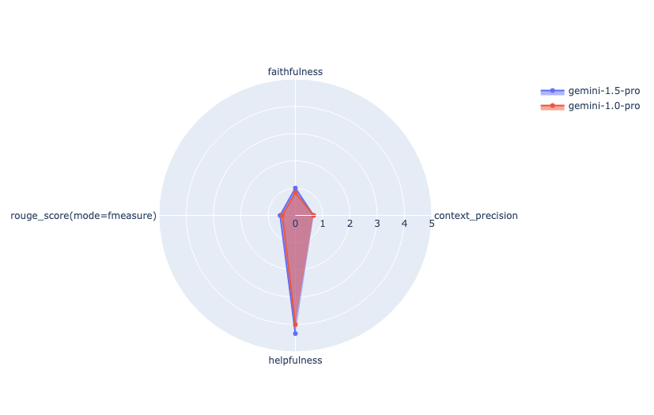

# Compare models provided by VertexAI on RAG-based Q&A task using Ragas metrics

This tutorial is part of a three-part series on how to use Vertex AI models with Ragas. It is recommeded that you have gone through [Getting Started: Ragas with Vertex AI](./vertexai_x_ragas.md), even if you have not followed it you’ll be golden. You can check to the Align LLM Metrics tutorial by [clicking](./vertexai_alignment.md).

## Overview

In this tutorial, you will learn how to use the Ragas to score and evaluate different LLM models  for a  **Question Answering** (QA) task. Then visualise and compare the evaluation results to select a generative model.

## Getting Started

### Install Dependencies


```python
%pip install --upgrade --user --quiet langchain-core langchain-google-vertexai langchain ragas rouge_score
```

### Restart runtime

To use the newly installed packages in this Jupyter runtime, you must restart the runtime. You can do this by running the cell below, which restarts the current kernel.

The restart might take a minute or longer. After it's restarted, continue to the next step.


```python
import IPython

app = IPython.Application.instance()
app.kernel.do_shutdown(True)
```

### Authenticate your notebook environment (Colab only)

If you're running this notebook on Google Colab, run the cell below to authenticate your environment.


```python
import sys

if "google.colab" in sys.modules:
    from google.colab import auth

    auth.authenticate_user()
```

### Set Google Cloud project information and initialize Vertex AI SDK


```python
PROJECT_ID = "[your-project-id]"  # @param {type:"string"}
LOCATION = "us-central1"  # @param {type:"string"}

if not PROJECT_ID or PROJECT_ID == "[your-project-id]":
    raise ValueError("Please set your PROJECT_ID")


import vertexai

vertexai.init(project=PROJECT_ID, location=LOCATION)
```

### Helper Functions

Below are some helper functions for displaying evaluation reports and visualising evaluation results.


```python
import pandas as pd
import plotly.graph_objects as go
from IPython.display import HTML, Markdown, display


def display_eval_report(eval_result, metrics=None):
    """Display the evaluation results."""

    title, summary_metrics, report_df = eval_result
    metrics_df = pd.DataFrame.from_dict(summary_metrics, orient="index").T
    if metrics:
        metrics_df = metrics_df.filter(
            [
                metric
                for metric in metrics_df.columns
                if any(selected_metric in metric for selected_metric in metrics)
            ]
        )
        report_df = report_df.filter(
            [
                metric
                for metric in report_df.columns
                if any(selected_metric in metric for selected_metric in metrics)
            ]
        )

    # Display the title with Markdown for emphasis
    display(Markdown(f"## {title}"))

    # Display the metrics DataFrame
    display(Markdown("### Summary Metrics"))
    display(metrics_df)

    # Display the detailed report DataFrame
    display(Markdown("### Report Metrics"))
    display(report_df)


def plot_radar_plot(eval_results, max_score=5, metrics=None):
    fig = go.Figure()

    for eval_result in eval_results:
        title, summary_metrics, report_df = eval_result

        if metrics:
            summary_metrics = {
                k: summary_metrics[k]
                for k, v in summary_metrics.items()
                if any(selected_metric in k for selected_metric in metrics)
            }

        fig.add_trace(
            go.Scatterpolar(
                r=list(summary_metrics.values()),
                theta=list(summary_metrics.keys()),
                fill="toself",
                name=title,
            )
        )

    fig.update_layout(
        polar=dict(radialaxis=dict(visible=True, range=[0, max_score])), showlegend=True
    )

    fig.show()


def plot_bar_plot(eval_results, metrics=None):
    fig = go.Figure()
    data = []

    for eval_result in eval_results:
        title, summary_metrics, _ = eval_result
        if metrics:
            summary_metrics = {
                k: summary_metrics[k]
                for k, v in summary_metrics.items()
                if any(selected_metric in k for selected_metric in metrics)
            }

        data.append(
            go.Bar(
                x=list(summary_metrics.keys()),
                y=list(summary_metrics.values()),
                name=title,
            )
        )

    fig = go.Figure(data=data)

    # Change the bar mode
    fig.update_layout(barmode="group")
    fig.show()
```

## Set up eval using Ragas metrics

### Define evaluator_llm

To use model-based metrics, first define your evaluator LLM and embeddings.


```python
from ragas.llms import LangchainLLMWrapper
from ragas.embeddings import LangchainEmbeddingsWrapper
from langchain_google_vertexai import VertexAI, VertexAIEmbeddings


evaluator_llm = LangchainLLMWrapper(VertexAI(model_name="gemini-pro"))
evaluator_embeddings = LangchainEmbeddingsWrapper(VertexAIEmbeddings(model_name="text-embedding-004"))
```

### **Ragas metrics**

Select and define the metrics that are most relevant to your application.


```python
from ragas import evaluate
from ragas.metrics import ContextPrecision, Faithfulness, RubricsScore, RougeScore

rouge_score = RougeScore()

helpfulness_rubrics = {
    "score1_description": "Response is useless/irrelevant, contains inaccurate/deceptive/misleading information, and/or contains harmful/offensive content. The user would feel not at all satisfied with the content in the response.",
    "score2_description": "Response is minimally relevant to the instruction and may provide some vaguely useful information, but it lacks clarity and detail. It might contain minor inaccuracies. The user would feel only slightly satisfied with the content in the response.",
    "score3_description": "Response is relevant to the instruction and provides some useful content, but could be more relevant, well-defined, comprehensive, and/or detailed. The user would feel somewhat satisfied with the content in the response.",
    "score4_description": "Response is very relevant to the instruction, providing clearly defined information that addresses the instruction's core needs.  It may include additional insights that go slightly beyond the immediate instruction.  The user would feel quite satisfied with the content in the response.",
    "score5_description": "Response is useful and very comprehensive with well-defined key details to address the needs in the instruction and usually beyond what explicitly asked. The user would feel very satisfied with the content in the response.",
}

rubrics_score = RubricsScore(name="helpfulness", rubrics=helpfulness_rubrics)
context_precision = ContextPrecision(llm=evaluator_llm)
faithfulness = Faithfulness(llm=evaluator_llm)
```

## **Prepare your dataset**

To perform evaluations using Ragas metrics, you need to convert your data into an `EvaluationDataset`, the core data type in Ragas. For more details on its structure, refer to the [Ragas documentation](../../concepts/components/eval_dataset.md).


```python
# questions or query from user
user_inputs = [
    "Which part of the brain does short-term memory seem to rely on?",
    "What provided the Roman senate with exuberance?",
    "What area did the Hasan-jalalians command?",
]

# retrieved data used in answer generation
retrieved_contexts = [
    ["Short-term memory is supported by transient patterns of neuronal communication, dependent on regions of the frontal lobe (especially dorsolateral prefrontal cortex) and the parietal lobe. Long-term memory, on the other hand, is maintained by more stable and permanent changes in neural connections widely spread throughout the brain. The hippocampus is essential (for learning new information) to the consolidation of information from short-term to long-term memory, although it does not seem to store information itself. Without the hippocampus, new memories are unable to be stored into long-term memory, as learned from patient Henry Molaison after removal of both his hippocampi, and there will be a very short attention span. Furthermore, it may be involved in changing neural connections for a period of three months or more after the initial learning."],
    ["In 62 BC, Pompey returned victorious from Asia. The Senate, elated by its successes against Catiline, refused to ratify the arrangements that Pompey had made. Pompey, in effect, became powerless. Thus, when Julius Caesar returned from a governorship in Spain in 61 BC, he found it easy to make an arrangement with Pompey. Caesar and Pompey, along with Crassus, established a private agreement, now known as the First Triumvirate. Under the agreement, Pompey's arrangements would be ratified. Caesar would be elected consul in 59 BC, and would then serve as governor of Gaul for five years. Crassus was promised a future consulship."],
    ["The Seljuk Empire soon started to collapse. In the early 12th century, Armenian princes of the Zakarid noble family drove out the Seljuk Turks and established a semi-independent Armenian principality in Northern and Eastern Armenia, known as Zakarid Armenia, which lasted under the patronage of the Georgian Kingdom. The noble family of Orbelians shared control with the Zakarids in various parts of the country, especially in Syunik and Vayots Dzor, while the Armenian family of Hasan-Jalalians controlled provinces of Artsakh and Utik as the Kingdom of Artsakh."],
]

# expected responses or ground truth
references = [
    "frontal lobe and the parietal lobe",
    "Due to successes against Catiline.",
    "The Hasan-Jalalians commanded the area of Artsakh and Utik.",
]
```


```python
from vertexai.generative_models import GenerativeModel

generation_config = {
    "max_output_tokens": 128,
    "temperature": 0.1,
}

model_a_name = "gemini-1.5-pro"
model_b_name = "gemini-1.0-pro"

gemini_model_15 = GenerativeModel(
    model_a_name,
    generation_config=generation_config,
)

gemini_model_1 = GenerativeModel(
    model_b_name,
    generation_config=generation_config,
)
```


```python
responses_a = []
responses_b = []

# Template for creating the prompt
template = """Answer the question based only on the following context:
{context}

Question: {query}
"""

# Iterate through each user input and corresponding context
for i in range(len(user_inputs)):
    # Join the list of retrieved contexts into a single string
    context_str = "\n".join(retrieved_contexts[i])

    # Create prompt Generate response for Gemini 1.5 pro model
    gemini_15_prompt = template.format(context=context_str, query=user_inputs[i])

    gemini_15_response = gemini_model_15.generate_content(gemini_15_prompt)
    responses_a.append(gemini_15_response.text)

    # Create prompt Generate response for Gemini 1 pro model
    gemini_1_prompt = template.format(context=context_str, query=user_inputs[i])

    gemini_1_response = gemini_model_1.generate_content(gemini_1_prompt)
    responses_b.append(gemini_1_response.text)
```

Convert these into Ragas `EvaluationDataset`:


```python
from ragas.dataset_schema import SingleTurnSample, EvaluationDataset

n = len(user_inputs)

samples_a = []
samples_b = []

for i in range(n):
    sample_a = SingleTurnSample(
        user_input=user_inputs[i],
        retrieved_contexts=retrieved_contexts[i],
        response=responses_a[i],
        reference=references[i],
    )
    sample_b = SingleTurnSample(
        user_input=user_inputs[i],
        retrieved_contexts=retrieved_contexts[i],
        response=responses_b[i],
        reference=references[i],
    )

    samples_a.append(sample_a)
    samples_b.append(sample_b)

ragas_eval_dataset_a = EvaluationDataset(samples=samples_a)
ragas_eval_dataset_b = EvaluationDataset(samples=samples_b)
```


```python
ragas_eval_dataset_a.to_pandas()
```
Output

<div>
<table border=1>
  <thead>
    <tr style="text-align: right;">
      <th></th>
      <th>user_input</th>
      <th>retrieved_contexts</th>
      <th>response</th>
      <th>reference</th>
    </tr>
  </thead>
  <tbody>
    <tr>
      <th>0</th>
      <td>Which part of the brain does short-term memory...</td>
      <td>[Short-term memory is supported by transient p...</td>
      <td>Short-term memory relies on regions of the **f...</td>
      <td>frontal lobe and the parietal lobe</td>
    </tr>
    <tr>
      <th>1</th>
      <td>What provided the Roman senate with exuberance?</td>
      <td>[In 62 BC, Pompey returned victorious from Asi...</td>
      <td>The Roman Senate was elated by its successes a...</td>
      <td>Due to successes against Catiline.</td>
    </tr>
    <tr>
      <th>2</th>
      <td>What area did the Hasan-jalalians command?</td>
      <td>[The Seljuk Empire soon started to collapse. I...</td>
      <td>The Hasan-Jalalians controlled the provinces o...</td>
      <td>The Hasan-Jalalians commanded the area of Arts...</td>
    </tr>
  </tbody>
</table>
</div>

```python
ragas_eval_dataset_b.to_pandas()
```
Output
<div>
<table border=1>
  <thead>
    <tr style="text-align: right;">
      <th></th>
      <th>user_input</th>
      <th>retrieved_contexts</th>
      <th>response</th>
      <th>reference</th>
    </tr>
  </thead>
  <tbody>
    <tr>
      <th>0</th>
      <td>Which part of the brain does short-term memory...</td>
      <td>[Short-term memory is supported by transient p...</td>
      <td>The frontal lobe, especially the dorsolateral ...</td>
      <td>frontal lobe and the parietal lobe</td>
    </tr>
    <tr>
      <th>1</th>
      <td>What provided the Roman senate with exuberance?</td>
      <td>[In 62 BC, Pompey returned victorious from Asi...</td>
      <td>The Roman Senate's exuberance stemmed from its...</td>
      <td>Due to successes against Catiline.</td>
    </tr>
    <tr>
      <th>2</th>
      <td>What area did the Hasan-jalalians command?</td>
      <td>[The Seljuk Empire soon started to collapse. I...</td>
      <td>The Hasan-Jalalians controlled the provinces o...</td>
      <td>The Hasan-Jalalians commanded the area of Arts...</td>
    </tr>
  </tbody>
</table>
</div>

## Run evaluation

Evaluate the datasets using Ragas by passing the dataset and a list of desired metrics to the `evaluate` function:


```python
from ragas import evaluate

ragas_metrics = [
    context_precision,
    faithfulness,
    rouge_score,
    rubrics_score,
]

ragas_result_rag_a = evaluate(
    dataset=ragas_eval_dataset_a, metrics=ragas_metrics, llm=evaluator_llm
)

ragas_result_rag_b = evaluate(
    dataset=ragas_eval_dataset_b, metrics=ragas_metrics, llm=evaluator_llm
)
```
```
Evaluating: 100%|██████████| 12/12 [00:00<?, ?it/s]

Evaluating: 100%|██████████| 12/12 [00:00<?, ?it/s]
```

Wrap the results into google’s EvalResult structure:


```python
from vertexai.evaluation import EvalResult

result_rag_a = EvalResult(
    summary_metrics=ragas_result_rag_a._repr_dict,
    metrics_table=ragas_result_rag_a.to_pandas(),
)

result_rag_b = EvalResult(
    summary_metrics=ragas_result_rag_b._repr_dict,
    metrics_table=ragas_result_rag_b.to_pandas(),
)
```

## Compare Eval Results

### View summary results

If you'd like to view a comprehensive summary of all evaluation metrics in a single table, simply call the `display_eval_report()` helper function.


```python
display_eval_report(
    eval_result=(
        f"{model_a_name} Eval Result",
        result_rag_a.summary_metrics,
        result_rag_a.metrics_table,
    ),
)
```
Output

## gemini-1.5-pro Eval Result

### Summary Metrics
  <div id="summary-metrics">
    <table border=1>
      <thead>
        <tr>
          <th></th>
          <th>context_precision</th>
          <th>faithfulness</th>
          <th>rouge_score(mode=fmeasure)</th>
          <th>helpfulness</th>
        </tr>
      </thead>
      <tbody>
        <tr>
          <th>0</th>
          <td>0.666667</td>
          <td>1.0</td>
          <td>0.56</td>
          <td>4.333333</td>
        </tr>
      </tbody>
    </table>
  </div>

### Report Metrics
  <div id="report-metrics">
    <table border=1>
      <thead>
        <tr>
          <th></th>
          <th>user_input</th>
          <th>retrieved_contexts</th>
          <th>response</th>
          <th>reference</th>
          <th>context_precision</th>
          <th>faithfulness</th>
          <th>rouge_score(mode=fmeasure)</th>
          <th>helpfulness</th>
        </tr>
      </thead>
      <tbody>
        <tr>
          <th>0</th>
          <td>Which part of the brain does short-term memory...</td>
          <td>[Short-term memory is supported by transient p...</td>
          <td>Short-term memory relies on regions of the **f...</td>
          <td>frontal lobe and the parietal lobe</td>
          <td>1.0</td>
          <td>1.0</td>
          <td>0.48</td>
          <td>5</td>
        </tr>
        <tr>
          <th>1</th>
          <td>What provided the Roman senate with exuberance?</td>
          <td>[In 62 BC, Pompey returned victorious from Asi...</td>
          <td>The Roman Senate was elated by its successes a...</td>
          <td>Due to successes against Catiline.</td>
          <td>0.0</td>
          <td>1.0</td>
          <td>0.40</td>
          <td>4</td>
        </tr>
        <tr>
          <th>2</th>
          <td>What area did the Hasan-jalalians command?</td>
          <td>[The Seljuk Empire soon started to collapse. I...</td>
          <td>The Hasan-Jalalians controlled the provinces o...</td>
          <td>The Hasan-Jalalians commanded the area of Arts...</td>
          <td>1.0</td>
          <td>1.0</td>
          <td>0.80</td>
          <td>4</td>
        </tr>
      </tbody>
    </table>
  </div>


```python
display_eval_report(
    (
        f"{model_b_name} Eval Result",
        result_rag_b.summary_metrics,
        result_rag_b.metrics_table,
    )
)
```
Output

## gemini-1.0-pro Eval Result
### Summary Metrics
<div id="summary-metrics">
    <table border=1>
      <thead>
        <tr>
          <th></th>
          <th>context_precision</th>
          <th>faithfulness</th>
          <th>rouge_score(mode=fmeasure)</th>
          <th>helpfulness</th>
        </tr>
      </thead>
      <tbody>
        <tr>
          <th>0</th>
          <td>1.0</td>
          <td>0.916667</td>
          <td>0.479034</td>
          <td>4.0</td>
        </tr>
      </tbody>
    </table>
  </div>

### Report Metrics
<div id="report-metrics">
    <table border=1>
      <thead>
        <tr>
          <th></th>
          <th>user_input</th>
          <th>retrieved_contexts</th>
          <th>response</th>
          <th>reference</th>
          <th>context_precision</th>
          <th>faithfulness</th>
          <th>rouge_score(mode=fmeasure)</th>
          <th>helpfulness</th>
        </tr>
      </thead>
      <tbody>
        <tr>
          <th>0</th>
          <td>Which part of the brain does short-term memory...</td>
          <td>[Short-term memory is supported by transient p...</td>
          <td>The frontal lobe, especially the dorsolateral ...</td>
          <td>frontal lobe and the parietal lobe</td>
          <td>1.0</td>
          <td>1.00</td>
          <td>0.666667</td>
          <td>4</td>
        </tr>
        <tr>
          <th>1</th>
          <td>What provided the Roman senate with exuberance?</td>
          <td>[In 62 BC, Pompey returned victorious from Asi...</td>
          <td>The Roman Senate's exuberance stemmed from its...</td>
          <td>Due to successes against Catiline.</td>
          <td>1.0</td>
          <td>0.75</td>
          <td>0.130435</td>
          <td>4</td>
        </tr>
        <tr>
          <th>2</th>
          <td>What area did the Hasan-jalalians command?</td>
          <td>[The Seljuk Empire soon started to collapse. I...</td>
          <td>The Hasan-Jalalians controlled the provinces o...</td>
          <td>The Hasan-Jalalians commanded the area of Arts...</td>
          <td>1.0</td>
          <td>1.00</td>
          <td>0.640000</td>
          <td>4</td>
        </tr>
      </tbody>
    </table>
  </div>


### Visualise evaluation results


```python
eval_results = []

eval_results.append(
    (model_a_name, result_rag_a.summary_metrics, result_rag_a.metrics_table)
)
eval_results.append(
    (model_b_name, result_rag_b.summary_metrics, result_rag_b.metrics_table)
)
```


```python
plot_radar_plot(eval_results, max_score=5)
```


```python
plot_bar_plot(eval_results)
```


Checkout other tutorials of this series:

- [Ragas with Vertex AI](./vertexai_x_ragas.md): Learn how to use Vertex AI models with Ragas to evaluate your LLM workflows.
- [Align LLM Metrics](./vertexai_alignment.md): Train and align your LLM evaluators to better match human judgment.