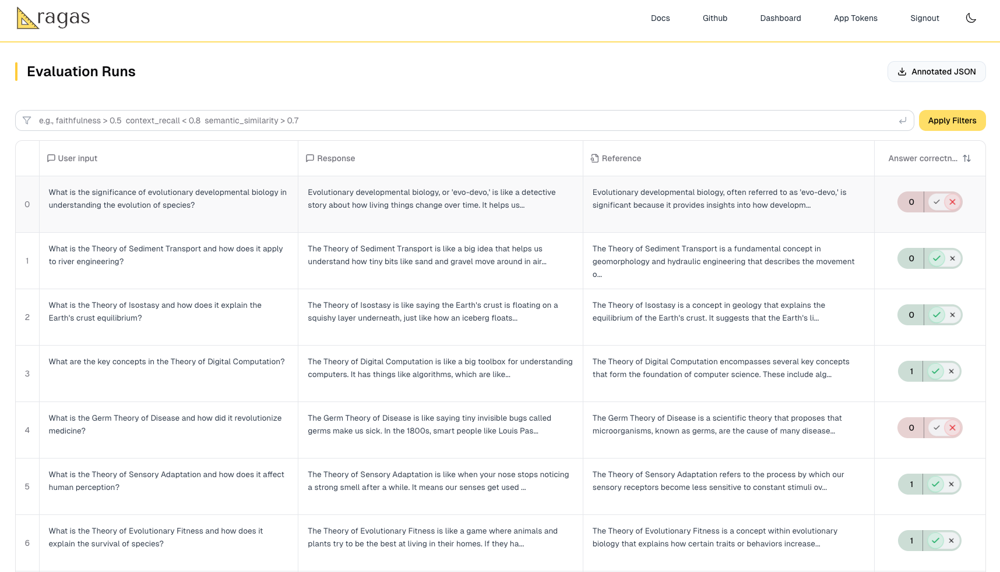
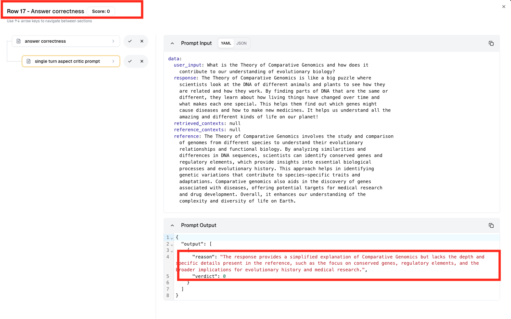
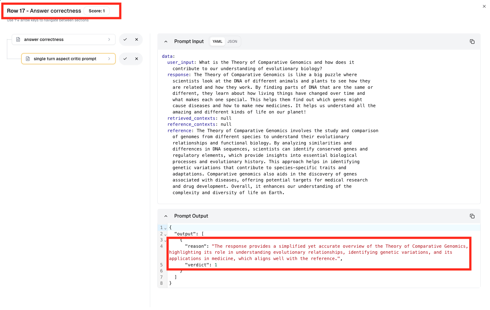

# Train and Align your own Metric

[Open notebook in colab](https://colab.research.google.com/drive/16RIHEAJ0Ded3RuPoMq5498vBuhvPIruv?usp=sharing)

LLM as judge metric often makes mistakes and lack alignment with human evaluators. This makes them risky to use as their results cannot be trusted fully. Now, you can fix this using ragas. This simple tutorial notebook showcasing how to train and align any LLM as judge metric using ragas. One can use this to train any LLM based metric in ragas. 


## Import required modules


```python
import os
from datasets import load_dataset
from ragas import evaluate, EvaluationDataset
from ragas.metrics import AspectCritic

```

### Setup the models used for evaluation and training
You may choose any LLM model for training and evaluation. Here's [how to do it](../customize_models.md)


```python
from ragas.llms import LangchainLLMWrapper
from ragas.embeddings import LangchainEmbeddingsWrapper
from langchain_openai import ChatOpenAI
from langchain_openai import OpenAIEmbeddings
llm = LangchainLLMWrapper(ChatOpenAI(model="gpt-4o-mini"))
embeddings = LangchainEmbeddingsWrapper(OpenAIEmbeddings())
```

## Evaluation

### Load sample evaluation dataset
Here, we are loading the sample dataset for evaluation. You can replace it with your own dataset. 


```python
dataset = load_dataset("explodinggradients/ELI5",split="test")
eval_dataset = EvaluationDataset.from_hf_dataset(dataset)
print(eval_dataset[10].to_string())
```


```
user_input:
	What is the Theory of Glacial Cycles and how does it explain the occurrence of ice ages?

response:
	The Theory of Glacial Cycles, or Milankovitch Cycles, is like a big clock for Earth's ice ages. It says that the way Earth moves around the sun changes over a long time, like how it tilts and wobbles. These changes make the sunlight hit Earth differently, which can make it colder or warmer. Over thousands of years, this can make big ice sheets grow or melt. It's like a chain reaction where these changes also affect things like greenhouse gases and how shiny Earth is, making the ice ages come and go.

reference:
	The Theory of Glacial Cycles, also known as the Milankovitch Cycles, explains the occurrence of ice ages through variations in Earth's orbit and axial tilt. These cycles include changes in eccentricity, axial tilt, and precession, which affect the distribution and intensity of sunlight received by Earth. Over tens of thousands of years, these variations lead to significant climate changes, including the advance and retreat of ice sheets. The theory suggests that these orbital changes trigger feedback mechanisms, such as changes in greenhouse gas concentrations and albedo, amplifying the climatic effects and leading to glacial and interglacial periods.
```


The dataset contains user input, reference and response. Our goal is to evaluate the response based on the reference. The response here is in ELI5 format, which is a simple way of explaining complex topics. 

In this particular application, we need to align our evaluation metric to evaluate the correctness of the response compared to the reference. 

- LLM as judge by default may regard the response as incorrect as it's not written in the same way as the reference, which is not the case here. 
- At the same time, we also need it to identify instances where response makes factual errors or misrepresents the reference.


### Setup the Metric
You may use any LLM based metric. For simplicity, I am using aspect critic metric and setting it up so that it can compare the response with the reference.


```python
critic = AspectCritic(name="answer_correctness",definition="Given the user_input, reference and response. Is the response correct compared with the reference",llm=llm)

```

### Evaluate


```python
results = evaluate(eval_dataset,metrics=[critic])

```

    Evaluating: 100%|██████████████████████████████████████████████████████████| 56/56 [00:01<00:00,  3.49it/s]


## Review and Annotate

Now you have the evaluation results. Now it's time to review the evaluations and give feedback to the metric. This feedback will be used to train the metric. For this you can use [app.ragas.io](https://app.ragas.io) or any other annotation tool like prodigy, label studio etc.

If you're using app.ragas.io,

- Go to [app.ragas.io](https://app.ragas.io) and login.
- Then go to [App tokens](https://app.ragas.io/dashboard/settings/app-tokens) and create a new app token.
- Set the token in the environment variable

```python
os.environ['RAGAS_APP_TOKEN'] = 'your_app_token'
```

Once that's done, you can upload the evaluation results to app.ragas using the following code.
!!! note
    Please ensure that you're in ragas 0.2.8 or above to use this feature.
    
```python
results.upload()
```

Evaluation results uploaded! View at https://app.ragas.io/dashboard/alignment/evaluation/a6baf6ff-027f-4097-89e3-e11c70b8cf61
'https://app.ragas.io/dashboard/alignment/evaluation/a6baf6ff-027f-4097-89e3-e11c70b8cf61'


### Review and annotate some results
You may now view and annotate the evaluation results in app.ragas.io. These annotations will be used to train the metric. Please make sure to annotate at least 15-20 examples for good results.

<figure markdown="span">
  {width="600"}
  <figcaption>Annotating results</figcaption>
</figure>

Here is a sample annotation for the above example. You can [download](../../../_static/edited_chain_runs.json) and use it.

## Training and Alignment

### Train the metric
Download the annotated samples from app.ragas.io using `Download annotated json` button. 
Instruction and demonstration configurations are required tells ragas how to optimize instruction and few shot demonstrations respectively. You can customize these configurations as per your requirements.

```python
from ragas.config import InstructionConfig,DemonstrationConfig
demo_config = DemonstrationConfig(embedding = embeddings)
inst_config = InstructionConfig(llm=llm)
```


```python
critic.train(path="edited_chain_runs.json",demonstration_config=demo_config,instruction_config=inst_config)
```

    Fitness Evaluation Step 4/4: 100%|█████████████████████████████████████| 146/146 [00:24<00:00,  6.03it/s]
    Few-shot examples [single_turn_aspect_critic_prompt]: 100%|██████████████| 18/18 [00:09<00:00,  1.82it/s]


### Analysis
Now, let's do some analysis on the trained metric.

First, let's take a look at new instructions that was obtained for the metric after training.


```python
print(critic.get_prompts()['single_turn_aspect_critic_prompt'].instruction)
```

```
Evaluate the provided user responses against the reference information for accuracy and completeness. 
Assign a verdict of 1 if the response is accurate and aligns well with the reference, or 0 if it contains inaccuracies or misrepresentations.
```

compared with old prompt
```
Evaluate the Input based on the criterial defined. Use only 'Yes' (1) and 'No' (0) as verdict.
Criteria Definition: Given the user_input, reference and response. Is the response correct compared with the reference
```


### Re-evaluate
Let's evaluate again and see if the metric has improved for any un-annotated examples.


```python
results = evaluate(eval_dataset,metrics=[critic])

```

    Evaluating: 100%|████████████████████████████████████████████████████████| 56/56 [00:28<00:00,  1.78it/s]


```python
results.upload()
```

Evaluation results uploaded! View at https://app.ragas.io/dashboard/alignment/evaluation/687e7cdf-ff31-4c15-9780-c179207c929c
'https://app.ragas.io/dashboard/alignment/evaluation/687e7cdf-ff31-4c15-9780-c179207c929c'

### Inspect and compare results

Go to [app.ragas](https://app.ragas.io/dashboard) dashboard and compare the results before and after training.

Here in this case, the metric has improved significantly. You can see the difference in the scores. To show the difference, let's compares the scores and changed reasoning for one specific example before and after training.

|  |  |
|:-------------------------------:|:-------------------------------:|
| *Before training*           | *After training*           |