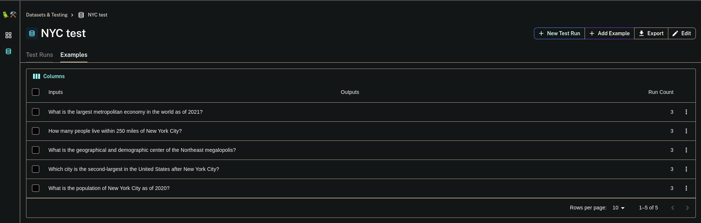

# Langchain
## Evaluating Langchain QA Chains

LangChain is a framework for developing applications powered by language models. It can also be used to create RAG systems (or QA systems as they are reffered to in langchain). If you want to know more about creating RAG systems with langchain you can check the [docs](https://python.langchain.com/docs/use_cases/question_answering/).

With this integration you can easily evaluate your QA chains with the metrics offered in ragas


```python
#!pip install ragas langchain_openai python-dotenv
```


```python
# attach to the existing event loop when using jupyter notebooks
import nest_asyncio
import os
import openai
from dotenv import load_dotenv

# Load environment variables from .env file
load_dotenv()
# IMPORTANT: Remember to create a .env variable containing: OPENAI_API_KEY=sk-xyz where xyz is your key

# Access the API key from the environment variable
api_key = os.environ.get("OPENAI_API_KEY")

# Initialize the OpenAI API client
openai.api_key = api_key

nest_asyncio.apply()
```

First lets load the dataset. We are going to build a generic QA system over the [NYC wikipedia page](https://en.wikipedia.org/wiki/New_York_City). Load the dataset and create the `VectorstoreIndex` and the `RetrievalQA` from it.


```python
from langchain_community.document_loaders import TextLoader
from langchain.indexes import VectorstoreIndexCreator
from langchain.chains import RetrievalQA
from langchain_openai import ChatOpenAI

loader = TextLoader("./nyc_wikipedia/nyc_text.txt")
index = VectorstoreIndexCreator().from_loaders([loader])


llm = ChatOpenAI(temperature=0)
qa_chain = RetrievalQA.from_chain_type(
    llm,
    retriever=index.vectorstore.as_retriever(),
    return_source_documents=True,
)
```


```python
# testing it out

question = "How did New York City get its name?"
result = qa_chain({"query": question})
result["result"]
```

Now in order to evaluate the qa system we generated a few relevant questions. We've generated a few question for you but feel free to add any you want.


```python
eval_questions = [
    "What is the population of New York City as of 2020?",
    "Which borough of New York City has the highest population?",
    "What is the economic significance of New York City?",
    "How did New York City get its name?",
    "What is the significance of the Statue of Liberty in New York City?",
]

eval_answers = [
    "8,804,190",
    "Brooklyn",
    "New York City's economic significance is vast, as it serves as the global financial capital, housing Wall Street and major financial institutions. Its diverse economy spans technology, media, healthcare, education, and more, making it resilient to economic fluctuations. NYC is a hub for international business, attracting global companies, and boasts a large, skilled labor force. Its real estate market, tourism, cultural industries, and educational institutions further fuel its economic prowess. The city's transportation network and global influence amplify its impact on the world stage, solidifying its status as a vital economic player and cultural epicenter.",
    "New York City got its name when it came under British control in 1664. King Charles II of England granted the lands to his brother, the Duke of York, who named the city New York in his own honor.",
    "The Statue of Liberty in New York City holds great significance as a symbol of the United States and its ideals of liberty and peace. It greeted millions of immigrants who arrived in the U.S. by ship in the late 19th and early 20th centuries, representing hope and freedom for those seeking a better life. It has since become an iconic landmark and a global symbol of cultural diversity and freedom.",
]

examples = [
    {"query": q, "ground_truth": [eval_answers[i]]}
    for i, q in enumerate(eval_questions)
]
```

## Introducing `RagasEvaluatorChain`

`RagasEvaluatorChain` creates a wrapper around the metrics ragas provides (documented [here](https://github.com/explodinggradients/ragas/blob/main/docs/concepts/metrics/index.md)), making it easier to run these evaluation with langchain and langsmith.

The evaluator chain has the following APIs

- `__call__()`: call the `RagasEvaluatorChain` directly on the result of a QA chain.
- `evaluate()`: evaluate on a list of examples (with the input queries) and predictions (outputs from the QA chain). 
- `evaluate_run()`: method implemented that is called by langsmith evaluators to evaluate langsmith datasets.

lets see each of them in action to learn more.


```python
result = qa_chain({"query": eval_questions[1]})
result["result"]
```


```python
result = qa_chain(examples[4])
result["result"]
```


```python
from ragas.langchain.evalchain import RagasEvaluatorChain
from ragas.metrics import (
    faithfulness,
    answer_relevancy,
    context_precision,
    context_recall,
)

# create evaluation chains
faithfulness_chain = RagasEvaluatorChain(metric=faithfulness)
answer_rel_chain = RagasEvaluatorChain(metric=answer_relevancy)
context_rel_chain = RagasEvaluatorChain(metric=context_precision)
context_recall_chain = RagasEvaluatorChain(metric=context_recall)
```

1. `__call__()`

Directly run the evaluation chain with the results from the QA chain. Do note that metrics like context_precision and faithfulness require the `source_documents` to be present.


```python
# Recheck the result that we are going to validate.
result
```

**Faithfulness**


```python
eval_result = faithfulness_chain(result)
eval_result["faithfulness_score"]
```

High faithfulness_score means that there are exact consistency between the source documents and the answer.

You can check lower faithfulness scores by changing the result (answer from LLM) or source_documents to something else.


```python
fake_result = result.copy()
fake_result["result"] = "we are the champions"
eval_result = faithfulness_chain(fake_result)
eval_result["faithfulness_score"]
```

**Context Recall**


```python
eval_result = context_recall_chain(result)
eval_result["context_recall_score"]
```

High context_recall_score means that the ground truth is present in the source documents.

You can check lower context recall scores by changing the source_documents to something else.


```python
from langchain.schema import Document

fake_result = result.copy()
fake_result["source_documents"] = [Document(page_content="I love christmas")]
eval_result = context_recall_chain(fake_result)
eval_result["context_recall_score"]
```

2. `evaluate()`

Evaluate a list of inputs/queries and the outputs/predictions from the QA chain.


```python
# run the queries as a batch for efficiency
predictions = qa_chain.batch(examples)

# evaluate
print("evaluating...")
r = faithfulness_chain.evaluate(examples, predictions)
r
```


```python
# evaluate context recall
print("evaluating...")
r = context_recall_chain.evaluate(examples, predictions)
r
```

## Evaluate with langsmith

[Langsmith](https://docs.smith.langchain.com/) is a platform that helps to debug, test, evaluate and monitor chains and agents built on any LLM framework. It also seamlessly integrates with LangChain. 

Langsmith also has a tools to build a testing dataset and run evaluations against them and with `RagasEvaluatorChain` you can use the ragas metrics for running langsmith evaluations as well. To know more about langsmith evaluations checkout the [quickstart](https://docs.smith.langchain.com/evaluation/quickstart).


Lets start of creating the dataset with the NYC questions listed in `eval_questions`. Create a new langsmith dataset and upload the questions.


```python
# dataset creation

from langsmith import Client
from langsmith.utils import LangSmithError

client = Client()
dataset_name = "NYC test"

try:
    # check if dataset exists
    dataset = client.read_dataset(dataset_name=dataset_name)
    print("using existing dataset: ", dataset.name)
except LangSmithError:
    # if not create a new one with the generated query examples
    dataset = client.create_dataset(
        dataset_name=dataset_name, description="NYC test dataset"
    )
    for e in examples:
        client.create_example(
            inputs={"query": e["query"]},
            outputs={"ground_truth": e["ground_truth"]},
            dataset_id=dataset.id,
        )

    print("Created a new dataset: ", dataset.name)
```



As you can see the questions have been uploaded. Now you can run your QA chain against this test dataset and compare the results in the langchain platform. 

Before you call `run_on_dataset` you need a factory function which creates a new instance of the QA chain you want to test. This is so that the internal state is not reused when running against each example.


```python
# factory function that return a new qa chain
def create_qa_chain(return_context=True):
    qa_chain = RetrievalQA.from_chain_type(
        llm,
        retriever=index.vectorstore.as_retriever(),
        return_source_documents=return_context,
    )
    return qa_chain
```

Now lets run the evaluation


```python
from langchain.smith import RunEvalConfig, run_on_dataset

evaluation_config = RunEvalConfig(
    custom_evaluators=[
        faithfulness_chain,
        answer_rel_chain,
        context_rel_chain,
        context_recall_chain,
    ],
    prediction_key="result",
)

result = run_on_dataset(
    client,
    dataset_name,
    create_qa_chain,
    evaluation=evaluation_config,
    input_mapper=lambda x: x,
)
```

You can follow the link to open the result for the run in langsmith. Check out the scores for each example too


Now if you want to dive more into the reasons for the scores and how to improve them, click on any example and open the feedback tab. This will show you each scores.


You can also see the curresponding `RagasEvaluatorChain` trace too to figure out why ragas scored the way it did.


