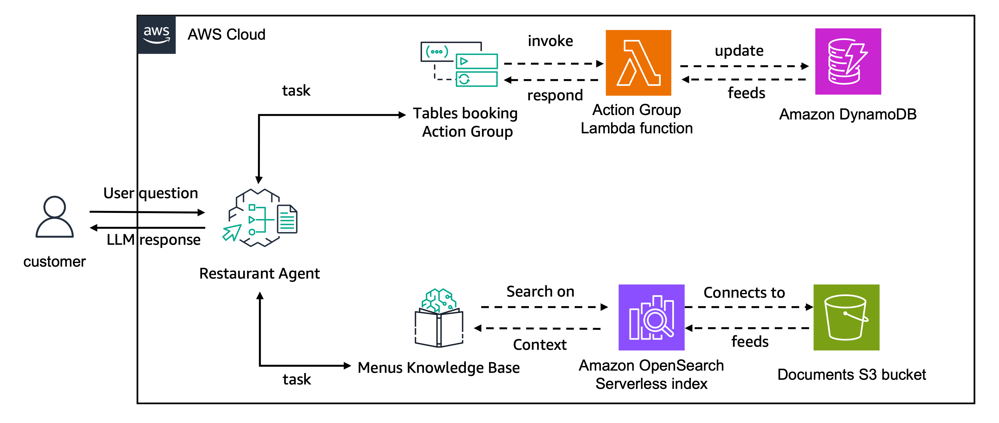

# Create and Evaluate an Amazon Bedrock Agent Integrated with an Amazon Bedrock Knowledge Base and Action Groups

In this notebook, you will learn how to evaluate an Amazon Bedrock Agent. The agent we'll evaluate is a restaurant agent that provides clients with information about adult and children's menus and manages the table booking system. This agent is inspired by a [features example notebooks](https://github.com/aws-samples/amazon-bedrock-samples/tree/main/agents-and-function-calling/bedrock-agents/features-examples/05-create-agent-with-knowledge-base-and-action-group) of [Amazon Bedrock Agents](https://aws.amazon.com/bedrock/agents/) with minor changes. You can learn more about the agent creation process [here](https://github.com/aws-samples/amazon-bedrock-samples/tree/main/agents-and-function-calling/bedrock-agents/features-examples/05-create-agent-with-knowledge-base-and-action-group).

The architecture is illustrated below:



The steps covered in this notebook include:

- Importing necessary libraries
- Creating the agent
- Defining the Ragas metrics
- Evaluating the agent
- Cleaning up the created resources

??? note "Click to View the Agent creation"
    ## Import the needed libraries

    First step is to install the pre-requisites packages


    ```python
    %pip install --upgrade -q boto3 opensearch-py botocore awscli retrying ragas langchain-aws
    ```

    This command will clone the repository containing helper files needed for this tutorial. 

    ```
    ! git clone https://huggingface.co/datasets/explodinggradients/booking_agent_utils
    ```


    ```python
    import os
    import time
    import boto3
    import logging
    import pprint
    import json

    from booking_agent_utils.knowledge_base import BedrockKnowledgeBase
    from booking_agent_utils.agent import (
        create_agent_role_and_policies,
        create_lambda_role,
        delete_agent_roles_and_policies,
        create_dynamodb,
        create_lambda,
        clean_up_resources,
    )
    ```


    ```python
    # Clients
    s3_client = boto3.client("s3")
    sts_client = boto3.client("sts")
    session = boto3.session.Session()
    region = session.region_name
    account_id = sts_client.get_caller_identity()["Account"]
    bedrock_agent_client = boto3.client("bedrock-agent")
    bedrock_agent_runtime_client = boto3.client("bedrock-agent-runtime")
    logging.basicConfig(
        format="[%(asctime)s] p%(process)s {%(filename)s:%(lineno)d} %(levelname)s - %(message)s",
        level=logging.INFO,
    )
    logger = logging.getLogger(__name__)
    region, account_id
    ```


    ```python
    suffix = f"{region}-{account_id}"
    agent_name = "booking-agent"
    knowledge_base_name = f"{agent_name}-kb"
    knowledge_base_description = (
        "Knowledge Base containing the restaurant menu's collection"
    )
    agent_alias_name = "booking-agent-alias"
    bucket_name = f"{agent_name}-{suffix}"
    agent_bedrock_allow_policy_name = f"{agent_name}-ba"
    agent_role_name = f"AmazonBedrockExecutionRoleForAgents_{agent_name}"
    agent_foundation_model = "amazon.nova-pro-v1:0"

    agent_description = "Agent in charge of a restaurants table bookings"
    agent_instruction = """
    You are a restaurant agent responsible for managing clients’ bookings (retrieving, creating, or canceling reservations) and assisting with menu inquiries. When handling menu requests, provide detailed information about the requested items. Offer recommendations only when:

    1. The customer explicitly asks for a recommendation, even if the item is available (include complementary dishes).
    2. The requested item is unavailable—inform the customer and suggest suitable alternatives.
    3. For general menu inquiries, provide the full menu and add a recommendation only if the customer asks for one.

    In all cases, ensure that any recommended items are present in the menu.

    Ensure all responses are clear, contextually relevant, and enhance the customer's experience.
    """

    agent_action_group_description = """
    Actions for getting table booking information, create a new booking or delete an existing booking"""

    agent_action_group_name = "TableBookingsActionGroup"
    ```

    ## Setting up Agent

    ### Create Knowledge Base for Amazon Bedrock

    Let's start by creating a [Knowledge Base for Amazon Bedrock](https://aws.amazon.com/bedrock/knowledge-bases/) to store the restaurant menus. For this example, we will integrate the knowledge base with Amazon OpenSearch Serverless.


    ```python
    knowledge_base = BedrockKnowledgeBase(
        kb_name=knowledge_base_name,
        kb_description=knowledge_base_description,
        data_bucket_name=bucket_name,
    )
    ```

    ### Upload the Dataset to Amazon S3
    Now that we have created the knowledge base, let's populate it with the restaurant menus dataset. In this example, we will use [boto3 abstraction](https://boto3.amazonaws.com/v1/documentation/api/latest/reference/services/bedrock-agent/client/start_ingestion_job.html) of the API, via our helper classes.

    Let’s first upload the menu data available in the dataset folder to Amazon S3.


    ```python
    def upload_directory(path, bucket_name):
        for root, dirs, files in os.walk(path):
            for file in files:
                file_to_upload = os.path.join(root, file)
                print(f"uploading file {file_to_upload} to {bucket_name}")
                s3_client.upload_file(file_to_upload, bucket_name, file)


    upload_directory("booking_agent_utils/dataset", bucket_name)
    ```

    Now we start the ingestion job


    ```python
    # ensure that the kb is available
    time.sleep(30)
    # sync knowledge base
    knowledge_base.start_ingestion_job()
    ```

    Finally we collect the Knowledge Base Id to integrate it with our Agent later on.


    ```python
    kb_id = knowledge_base.get_knowledge_base_id()
    ```

    #### Testing Knowledge Base with Retrieve and Generate API

    First, let’s test the knowledge base using the Retrieve and Generate API to ensure that the knowledge base is functioning correctly.


    ```python
    response = bedrock_agent_runtime_client.retrieve_and_generate(
        input={"text": "Which are the mains available in the childrens menu?"},
        retrieveAndGenerateConfiguration={
            "type": "KNOWLEDGE_BASE",
            "knowledgeBaseConfiguration": {
                "knowledgeBaseId": kb_id,
                "modelArn": "arn:aws:bedrock:{}::foundation-model/{}".format(
                    region, agent_foundation_model
                ),
                "retrievalConfiguration": {
                    "vectorSearchConfiguration": {"numberOfResults": 5}
                },
            },
        },
    )

    print(response["output"]["text"], end="\n" * 2)
    ```

    ### Create the DynamoDB Table

    We will create a DynamoDB table that contains restaurant booking information.


    ```python
    table_name = "restaurant_bookings"
    create_dynamodb(table_name)
    ```

    ### Create the Lambda Function

    We will now create a Lambda function that interacts with the DynamoDB table.

    #### Create the Function Code

    Create the Lambda function that implements the functions for `get_booking_details`, `create_booking`, and `delete_booking`.


    ```python
    %%writefile lambda_function.py
    import json
    import uuid
    import boto3

    dynamodb = boto3.resource('dynamodb')
    table = dynamodb.Table('restaurant_bookings')

    def get_named_parameter(event, name):
        """
        Get a parameter from the lambda event
        """
        return next(item for item in event['parameters'] if item['name'] == name)['value']


    def get_booking_details(booking_id):
        """
        Retrieve details of a restaurant booking
        
        Args:
            booking_id (string): The ID of the booking to retrieve
        """
        try:
            response = table.get_item(Key={'booking_id': booking_id})
            if 'Item' in response:
                return response['Item']
            else:
                return {'message': f'No booking found with ID {booking_id}'}
        except Exception as e:
            return {'error': str(e)}


    def create_booking(date, name, hour, num_guests):
        """
        Create a new restaurant booking
        
        Args:
            date (string): The date of the booking
            name (string): Name to idenfity your reservation
            hour (string): The hour of the booking
            num_guests (integer): The number of guests for the booking
        """
        try:
            booking_id = str(uuid.uuid4())[:8]
            table.put_item(
                Item={
                    'booking_id': booking_id,
                    'date': date,
                    'name': name,
                    'hour': hour,
                    'num_guests': num_guests
                }
            )
            return {'booking_id': booking_id}
        except Exception as e:
            return {'error': str(e)}


    def delete_booking(booking_id):
        """
        Delete an existing restaurant booking
        
        Args:
            booking_id (str): The ID of the booking to delete
        """
        try:
            response = table.delete_item(Key={'booking_id': booking_id})
            if response['ResponseMetadata']['HTTPStatusCode'] == 200:
                return {'message': f'Booking with ID {booking_id} deleted successfully'}
            else:
                return {'message': f'Failed to delete booking with ID {booking_id}'}
        except Exception as e:
            return {'error': str(e)}
        

    def lambda_handler(event, context):
        # get the action group used during the invocation of the lambda function
        actionGroup = event.get('actionGroup', '')
        
        # name of the function that should be invoked
        function = event.get('function', '')
        
        # parameters to invoke function with
        parameters = event.get('parameters', [])

        if function == 'get_booking_details':
            booking_id = get_named_parameter(event, "booking_id")
            if booking_id:
                response = str(get_booking_details(booking_id))
                responseBody = {'TEXT': {'body': json.dumps(response)}}
            else:
                responseBody = {'TEXT': {'body': 'Missing booking_id parameter'}}

        elif function == 'create_booking':
            date = get_named_parameter(event, "date")
            name = get_named_parameter(event, "name")
            hour = get_named_parameter(event, "hour")
            num_guests = get_named_parameter(event, "num_guests")

            if date and hour and num_guests:
                response = str(create_booking(date, name, hour, num_guests))
                responseBody = {'TEXT': {'body': json.dumps(response)}}
            else:
                responseBody = {'TEXT': {'body': 'Missing required parameters'}}

        elif function == 'delete_booking':
            booking_id = get_named_parameter(event, "booking_id")
            if booking_id:
                response = str(delete_booking(booking_id))
                responseBody = {'TEXT': {'body': json.dumps(response)}}
            else:
                responseBody = {'TEXT': {'body': 'Missing booking_id parameter'}}

        else:
            responseBody = {'TEXT': {'body': 'Invalid function'}}

        action_response = {
            'actionGroup': actionGroup,
            'function': function,
            'functionResponse': {
                'responseBody': responseBody
            }
        }

        function_response = {'response': action_response, 'messageVersion': event['messageVersion']}
        print("Response: {}".format(function_response))

        return function_response
    ```

    #### Create the required permissions


    ```python
    lambda_iam_role = create_lambda_role(agent_name, table_name)
    ```

    #### Create the function


    ```python
    lambda_function_name = f"{agent_name}-lambda"
    lambda_function = create_lambda(lambda_function_name, lambda_iam_role)
    ```

    ### Create the IAM Policies Needed for the Agent

    Now that we have created the Knowledge Base, our DynamoDB table, and the Lambda function to execute the tasks for our Agent, let’s start creating our Agent.


    ```python
    agent_role = create_agent_role_and_policies(
        agent_name, agent_foundation_model, kb_id=kb_id
    )
    ```

    ### Create the Agent

    Now that we have created the necessary IAM role, we can use the [`create_agent`](https://boto3.amazonaws.com/v1/documentation/api/latest/reference/services/bedrock-agent/client/create_agent.html) API from boto3 to create a new agent.


    ```python
    response = bedrock_agent_client.create_agent(
        agentName=agent_name,
        agentResourceRoleArn=agent_role["Role"]["Arn"],
        description=agent_description,
        idleSessionTTLInSeconds=1800,
        foundationModel=agent_foundation_model,
        instruction=agent_instruction,
    )
    ```

    Let's get our Agent ID. It will be important to perform operations with our agent


    ```python
    agent_id = response["agent"]["agentId"]
    print("The agent id is:", agent_id)
    ```

    ### Create the Agent Action Group

    We will now create an Agent Action Group that uses the Lambda function created earlier. To inform the agent about the capabilities of the action group, we will provide a description outlining its functionalities.

    To define the functions using a function schema, you need to provide the name, description, and parameters for each function.


    ```python
    agent_functions = [
        {
            "name": "get_booking_details",
            "description": "Retrieve details of a restaurant booking",
            "parameters": {
                "booking_id": {
                    "description": "The ID of the booking to retrieve",
                    "required": True,
                    "type": "string",
                }
            },
        },
        {
            "name": "create_booking",
            "description": "Create a new restaurant booking",
            "parameters": {
                "date": {
                    "description": "The date of the booking",
                    "required": True,
                    "type": "string",
                },
                "name": {
                    "description": "Name to idenfity your reservation",
                    "required": True,
                    "type": "string",
                },
                "hour": {
                    "description": "The hour of the booking",
                    "required": True,
                    "type": "string",
                },
                "num_guests": {
                    "description": "The number of guests for the booking",
                    "required": True,
                    "type": "integer",
                },
            },
        },
        {
            "name": "delete_booking",
            "description": "Delete an existing restaurant booking",
            "parameters": {
                "booking_id": {
                    "description": "The ID of the booking to delete",
                    "required": True,
                    "type": "string",
                }
            },
        },
    ]
    ```

    We now use the function schema to create the agent action group using the [`create_agent_action_group`](https://boto3.amazonaws.com/v1/documentation/api/latest/reference/services/bedrock-agent/client/create_agent_action_group.html) API


    ```python
    # Pause to make sure agent is created
    time.sleep(30)

    # Now, we can configure and create an action group here:
    agent_action_group_response = bedrock_agent_client.create_agent_action_group(
        agentId=agent_id,
        agentVersion="DRAFT",
        actionGroupExecutor={"lambda": lambda_function["FunctionArn"]},
        actionGroupName=agent_action_group_name,
        functionSchema={"functions": agent_functions},
        description=agent_action_group_description,
    )
    ```

    ### Allow the Agent to invoke the Action Group Lambda


    ```python
    # Create allow to invoke permission on lambda
    lambda_client = boto3.client("lambda")
    response = lambda_client.add_permission(
        FunctionName=lambda_function_name,
        StatementId="allow_bedrock",
        Action="lambda:InvokeFunction",
        Principal="bedrock.amazonaws.com",
        SourceArn=f"arn:aws:bedrock:{region}:{account_id}:agent/{agent_id}",
    )
    ```

    ### Associate the Knowledge Base to the agent


    ```python
    response = bedrock_agent_client.associate_agent_knowledge_base(
        agentId=agent_id,
        agentVersion="DRAFT",
        description="Access the knowledge base when customers ask about the plates in the menu.",
        knowledgeBaseId=kb_id,
        knowledgeBaseState="ENABLED",
    )
    ```

    ### Prepare the Agent and create an alias

    Let's create a DRAFT version of the agent that can be used for internal testing.


    ```python
    response = bedrock_agent_client.prepare_agent(agentId=agent_id)
    print(response)
    # Pause to make sure agent is prepared
    time.sleep(30)
    ```


    ```python
    response = bedrock_agent_client.create_agent_alias(
        agentAliasName="TestAlias",
        agentId=agent_id,
        description="Test alias",
    )

    alias_id = response["agentAlias"]["agentAliasId"]
    print("The Agent alias is:", alias_id)
    time.sleep(30)
    ```

The `invokeAgent` function sends a user query to the Bedrock agent and returns both the agent’s response and trace data. It processes the event stream, capturing trace information for evaluation purposes.

```python
def invokeAgent(query, session_id, session_state=dict()):
    end_session: bool = False

    # invoke the agent API
    agentResponse = bedrock_agent_runtime_client.invoke_agent(
        inputText=query,
        agentId=agent_id,
        agentAliasId=alias_id,
        sessionId=session_id,
        enableTrace=True,
        endSession=end_session,
        sessionState=session_state,
    )

    event_stream = agentResponse["completion"]
    try:
        traces = []
        for event in event_stream:
            if "chunk" in event:
                data = event["chunk"]["bytes"]
                agent_answer = data.decode("utf8")
                end_event_received = True
                return agent_answer, traces
                # End event indicates that the request finished successfully
            elif "trace" in event:
                traces.append(event["trace"])
            else:
                raise Exception("unexpected event.", event)
        return agent_answer, traces
    except Exception as e:
        raise Exception("unexpected event.", e)
```

## Defining the Ragas metrics

Evaluating agents is different from testing traditional software, where you can simply verify whether the output matches expected results. These agents perform complex tasks that often have multiple valid approaches.

Given their inherent autonomy, evaluating agents is essential to ensure they function properly.

#### Choosing What to Evaluate in Your Agent

Selecting evaluation metrics depends entirely on your use case. A good rule of thumb is to select metrics directly tied to user needs or metrics that clearly drive business value. In the restaurant agent example above, we want the agent to fulfill user requests without unnecessary repetition, provide helpful recommendations when appropriate to enhance customer experience, and maintain consistency with the brand tone.

We’ll define metrics to evaluate these priorities. Ragas provides several user-defined metrics for evaluations.

When defining evaluation criteria, focus on binary decisions or discrete classification scores rather than ambiguous scores. Binary or clear classifications compel you to explicitly define success criteria. Avoid metrics yielding scores between 0 and 100 without clear interpretation, as distinguishing between close scores like 87 and 91 can be challenging, especially when evaluations occur independently.

Ragas includes metrics suited to such evaluations, and we will explore some of them in action:  

- [Aspect Critic Metric](../../concepts/metrics/available_metrics/aspect_critic.md): Evaluates whether a submission follows user-defined criteria by leveraging LLM judgments to yield a binary outcome.
- [Rubric Score Metric](../../concepts/metrics/available_metrics/general_purpose.md#rubrics-based-criteria-scoring): Assesses responses against detailed, user-defined rubrics to consistently assign scores reflecting quality.


```python
from langchain_aws import ChatBedrock
from ragas.llms import LangchainLLMWrapper

model_id = "us.amazon.nova-pro-v1:0"   # Choose your desired model
region_name = "us-east-1"              # Choose your desired AWS region

bedrock_llm = ChatBedrock(model_id=model_id, region_name=region_name)
evaluator_llm = LangchainLLMWrapper(bedrock_llm)
```


```python
from ragas.metrics import AspectCritic, RubricsScore
from ragas.dataset_schema import SingleTurnSample, MultiTurnSample, EvaluationDataset
from ragas import evaluate

rubrics = {
    "score-1_description": (
        "The item requested by the customer is not present in the menu and no recommendations were made."
    ),
    "score0_description": (
        "Either the item requested by the customer is present in the menu, or the conversation does not include any food or menu inquiry (e.g., booking, cancellation). This score applies regardless of whether any recommendation was provided."
    ),
    "score1_description": (
        "The item requested by the customer is not present in the menu and a recommendation was provided."
    ),
}

recommendations = RubricsScore(rubrics=rubrics, llm=evaluator_llm, name="Recommendations")


# Metric to evaluate if the AI fulfills all human requests completely.
request_completeness = AspectCritic(
    name="Request Completeness",
    llm=evaluator_llm,
    definition=(
        "Return 1 The agent completely fulfills all the user requests with no omissions. "
        "otherwise, return 0."
    ),
)

# Metric to assess if the AI's communication aligns with the desired brand voice.
brand_tone = AspectCritic(
    name="Brand Voice Metric",
    llm=evaluator_llm,
    definition=(
        "Return 1 if the AI's communication is friendly, approachable, helpful, clear, and concise; "
        "otherwise, return 0."
    ),
)
```

## Evaluating Agent with Ragas

In order to perform evaluations using Ragas, the traces need to be converted into the format recognized by Ragas. To convert an Amazon Bedrock agent trace into a format suitable for Ragas evaluation, Ragas provides the function [convert_to_ragas_messages][ragas.integrations.amazon_bedrock.convert_to_ragas_messages], which can be used to transform Amazon Bedrock messages into the format expected by Ragas. You can read more about it [here](../../concepts/components/eval_dataset.md).


```python
%%time
import uuid
session_id:str = str(uuid.uuid1())
query = "If you have children food then book a table for 2 people at 7pm on the 5th of May 2025."
agent_answer, traces_1 = invokeAgent(query, session_id)

print(agent_answer)
```
Output
```
Your booking for 2 people at 7pm on the 5th of May 2025 has been successfully created. Your booking ID is ca2fab70.
```

```python
query = "Can you check my previous booking? Can you please delete the booking?"
agent_answer, traces_2 = invokeAgent(query, session_id)

print(agent_answer)
```
Output
```
Your reservation was found and has been successfully canceled.
```

```python
from ragas.integrations.amazon_bedrock import convert_to_ragas_messages

# Convert Amazon Bedrock traces to messages accepted by RAGAS.
# The convert_to_ragas_messages function transforms Bedrock-specific trace data 
# into a format that RAGAS can process as conversation messages.
ragas_messages_trace_1 = convert_to_ragas_messages(traces_1)
ragas_messages_trace_2 = convert_to_ragas_messages(traces_2)

# Initialize MultiTurnSample objects.
# MultiTurnSample is a data type defined in RAGAS that encapsulates conversation
# data for multi-turn evaluation. This conversion is necessary to perform evaluations.
sample_1 = MultiTurnSample(user_input=ragas_messages_trace_1)
sample_2 = MultiTurnSample(user_input=ragas_messages_trace_2)

result = evaluate(
    # Create an evaluation dataset from the multi-turn samples
    dataset=EvaluationDataset(samples=[sample_1, sample_2]),
    metrics=[request_completeness, brand_tone],
)

result.to_pandas()
```
Output
```
Evaluating: 100%|██████████| 4/4 [00:00<?, ?it/s]
```
<div>
<style scoped>
    .dataframe tbody tr th:only-of-type {
        vertical-align: middle;
    }
    .dataframe tbody tr th {
        vertical-align: top;
    }
    .dataframe thead th {
        text-align: right;
    }
</style>
<table border="1">
  <thead>
    <tr style="text-align: right;">
      <th></th>
      <th>user_input</th>
      <th>Request Completeness</th>
      <th>Brand Voice Metric</th>
    </tr>
  </thead>
  <tbody>
    <tr>
      <th>0</th>
      <td>[{'content': '[{text=If you have children food...</td>
      <td>1</td>
      <td>1</td>
    </tr>
    <tr>
      <th>1</th>
      <td>[{'content': '[{text=If you have children food...</td>
      <td>1</td>
      <td>1</td>
    </tr>
  </tbody>
</table>
</div>


The scores of 1 were awarded because the agent fully met all user requests without any omissions (completeness) and communicated in a friendly, approachable, helpful, clear, and concise manner (brand voice) for both the conversations.


```python
%%time
import uuid

session_id:str = str(uuid.uuid1())
query = "Do you serve Chicken Wings?"

agent_answer, traces_3 = invokeAgent(query, session_id)
print(agent_answer)
```
Output
```
Yes, we serve Chicken Wings. Here are the details:
- **Buffalo Chicken Wings**: Classic buffalo wings served with celery sticks and blue cheese dressing. Allergens: Dairy (in blue cheese dressing), Gluten (in the coating), possible Soy (in the sauce).
```

```python
%%time
session_id:str = str(uuid.uuid1())
query = "For desserts, do you have chocolate truffle cake?"
agent_answer, traces_4 = invokeAgent(query, session_id)
print(agent_answer)
```
Output
```
I'm sorry, but we do not have chocolate truffle cake on our dessert menu. However, we have several delicious alternatives you might enjoy:
    
1. **Classic New York Cheesecake** - Creamy cheesecake with a graham cracker crust, topped with a choice of fruit compote or chocolate ganache.
2. **Apple Pie à la Mode** - Warm apple pie with a flaky crust, served with a scoop of vanilla ice cream and a drizzle of caramel sauce.
3. **Chocolate Lava Cake** - Rich and gooey chocolate cake with a molten center, dusted with powdered sugar and served with a scoop of raspberry sorbet.
4. **Pecan Pie Bars** - Buttery shortbread crust topped with a gooey pecan filling, cut into bars for easy serving.
5. **Banana Pudding Parfait** - Layers of vanilla pudding, sliced bananas, and vanilla wafers, topped with whipped cream and a sprinkle of crushed nuts.

May I recommend the **Chocolate Lava Cake** for a decadent treat?
```

```python
%%time
from datetime import datetime
today = datetime.today().strftime('%b-%d-%Y')

session_id:str = str(uuid.uuid1())
query = "Do you have indian food?"
session_state = {
    "promptSessionAttributes": {
        "name": "John",
        "today": today
    }
}

agent_answer, traces_5 = invokeAgent(query, session_id, session_state=session_state)
print(agent_answer)
```
Output
```
I could not find Indian food on our menu. However, we offer a variety of other cuisines including American, Italian, and vegetarian options. Would you like to know more about these options? 
```

```python
from ragas.integrations.amazon_bedrock import convert_to_ragas_messages

ragas_messages_trace_3 = convert_to_ragas_messages(traces_3)
ragas_messages_trace_4 = convert_to_ragas_messages(traces_4)
ragas_messages_trace_5 = convert_to_ragas_messages(traces_5)

sample_3 = MultiTurnSample(user_input=ragas_messages_trace_3)
sample_4 = MultiTurnSample(user_input=ragas_messages_trace_4)
sample_5 = MultiTurnSample(user_input=ragas_messages_trace_5)

result = evaluate(
    dataset=EvaluationDataset(samples=[sample_3, sample_4, sample_5]),
    metrics=[recommendations],
)

result.to_pandas()
```
```
Evaluating: 100%|██████████| 3/3 [00:00<?, ?it/s]
```

<div>
<style scoped>
    .dataframe tbody tr th:only-of-type {
        vertical-align: middle;
    }
    .dataframe tbody tr th {
        vertical-align: top;
    }
    .dataframe thead th {
        text-align: right;
    }
</style>
<table border="1">
  <thead>
    <tr style="text-align: right;">
      <th></th>
      <th>user_input</th>
      <th>Recommendations</th>
    </tr>
  </thead>
  <tbody>
    <tr>
      <th>0</th>
      <td>[{'content': '[{text=Do you serve Chicken Wing...</td>
      <td>0</td>
    </tr>
    <tr>
      <th>1</th>
      <td>[{'content': '[{text=For desserts, do you have...</td>
      <td>1</td>
    </tr>
    <tr>
      <th>2</th>
      <td>[{'content': '[{text=Do you have indian food?}...</td>
      <td>1</td>
    </tr>
  </tbody>
</table>
</div>


For the Recommendation metric, the chicken wings inquiry scored 0 since the item was available. Both the chocolate truffle cake and Indian food inquiries scored 1 because the requested items were not on the menu and alternative recommendations were provided.

To evaluate how well our agent utilizes information retrieved from the knowledge base, we use the RAG evaluation metrics provided by Ragas. You can learn more about these metrics [here]().

In this tutorial, we will use the following RAG metrics:  

- [ContextRelevance](../../concepts/metrics/available_metrics/nvidia_metrics.md#context-relevance): Measures how well the retrieved contexts address the user’s query by evaluating their pertinence through dual LLM judgments.
- [Faithfulness](../../concepts/metrics/available_metrics/faithfulness.md): Assesses the factual consistency of the response by determining whether all its claims can be supported by the provided retrieved contexts.
- [ResponseGroundedness](../../concepts/metrics/available_metrics/nvidia_metrics.md#response-groundedness): Determines the extent to which each claim in the response is directly supported or “grounded” in the provided contexts.


```python
from ragas.metrics import ContextRelevance, Faithfulness,  ResponseGroundedness

metrics = [
    ContextRelevance(llm=evaluator_llm),
    Faithfulness(llm=evaluator_llm),
    ResponseGroundedness(llm=evaluator_llm),
]
```


```python
from ragas.integrations.amazon_bedrock import extract_kb_trace

kb_trace_3 = extract_kb_trace(traces_3)
kb_trace_4 = extract_kb_trace(traces_4)

trace_3_single_turn_sample = SingleTurnSample(
    user_input=kb_trace_3[0].get("user_input"),
    retrieved_contexts=kb_trace_3[0].get("retrieved_contexts"),
    response=kb_trace_3[0].get("response"),
    reference="Yes, we do serve chicken wings prepared in Buffalo style, chicken wing that’s typically deep-fried and then tossed in a tangy, spicy Buffalo sauce.",
)

trace_4_single_turn_sample = SingleTurnSample(
    user_input=kb_trace_4[0].get("user_input"),
    retrieved_contexts=kb_trace_4[0].get("retrieved_contexts"),
    response=kb_trace_4[0].get("response"),
    reference="The desserts on the adult menu are:\n1. Classic New York Cheesecake\n2. Apple Pie à la Mode\n3. Chocolate Lava Cake\n4. Pecan Pie Bars\n5. Banana Pudding Parfait",
)

single_turn_samples = [trace_3_single_turn_sample, trace_4_single_turn_sample]

dataset = EvaluationDataset(samples=single_turn_samples)
```


```python
kb_results = evaluate(dataset=dataset, metrics=metrics)
kb_results.to_pandas()
```
```
Evaluating: 100%|██████████| 6/6 [00:00<?, ?it/s]
```
<div>
<style scoped>
    .dataframe tbody tr th:only-of-type {
        vertical-align: middle;
    }
    .dataframe tbody tr th {
        vertical-align: top;
    }
    .dataframe thead th {
        text-align: right;
    }
</style>
<table border="1">
  <thead>
    <tr style="text-align: right;">
      <th></th>
      <th>user_input</th>
      <th>retrieved_contexts</th>
      <th>response</th>
      <th>reference</th>
      <th>nv_context_relevance</th>
      <th>faithfulness</th>
      <th>nv_response_groundedness</th>
    </tr>
  </thead>
  <tbody>
    <tr>
      <th>0</th>
      <td>Chicken Wings</td>
      <td>[The Regrettable Experience -- Dinner Menu Ent...</td>
      <td>Yes, we serve Chicken Wings. Here are the deta...</td>
      <td>Yes, we do serve chicken wings prepared in Buf...</td>
      <td>1.0</td>
      <td>1.00</td>
      <td>1.0</td>
    </tr>
    <tr>
      <th>1</th>
      <td>chocolate truffle cake</td>
      <td>[Allergens: Gluten (in the breading).     3. B...</td>
      <td>I'm sorry, but we do not have chocolate truffl...</td>
      <td>The desserts on the adult menu are:\n1. Classi...</td>
      <td>0.0</td>
      <td>0.75</td>
      <td>0.5</td>
    </tr>
  </tbody>
</table>
</div>


Corrected Snippet:

To evaluate whether the agent is able to achieve its goal, we can use the following metrics:  

- [AgentGoalAccuracyWithReference](../../concepts/metrics/available_metrics/agents.md#agent-goal-accuracy): Determines if the AI achieved the user’s goal by comparing its final outcome against an annotated ideal outcome, yielding a binary result.
- [AgentGoalAccuracyWithoutReference](../../concepts/metrics/available_metrics/agents.md#agent-goal-accuracy): Infers whether the AI met the user’s goal solely based on conversational interactions, providing a binary success indicator without an explicit reference.


```python
from ragas.metrics import (
    AgentGoalAccuracyWithoutReference,
    AgentGoalAccuracyWithReference,
)

goal_accuracy_with_reference = AgentGoalAccuracyWithReference(llm=evaluator_llm)
goal_accuracy_without_reference = AgentGoalAccuracyWithoutReference(llm=evaluator_llm)
```


```python
%%time
import uuid

session_id:str = str(uuid.uuid1())
query = "What entrees do you have for children?"

agent_answer, traces_6 = invokeAgent(query, session_id)
print(agent_answer)
```
Output
```
Here are the entrees available for children:
1. CHICKEN NUGGETS - Crispy chicken nuggets served with a side of ketchup or ranch dressing. Allergens: Gluten (in the coating), possible Soy. Suitable for Vegetarians: No
2. MACARONI AND CHEESE - Classic macaroni pasta smothered in creamy cheese sauce. Allergens: Dairy, Gluten. Suitable for Vegetarians: Yes
3. MINI CHEESE QUESADILLAS - Small flour tortillas filled with melted cheese, served with a mild salsa. Allergens: Dairy, Gluten. Suitable for Vegetarians: Yes
4. PEANUT BUTTER AND BANANA SANDWICH - Peanut butter and banana slices on whole wheat bread. Allergens: Nuts (peanut), Gluten. Suitable for Vegetarians: Yes (if using vegetarian peanut butter)
5. VEGGIE PITA POCKETS - Mini whole wheat pita pockets filled with hummus, cucumber, and cherry tomatoes. Allergens: Gluten, possible Soy. Suitable for Vegetarians: Yes
``` 

```python
from ragas.integrations.amazon_bedrock import convert_to_ragas_messages

ragas_messages_trace_6 = convert_to_ragas_messages(traces_6)

sample_6 = MultiTurnSample(
    user_input=ragas_messages_trace_6,
    reference="Response contains entrees food items for the children.",
)

result = evaluate(
    dataset=EvaluationDataset(samples=[sample_6]),
    metrics=[goal_accuracy_with_reference],
)

result.to_pandas()
```
```
Evaluating: 100%|██████████| 1/1 [00:00<?, ?it/s]
```

<div>
<style scoped>
    .dataframe tbody tr th:only-of-type {
        vertical-align: middle;
    }
    .dataframe tbody tr th {
        vertical-align: top;
    }
    .dataframe thead th {
        text-align: right;
    }
</style>
<table border="1">
  <thead>
    <tr style="text-align: right;">
      <th></th>
      <th>user_input</th>
      <th>reference</th>
      <th>agent_goal_accuracy</th>
    </tr>
  </thead>
  <tbody>
    <tr>
      <th>0</th>
      <td>[{'content': '[{text=What entrees do you have ...</td>
      <td>The final outcome provides child-friendly entr...</td>
      <td>1.0</td>
    </tr>
  </tbody>
</table>
</div>


```python
sample_6 = MultiTurnSample(user_input=ragas_messages_trace_6)

result = evaluate(
    dataset=EvaluationDataset(samples=[sample_6]),
    metrics=[goal_accuracy_without_reference],
)

result.to_pandas()
```
```
Evaluating: 100%|██████████| 1/1 [00:00<?, ?it/s]
```
<div>
<style scoped>
    .dataframe tbody tr th:only-of-type {
        vertical-align: middle;
    }
    .dataframe tbody tr th {
        vertical-align: top;
    }
    .dataframe thead th {
        text-align: right;
    }
</style>
<table border="1">
  <thead>
    <tr style="text-align: right;">
      <th></th>
      <th>user_input</th>
      <th>agent_goal_accuracy</th>
    </tr>
  </thead>
  <tbody>
    <tr>
      <th>0</th>
      <td>[{'content': '[{text=What entrees do you have ...</td>
      <td>1.0</td>
    </tr>
  </tbody>
</table>
</div>


In both scenarios, the agent earned a score of 1 by comprehensively providing all available options—specifically by listing all children's entrees.

## Clean-up 
Let's delete all the associated resources created to avoid unnecessary costs. 

```python
clean_up_resources(
    table_name,
    lambda_function,
    lambda_function_name,
    agent_action_group_response,
    agent_functions,
    agent_id,
    kb_id,
    alias_id,
)
```

```python
# Delete the agent roles and policies
delete_agent_roles_and_policies(agent_name)
```

```python
# delete KB
knowledge_base.delete_kb(delete_s3_bucket=True, delete_iam_roles_and_policies=True)
```
