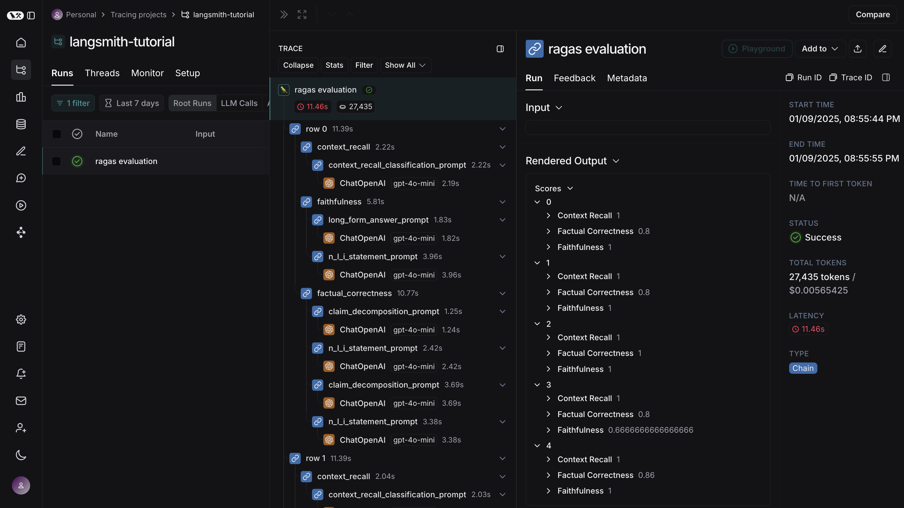

# LangSmith

[LangSmith](https://docs.smith.langchain.com/) is an advanced tool designed to enhance the development and deployment of applications utilizing large language models (LLMs). It provides a comprehensive framework for tracing, analyzing, and optimizing LLM workflows, making it easier for developers to manage complex interactions within their applications.

This tutorial explains how to log traces of Ragas evaluations using LangSmith. Since Ragas is built on LangChain, you only need to set up LangSmith, and it will handle logging the traces automatically.

## Setting Up LangSmith

To set up LangSmith, make sure you set the following environment variables (refer to the [LangSmith documentation](https://docs.smith.langchain.com/#quick-start) for more details):

```bash
export LANGCHAIN_TRACING_V2=true
export LANGCHAIN_ENDPOINT=https://api.smith.langchain.com
export LANGCHAIN_API_KEY=<your-api-key>
export LANGCHAIN_PROJECT=<your-project>  # Defaults to "default" if not set
```

## Getting the Dataset

When creating evaluation dataset or evaluating instance, ensure the terminology matches the schema used in `SingleTurnSample` or `MultiTurnSample`.


```python
from ragas import EvaluationDataset


dataset = [
    {
        "user_input": "Which CEO is widely recognized for democratizing AI education through platforms like Coursera?",
        "retrieved_contexts": [
            "Andrew Ng, CEO of Landing AI, is known for his pioneering work in deep learning and for democratizing AI education through Coursera."
        ],
        "response": "Andrew Ng is widely recognized for democratizing AI education through platforms like Coursera.",
        "reference": "Andrew Ng, CEO of Landing AI, is known for democratizing AI education through Coursera.",
    },
    {
        "user_input": "Who is Sam Altman?",
        "retrieved_contexts": [
            "Sam Altman, CEO of OpenAI, has advanced AI research and advocates for safe, beneficial AI technologies."
        ],
        "response": "Sam Altman is the CEO of OpenAI and advocates for safe, beneficial AI technologies.",
        "reference": "Sam Altman, CEO of OpenAI, has advanced AI research and advocates for safe AI.",
    },
    {
        "user_input": "Who is Demis Hassabis and how did he gain prominence?",
        "retrieved_contexts": [
            "Demis Hassabis, CEO of DeepMind, is known for developing systems like AlphaGo that master complex games."
        ],
        "response": "Demis Hassabis is the CEO of DeepMind, known for developing systems like AlphaGo.",
        "reference": "Demis Hassabis, CEO of DeepMind, is known for developing AlphaGo.",
    },
    {
        "user_input": "Who is the CEO of Google and Alphabet Inc., praised for leading innovation across Google's product ecosystem?",
        "retrieved_contexts": [
            "Sundar Pichai, CEO of Google and Alphabet Inc., leads innovation across Google's product ecosystem."
        ],
        "response": "Sundar Pichai is the CEO of Google and Alphabet Inc., praised for leading innovation across Google's product ecosystem.",
        "reference": "Sundar Pichai, CEO of Google and Alphabet Inc., leads innovation across Google's product ecosystem.",
    },
    {
        "user_input": "How did Arvind Krishna transform IBM?",
        "retrieved_contexts": [
            "Arvind Krishna, CEO of IBM, transformed the company by focusing on cloud computing and AI solutions."
        ],
        "response": "Arvind Krishna transformed IBM by focusing on cloud computing and AI solutions.",
        "reference": "Arvind Krishna, CEO of IBM, transformed the company through cloud computing and AI.",
    },
]

evaluation_dataset = EvaluationDataset.from_list(dataset)
```

## Tracing ragas metrics

Run the Ragas evaluations on your dataset, and the traces will appear in your LangSmith dashboard under the specified project name or "default."


```python
from ragas import evaluate
from ragas.llms import LangchainLLMWrapper
from langchain_openai import ChatOpenAI
from ragas.metrics import LLMContextRecall, Faithfulness, FactualCorrectness

llm = ChatOpenAI(model="gpt-4o-mini")
evaluator_llm = LangchainLLMWrapper(llm)

result = evaluate(
    dataset=evaluation_dataset,
    metrics=[LLMContextRecall(), Faithfulness(), FactualCorrectness()],
    llm=evaluator_llm,
)

result
```

Output
```
Evaluating:   0%|          | 0/15 [00:00<?, ?it/s]

{'context_recall': 1.0000, 'faithfulness': 0.9333, 'factual_correctness': 0.8520}
```

## LangSmith Dashboard

