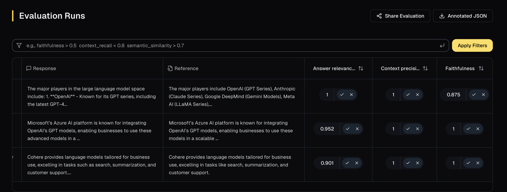

# R2R Integration

R2R is an all-in-one solution for AI Retrieval-Augmented Generation (RAG) with production-ready features, including multimodal content ingestion, hybrid search functionality user/document management and many more.

## Overview
In this tutorial, we will:

- Leverage the `/rag` endpoint from R2R to perform Retrieval-Augmented Generation (RAG) on a small dataset.
- Evaluate the generated responses.
- Analyze the traces of evaluation.

## R2R Setup

#### Installing the Dependencies

To begin, install the necessary packages:


```python
%pip install r2r -q
```

#### Setting up the local environment

Configure the `R2R_API_KEY`, `OPENAI_API_KEY` and `RAGAS_APP_TOKEN`(Optional).


```python
from dotenv import load_dotenv

load_dotenv()
```

#### Getting the data


```python
dataset = [
    "OpenAI is one of the most recognized names in the large language model space, known for its GPT series of models. These models excel at generating human-like text and performing tasks like creative writing, answering questions, and summarizing content. GPT-4, their latest release, has set benchmarks in understanding context and delivering detailed responses.",
    "Anthropic is well-known for its Claude series of language models, designed with a strong focus on safety and ethical AI behavior. Claude is particularly praised for its ability to follow complex instructions and generate text that aligns closely with user intent.",
    "DeepMind, a division of Google, is recognized for its cutting-edge Gemini models, which are integrated into various Google products like Bard and Workspace tools. These models are renowned for their conversational abilities and their capacity to handle complex, multi-turn dialogues.",
    "Meta AI is best known for its LLaMA (Large Language Model Meta AI) series, which has been made open-source for researchers and developers. LLaMA models are praised for their ability to support innovation and experimentation due to their accessibility and strong performance.",
    "Meta AI with it's LLaMA models aims to democratize AI development by making high-quality models available for free, fostering collaboration across industries. Their open-source approach has been a game-changer for researchers without access to expensive resources.",
    "Microsoft’s Azure AI platform is famous for integrating OpenAI’s GPT models, enabling businesses to use these advanced models in a scalable and secure cloud environment. Azure AI powers applications like Copilot in Office 365, helping users draft emails, generate summaries, and more.",
    "Amazon’s Bedrock platform is recognized for providing access to various language models, including its own models and third-party ones like Anthropic’s Claude and AI21’s Jurassic. Bedrock is especially valued for its flexibility, allowing users to choose models based on their specific needs.",
    "Cohere is well-known for its language models tailored for business use, excelling in tasks like search, summarization, and customer support. Their models are recognized for being efficient, cost-effective, and easy to integrate into workflows.",
    "AI21 Labs is famous for its Jurassic series of language models, which are highly versatile and capable of handling tasks like content creation and code generation. The Jurassic models stand out for their natural language understanding and ability to generate detailed and coherent responses.",
    "In the rapidly advancing field of artificial intelligence, several companies have made significant contributions with their large language models. Notable players include OpenAI, known for its GPT Series (including GPT-4); Anthropic, which offers the Claude Series; Google DeepMind with its Gemini Models; Meta AI, recognized for its LLaMA Series; Microsoft Azure AI, which integrates OpenAI’s GPT Models; Amazon AWS (Bedrock), providing access to various models including Claude (Anthropic) and Jurassic (AI21 Labs); Cohere, which offers its own models tailored for business use; and AI21 Labs, known for its Jurassic Series. These companies are shaping the landscape of AI by providing powerful models with diverse capabilities.",
]
```

#### Setting up the R2R Client


```python
from r2r import R2RClient

client = R2RClient()
```

#### Ingesting the Data


```python
ingest_response = client.documents.create(
    chunks=dataset,
)
```

#### Using the `/rag` Endpoint

The [`/rag`](https://r2r-docs.sciphi.ai/api-and-sdks/retrieval/rag-app) endpoint facilitate Retrieval-Augmented Generation by integrating search results with language model outputs. The generation process can be customized using the `rag_generation_config` parameter, while the retrieval process can be configured using the `search_settings`.


```python
query = "What makes Meta AI’s LLaMA models stand out?"

search_settings = {
        "limit": 2,
        "graph_settings": {"enabled": False, "limit": 2},
    }

response = client.retrieval.rag(
    query=query,
    search_settings=search_settings
)

print(response.results.generated_answer)
```
Output
```
Meta AI’s LLaMA models stand out due to their open-source nature, which supports innovation and experimentation by making high-quality models accessible to researchers and developers [1]. This approach democratizes AI development, fostering collaboration across industries and enabling researchers without access to expensive resources to work with advanced AI models [2].
```

## Evaluations

#### **Evaluating the `R2R Client` with Ragas**  

With the `R2R Client` in place, we can use Ragas `r2r` integration for evaluation. This process involves the following key components:  

- **1. R2R Client and Configurations**  
The `R2RClient` and `/rag` configurations specifying RAG settings.   

- **2. Evaluation Dataset**  
You need a Ragas `EvaluationDataset` that includes all necessary inputs required by Ragas metrics. 

- **3. Ragas Metrics**  
Ragas provides various evaluation metrics to assess different aspects of the RAG, such as faithfulness, answer relevance, and context recall. You can explore the full list of available metrics in the [Ragas documentation](https://docs.ragas.io/en/latest/concepts/metrics/available_metrics/).  


#### Constructing a Ragas EvaluationDataset  
The [`EvaluationDataset`](../../concepts/components/eval_dataset.md) is a data type in Ragas designed to represent evaluation samples. You can find more details about its structure and usage in the [core concepts section](../../concepts/components/eval_dataset.md).

We will use the `transform_to_ragas_dataset` function from ragas to get the EvaluationDataset for our data.

```python
questions = [
    "Who are the major players in the large language model space?",
    "What is Microsoft’s Azure AI platform known for?",
    "What kind of models does Cohere provide?",
]

references = [
    "The major players include OpenAI (GPT Series), Anthropic (Claude Series), Google DeepMind (Gemini Models), Meta AI (LLaMA Series), Microsoft Azure AI (integrating GPT Models), Amazon AWS (Bedrock with Claude and Jurassic), Cohere (business-focused models), and AI21 Labs (Jurassic Series).",
    "Microsoft’s Azure AI platform is known for integrating OpenAI’s GPT models, enabling businesses to use these models in a scalable and secure cloud environment.",
    "Cohere provides language models tailored for business use, excelling in tasks like search, summarization, and customer support.",
]

r2r_responses = []

search_settings = {
    "limit": 2,
    "graph_settings": {"enabled": False, "limit": 2},
}

for que in questions:
    response = client.retrieval.rag(query=que, search_settings=search_settings)
    r2r_responses.append(response)
```


```python
from ragas.integrations.r2r import transform_to_ragas_dataset

ragas_eval_dataset = transform_to_ragas_dataset(
    user_inputs=questions, r2r_responses=r2r_responses, references=references
)
```
Output
```
EvaluationDataset(features=['user_input', 'retrieved_contexts', 'response', 'reference'], len=3)
```


#### Selecting the Metrics

To evaluate our RAG endpoint, we will use the following metrics:

- [Response Relevancy](https://docs.ragas.io/en/stable/concepts/metrics/available_metrics/answer_relevance/#response-relevancy): Measures how relevant a response is to the user’s input (query).
- [Context Precision](https://docs.ragas.io/en/stable/concepts/metrics/available_metrics/context_precision/): Measures how many of the relevant documents (or pieces of information) were successfully retrieved.
- [Faithfulness](https://docs.ragas.io/en/stable/concepts/metrics/available_metrics/faithfulness/): Measures how factually consistent a response is with the retrieved context.


```python
from ragas.metrics import AnswerRelevancy, ContextPrecision, Faithfulness
from ragas import evaluate
from langchain_openai import ChatOpenAI
from ragas.llms import LangchainLLMWrapper

llm = ChatOpenAI(model="gpt-4o-mini")
evaluator_llm = LangchainLLMWrapper(llm)

ragas_metrics = [AnswerRelevancy(llm=evaluator_llm ), ContextPrecision(llm=evaluator_llm ), Faithfulness(llm=evaluator_llm )]

results = evaluate(dataset=ragas_eval_dataset, metrics=ragas_metrics)
```
Output
```
Querying Client: 100%|██████████| 3/3 [00:00<?, ?it/s]

Evaluating: 100%|██████████| 9/9 [00:00<?, ?it/s]
```

<div>
<style scoped>
    .dataframe tbody tr th:only-of-type {
        vertical-align: middle;
    }

    .dataframe tbody tr th {
        vertical-align: top;
    }

    .dataframe thead th {
        text-align: right;
    }
</style>
<table border="1" class="dataframe">
  <thead>
    <tr style="text-align: right;">
      <th></th>
      <th>user_input</th>
      <th>retrieved_contexts</th>
      <th>response</th>
      <th>reference</th>
      <th>answer_relevancy</th>
      <th>context_precision</th>
      <th>faithfulness</th>
    </tr>
  </thead>
  <tbody>
    <tr>
      <th>0</th>
      <td>Who are the major players in the large languag...</td>
      <td>[In the rapidly advancing field of artificial ...</td>
      <td>The major players in the large language model ...</td>
      <td>The major players include OpenAI (GPT Series),...</td>
      <td>1.000000</td>
      <td>1.0</td>
      <td>1.000000</td>
    </tr>
    <tr>
      <th>1</th>
      <td>What is Microsoft’s Azure AI platform known for?</td>
      <td>[Microsoft’s Azure AI platform is famous for i...</td>
      <td>Microsoft’s Azure AI platform is known for int...</td>
      <td>Microsoft’s Azure AI platform is known for int...</td>
      <td>0.948908</td>
      <td>1.0</td>
      <td>0.833333</td>
    </tr>
    <tr>
      <th>2</th>
      <td>What kind of models does Cohere provide?</td>
      <td>[Cohere is well-known for its language models ...</td>
      <td>Cohere provides language models tailored for b...</td>
      <td>Cohere provides language models tailored for b...</td>
      <td>0.903765</td>
      <td>1.0</td>
      <td>1.000000</td>
    </tr>
  </tbody>
</table>
</div>


#### Tracing the Evaluations

To gain a better understanding of the scores from the evaluation, we can obtain the traces and reasons for the verdicts using the code below.


```python
results.upload()
```


Happy Coding
