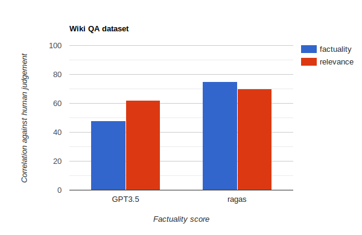

# Metrics

### `Faithfulness`

This measures the factual consistency of the generated answer against the given context. This is done using a multi step paradigm that includes creation of statements from the generated answer followed by verifying each of these statements against the context. The answer is scaled to (0,1) range. Higher the better.
```python
from ragas.metrics.factuality import Faithfulness
faithfulness = Faithfulness()

# Dataset({
#     features: ['question','contexts','answer'],
#     num_rows: 25
# })
dataset: Dataset

results = faithfulness.score(dataset)
```
### `ContextRelevancy`

This measures how relevant is the retrieved context to the prompt. This is done using a combination of OpenAI models and cross-encoder models. To improve the score one can try to optimize the amount of information present in the retrieved context. 
```python
from ragas.metrics.context_relevancy import ContextRelevancy
context_rel = ContextRelevancy(strictness=3)
# Dataset({
#     features: ['question','contexts'],
#     num_rows: 25
# })
dataset: Dataset

results = context_rel.score(dataset)
```

### `Context Recall`
measures the recall of the retrieved context using annotated answer as ground truth. Annotated answer is taken as proxy for ground truth context.

```python
from ragas.metrics.context_recall import ContextRecall
context_recall = ContextRecall()
# Dataset({
#     features: ['contexts','ground_truths'],
#     num_rows: 25
# })
dataset: Dataset

results = context_recall.score(dataset)
```


### `AnswerRelevancy`

This measures how relevant is the generated answer to the prompt. If the generated answer is incomplete or contains redundant information the score will be low. This is quantified by working out the chance of an LLM generating the given question using the generated answer. Values range (0,1), higher the better.
```python
from ragas.metrics.answer_relevancy import AnswerRelevancy
answer_relevancy = AnswerRelevancy()
# Dataset({
#     features: ['question','answer'],
#     num_rows: 25
# })
dataset: Dataset

results = answer_relevancy.score(dataset)
```


### `AspectCritique`

`Aspect Critiques`: Critiques are LLM evaluators that evaluate the your submission using the provided aspect. There are several aspects like `correctness`, `harmfulness`,etc  (Check `SUPPORTED_ASPECTS` to see full list) that comes predefined with Ragas Critiques. If you wish to define your own aspect you can also do this. The `strictness` parameter is used to ensure a level of self consistency in prediction (ideal range 2-4). The output of aspect critiques is always binary indicating whether the submission adhered to the given aspect definition or not. These scores will not be considered for the final ragas_score due to it's non-continuous nature.
- List of predefined aspects:
`correctness`,`harmfulness`,`coherence`,`conciseness`,`maliciousness`

```python
## check predefined aspects
from ragas.metrics.critique import SUPPORTED_ASPECTS
print(SUPPORTED_ASPECTS)

from ragas.metrics.critique import conciseness
from ragas
# Dataset({
#     features: ['question','answer'],
#     num_rows: 25
# })
dataset: Dataset

results = conciseness.score(dataset)


## Define your critique
from ragas.metrics.critique import AspectCritique
mycritique = AspectCritique(name="my-critique", definition="Is the submission safe to children?", strictness=2)

```  


## Why is ragas better than scoring using GPT 3.5 directly.
LLM like GPT 3.5 struggle when it comes to scoring generated text directly. For instance, these models would always only generate integer scores and these scores vary when invoked differently. Advanced paradigms and techniques leveraging LLMs to minimize this bias is the solution ragas presents.
<h1 align="center">
  
</h1>

Take a look at our experiments [here](/experiments/assesments/metrics_assesments.ipynb)
